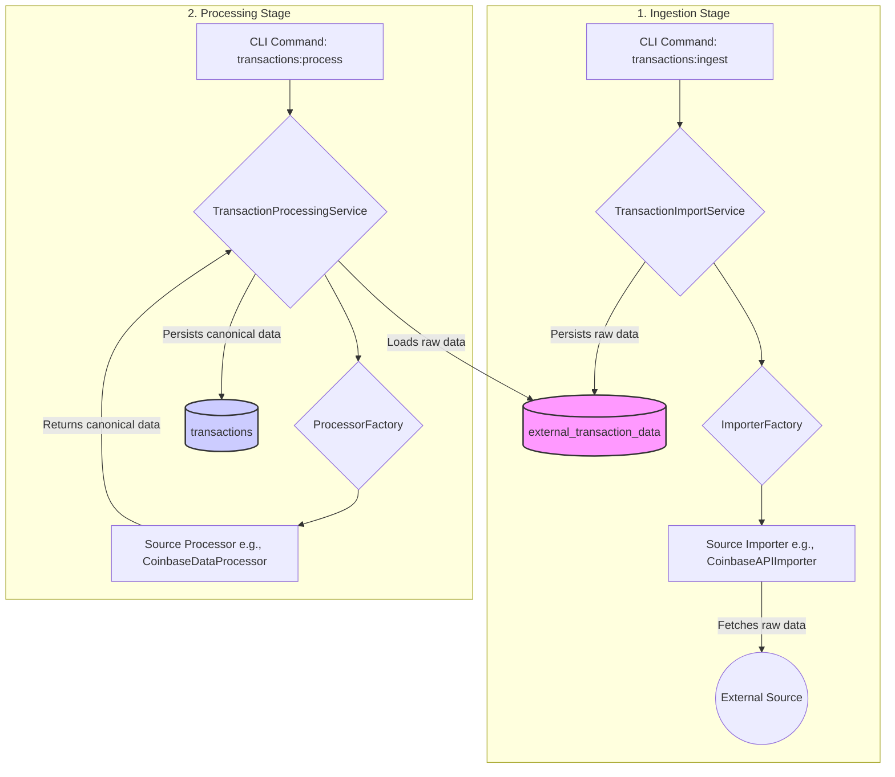

# Project Architecture

## 1. Architectural Philosophy

The architecture of this project is guided by two core principles: **Domain-Driven Design (DDD)** and **Vertical Slicing**. Our goal is to create a system that is highly maintainable, scalable, and easy for new developers to understand because the code's structure directly reflects the business domain it serves.

The business domain is the management of cryptocurrency transactions, which involves three primary capabilities:

1.  **Ingesting** data from various external sources (exchanges, blockchains).
2.  **Processing** that data into a single, canonical format.
3.  **Exporting** that canonical data to external formats (e.g., for tax software).

This document outlines the design choices made to model these capabilities effectively.

## 2. The Ubiquitous Language

To ensure clarity between the business domain and the code, we've established a Ubiquitous Language. These are the core terms used consistently throughout the codebase, from package names down to class names.

| Term                      | Definition                                                                                                                           |
| :------------------------ | :----------------------------------------------------------------------------------------------------------------------------------- |
| **Ingestion**             | The business process of fetching raw, unprocessed data from an external `Source` and persisting it for later use.                    |
| **Processing**            | The business process of transforming ingested raw data into our standardized, canonical format.                                      |
| **Export**                | The business process of converting our canonical data into an external format (e.g., a Koinly CSV).                                  |
| **Source**                | An external system from which we get data, such as the Coinbase API or the Bitcoin blockchain.                                       |
| **Canonical Transaction** | The single, authoritative, standardized representation of a transaction within our system. This is our "single source of truth."     |
| **Importer**              | A component responsible for connecting to a `Source` and fetching its raw data.                                                      |
| **Processor**             | A component responsible for applying business rules to map raw data from a `Source` into a `CanonicalTransaction`.                   |
| **Orchestrator**          | A high-level service that manages a business process by coordinating the necessary components (Importers, Processors, Repositories). |

## 3. High-Level Architecture: A Decoupled Data Pipeline

The core of the system is a decoupled **ETL (Extract, Transform, Load)** pipeline, but named according to our Ubiquitous Language. This pipeline ensures that the high-risk, I/O-bound work of fetching data is cleanly separated from the CPU-bound, business-logic-heavy work of processing it.

This separation provides resilience: if a processing step fails, it can be retried without having to re-fetch data from the external source, saving time and respecting API rate limits.

