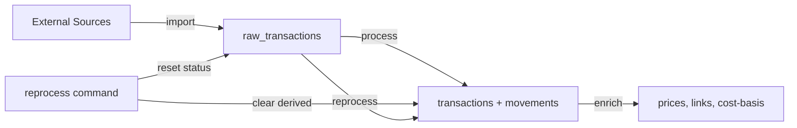

# Data Integrity & Processing

> Exitbook enforces financial-grade data integrity through a two-phase raw/derived architecture, multi-layered deduplication, runtime schema validation, and typed error propagation.

## The Problem

Cryptocurrency portfolio tracking is an accounting problem disguised as a data engineering problem. Every transaction affects cost-basis calculations, balance verification, and tax reporting. A single duplicate, a silently dropped error, or a malformed record can cascade into incorrect financial figures.

The typical failure modes are subtle. An import that runs twice creates phantom holdings. A processor that swallows an exception hides missing transactions from the balance. A schema change in a blockchain API silently produces `undefined` fields that downstream calculations treat as zero. A bug in fee classification causes incorrect cost-basis for every subsequent disposal.

The system must make every failure visible, make every import safely repeatable, and preserve the ability to fix processing logic without re-fetching expensive external data.

## Design Overview

The architecture separates data into two phases:

**Raw phase**: `raw_transactions` stores the original provider data (`provider_data` JSON) and a normalized representation (`normalized_data` JSON) for every imported record. These rows are never deleted by any operation except a full data wipe. The `processing_status` field (`pending`/`processed`) is the only mutable column.

**Derived phase**: `transactions` and `transaction_movements` are derived from raw data by processors. These can be deleted and regenerated at any time via the `reprocess` command, which clears derived tables, resets `processing_status` to `pending`, and re-runs all processors.

This separation means a bug in transaction classification, fee calculation, or operation typing can be fixed in the processor code and applied retroactively to all historical data — without making a single API call.

## Key Design Decisions

### Raw transactions are never deleted

**Decision**: The `clear` command deletes `transactions`, `transaction_movements`, and `transaction_links`, but never touches `raw_transactions`. The `reprocess` command resets processing status but preserves all raw records.

**Why**: Raw data represents real-world events captured from external sources. Re-fetching is expensive (API rate limits, pagination, potential data loss if providers prune history). Preserving raw data means any processing improvement applies to the full history automatically.

**Alternative considered**: Delete everything and re-import. Some tools take this approach, but it wastes API quota, loses data from providers that prune old records, and makes "fix and replay" workflows impossible.

### Three-layer deduplication

**Decision**: Duplicate prevention operates at three independent layers:

1. **Provider-level dedup**: Each importer's streaming adapter maintains an in-memory dedup window (~500 items) to filter duplicates from overlapping API pages before they reach the database.

2. **Event ID uniqueness**: `UNIQUE INDEX idx_raw_tx_external_id_per_account ON raw_transactions(account_id, external_id)` ensures no two raw records share the same provider-assigned event ID within an account.

3. **Blockchain hash uniqueness**: `UNIQUE INDEX idx_raw_tx_hash_per_account ON raw_transactions(account_id, blockchain_transaction_hash) WHERE blockchain_transaction_hash IS NOT NULL` prevents the same on-chain transaction from being stored twice.

**Why**: Each layer catches different failure modes. Provider-level dedup handles overlapping pages during a single import. Event ID uniqueness handles re-imports of the same data (CSV re-import, API re-sync). Hash uniqueness handles the case where the same on-chain transaction appears with different provider-assigned IDs.

When a duplicate is detected at the DB layer, `saveBatch()` returns `{ inserted: N, skipped: M }` — duplicates are counted, not treated as errors. This makes imports idempotent: running the same import twice produces the same result.

### Result types over exceptions

**Decision**: Every fallible function returns `Result<T, Error>` (neverthrow) instead of throwing exceptions. This applies from CLI handlers down through orchestrators, processors, database queries, and API clients.

**Why**: In a financial system, a swallowed exception means lost data with no indication of what failed. The `Result` type makes every failure explicit at the type level — callers cannot ignore errors without deliberately unwrapping. The compiler enforces error handling at every call boundary.

This eliminates the class of bugs where a `try/catch` silently swallows an error, or where an `async` function rejects and the rejection goes unhandled. Every error is either explicitly handled, transformed, or propagated upward.

**Alternative considered**: Standard try/catch with a global error handler. This works for simple applications but creates invisible failure paths. A `catch (e) { logger.error(e) }` three levels deep silently discards the error context that the caller needs.

### Runtime Zod validation at every boundary

**Decision**: `BaseTransactionProcessor.process()` validates every normalized record against a Zod schema before processing. `validateAndFilterTransactions()` validates every processed transaction before persistence. Both validation failures are hard errors that abort the batch.

**Why**: TypeScript types evaporate at runtime. When a blockchain API changes its response format, TypeScript offers no protection — the data silently passes through with `undefined` fields. Zod catches this at the boundary: if a field is missing or has the wrong type, the batch fails with a specific error message identifying the exact field and record.

The strict mode is deliberate. Partial processing (skip invalid records, process the rest) would silently lose transactions, which corrupts portfolio calculations.

### Rich fee semantics with scope and settlement

**Decision**: Fees are not a single `amount` field. Each fee has a `scope` (network, platform, spread, tax, other) and a `settlement` (on-chain, balance, external) that determines its accounting treatment.

**Why**: A Bitcoin miner fee (scope: network, settlement: on-chain) is carved from the transaction inputs — it reduces what the recipient receives. An Ethereum gas fee (scope: network, settlement: balance) is paid separately from the account balance. A Kraken trading fee (scope: platform, settlement: balance) is a separate ledger deduction.

These distinctions matter for cost-basis calculation: on-chain fees reduce disposal proceeds, while balance fees increase acquisition cost. Collapsing them into a single "fee" field forces incorrect accounting for at least one category.

### Scam and spam detection during processing

**Decision**: `BaseTransactionProcessor.runScamDetection()` runs during the processing phase, before transactions are saved. Detected spam is flagged (`isSpam = true`) and annotated with notes, but the transaction is still stored.

**Why**: Airdrop spam is rampant on EVM chains. Unsolicited token transfers appear as real inflows, inflating portfolio balances and polluting transaction lists. Detecting spam during processing (rather than at display time) ensures the flag is persisted and available to all downstream consumers — balance calculations, cost-basis, and UI filtering.

Flagged transactions are stored rather than dropped because a false positive on spam detection would silently delete real transactions.

## How It Works

### Import → Raw Storage

When `StreamingImportRunner` receives a batch, it calls `rawDataQueries.saveBatch()` which inserts into `raw_transactions`:

- `provider_data`: The original JSON from the provider (preserved verbatim)
- `normalized_data`: A provider-agnostic normalized representation (used by processors)
- `external_id`: Provider-assigned event ID (used for dedup)
- `blockchain_transaction_hash`: On-chain hash if applicable (used for dedup)
- `processing_status`: Initially `pending`

Duplicate insertions (violating either unique index) are silently counted as skipped.

### Processing → Derived Transactions

`TransactionProcessingService.processAccountTransactions()`:

1. Asserts no incomplete imports exist for the account
2. Creates the appropriate processor via the adapter registry
3. Fetches pending raw records in batches (hash-grouped for blockchains to maintain correlation integrity)
4. For each batch:
   - Unpacks raw records (blockchain: `normalized_data`, exchange: `provider_data`)
   - Validates against the processor's Zod input schema
   - Transforms into `ProcessedTransaction[]` via the processor's `transformNormalizedData()`
   - Validates output against `ProcessedTransactionSchema`
   - Saves to `transactions` and `transaction_movements`
   - Marks raw records as `processed`

Any validation or processing failure aborts the batch with an error that explicitly states the accounting impact: "This would corrupt portfolio calculations."

### Reprocessing

The `reprocess` command:

1. Clears derived data: `transactions`, `transaction_movements`, `transaction_links`
2. Resets all `raw_transactions.processing_status` to `pending`
3. Runs the full processing pipeline from step 1 above

Raw records, price caches, token metadata, and provider health data are preserved.

## Tradeoffs

**Storage overhead from raw preservation.** Every imported record stores both `provider_data` (original JSON) and `normalized_data` (normalized JSON). For large accounts, this roughly doubles the storage for raw data. The tradeoff is worthwhile: re-fetching historical data from providers is slow, rate-limited, and sometimes impossible.

**Strict validation aborts entire batches.** A single invalid record in a batch of 500 aborts the entire batch. This prevents partial processing that would silently lose transactions, but means one malformed record blocks all processing for that account. The error message is specific enough to diagnose the issue.

**Result type verbosity.** Every function returns `Result<T, Error>`, and every call site must handle both cases. This adds boilerplate compared to exception-based code. The tradeoff is explicit error handling at every boundary — no silent failures.

## Key Files

| File                                                                    | Role                                                          |
| ----------------------------------------------------------------------- | ------------------------------------------------------------- |
| `packages/data/src/migrations/001_initial_schema.ts`                    | DB schema with dedup constraints                              |
| `packages/ingestion/src/features/process/process-service.ts`            | Processing orchestration, incomplete import guards            |
| `packages/ingestion/src/features/process/base-transaction-processor.ts` | Base class: Zod validation, scam detection, output validation |
| `packages/core/src/schemas/universal-transaction.ts`                    | Transaction schema with fee scope/settlement semantics        |
| `packages/data/src/repositories/raw-data-queries.ts`                    | `saveBatch()` with idempotent dedup                           |
| `apps/cli/src/features/process/process-handler.ts`                      | Reprocess command: clear + reset + reprocess                  |
