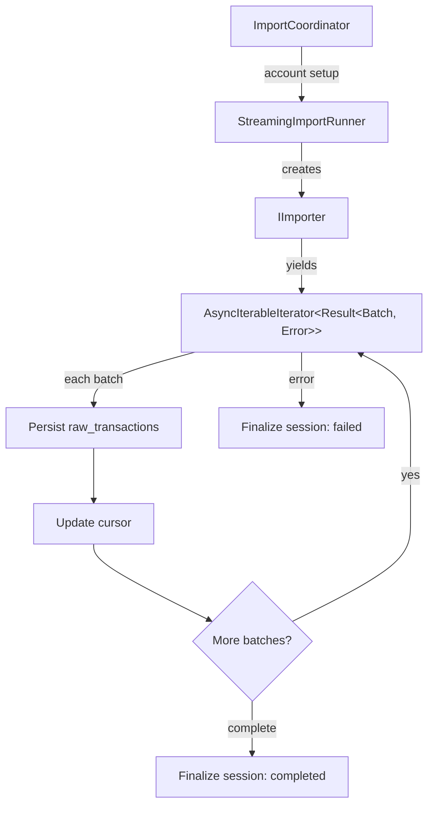

# Streaming Import Pipeline

> Exitbook imports transaction histories from blockchain APIs, exchange APIs, and CSV files through a memory-bounded streaming pipeline with per-batch crash recovery.

## The Problem

Cryptocurrency transaction histories are large, fragmented, and expensive to fetch. A single Ethereum address can have 50,000+ transactions spread across normal transfers, internal calls, and token events. Blockchain APIs enforce rate limits, return paginated results in varying formats, and go down without warning. Exchange APIs have their own pagination quirks and credential requirements.

An import that takes 20 minutes and dies at minute 18 is worthless if it has to start over. An import that loads everything into memory before persisting will crash on active addresses. An import that half-completes and silently feeds partial data into portfolio calculations produces wrong tax numbers.

The pipeline must handle all of these failure modes while remaining simple enough to extend with new data sources.

## Design Overview

The import pipeline separates concerns into three layers:



**ImportCoordinator** handles identity: ensuring a user exists, normalizing addresses, finding or creating the account record, and handling xpub derivation for UTXO chains. It delegates all import execution to StreamingImportRunner.

**StreamingImportRunner** handles execution: creating the appropriate importer via the adapter registry, managing import sessions (resume or create), iterating batches, persisting raw transactions, and updating cursors.

**IImporter** implementations handle data acquisition: each blockchain or exchange adapter yields batches through an async iterator, encapsulating pagination, provider failover, and source-specific normalization.

## Key Design Decisions

### Per-batch cursor persistence, not per-import

**Decision**: Save the cursor to the database after every batch, not once at the end of the import.

**Why**: A 50,000-transaction import might run for 30 minutes. If the process crashes at batch 47, per-batch persistence means the next run resumes at batch 48. The cost is one extra DB write per batch (negligible compared to the API call that produced the batch).

**Alternative considered**: Persist cursor only on successful completion. Simpler, but any crash or network timeout forces a full re-import, wasting API quota and user time.

### Cursor merging per operation type

**Decision**: Each account stores a cursor map keyed by operation type (`normal`, `internal`, `token`, `ledger`), and updates merge into the existing map rather than replacing it wholesale.

**Why**: Blockchain importers run multiple parallel streams (e.g., Ethereum fetches normal transactions, internal transactions, and token transfers as separate operation types). Each stream has independent pagination state. Replacing the entire cursor map when one stream updates would destroy progress on the others.

### Session state machine with resume semantics

**Decision**: Import sessions track status (`started` -> `completed`/`failed`). On the next import attempt, if the latest session is `started` or `failed`, the runner resumes it (resets to `started`, continues accumulating totals) rather than creating a new session.

**Why**: This gives a single session record that represents "all work to import this account," even if it took three attempts. Session totals (`transactionsImported`, `transactionsSkipped`) accumulate across retries, providing accurate final counts.

### Incomplete import guards block processing

**Decision**: `TransactionProcessingService.assertNoIncompleteImports()` checks that the latest import session for each account is `completed` before allowing processing to proceed. If any session is `started` or `failed`, processing is blocked with an error.

**Why**: Processing partial data produces incomplete portfolio calculations. If an Ethereum import fetched normal transactions but crashed before fetching token transfers, processing would miss all ERC-20 activity. The guard ensures processing only runs on complete datasets. The error message tells the user exactly what to do: finish or re-run the import.

**Alternative considered**: Process whatever is available and re-process later. This would require tracking which raw transactions have been processed and which haven't, plus reconciliation logic. The simpler approach is to ensure imports complete before processing begins.

## How It Works

### 1. Orchestration (ImportCoordinator)

The CLI command calls one of three methods: `importBlockchain()`, `importExchangeApi()`, or `importExchangeCsv()`. Each method:

1. Ensures the default CLI user exists (id=1)
2. Normalizes the identifier (address normalization for blockchains, path normalization for CSVs)
3. Finds or creates the account via a unique constraint on `(accountType, sourceName, identifier, userId)`
4. Delegates to `StreamingImportRunner.importFromSource(account)`

For xpub imports, the orchestrator first derives child addresses, creates child accounts, and imports each sequentially.

### 2. Streaming Execution (StreamingImportRunner)

`executeStreamingImport()` is the core loop:

1. Check for an incomplete session — resume if found, create new if not
2. Create the appropriate importer from the adapter registry
3. Iterate `importer.importStreaming(params)`:
   - Each batch yields `{ rawTransactions, streamType, cursor, isComplete }`
   - Persist raw transactions via `rawDataQueries.saveBatch()` — duplicates counted as skipped, not errors
   - Update cursor via `accountQueries.updateCursor(accountId, streamType, cursor)` — failures logged as warnings, import continues
   - Emit progress events for the dashboard UI
4. Finalize the session as `completed` or `failed`

### 3. Importer Contract (IImporter)

Every data source implements the same interface:

```typescript
importStreaming(params: ImportParams): AsyncIterableIterator<Result<ImportBatchResult, Error>>
```

The `Result` wrapper ensures errors are values, not exceptions. A batch error terminates the import cleanly (session marked `failed`) rather than crashing the process. The async iterator ensures only one batch is in memory at a time.

Each batch includes a `cursor` containing the pagination state needed to resume, and an `isComplete` flag that signals when the source has no more data.

## Tradeoffs

**Cursor update failures are tolerated.** If the cursor write fails, the import continues but logs a warning. The next run may re-fetch some overlap, which the deduplication layer handles. This trades occasional redundant work for import reliability — a cursor write failure shouldn't abort an otherwise successful batch.

**Sequential child imports for xpubs.** Each derived address is imported one at a time, not in parallel. This is slower but avoids overwhelming API rate limits and simplifies error handling. A single child failure aborts the entire xpub import.

**No partial processing.** The incomplete import guard is a hard stop. If an import fails, the user must re-run it before processing can proceed. This is deliberate — partial data produces wrong financial calculations — but can be frustrating when the failure was transient.

## Key Files

| File                                                                | Role                                                    |
| ------------------------------------------------------------------- | ------------------------------------------------------- |
| `packages/ingestion/src/features/import/import-coordinator.ts`      | Public API; account setup, xpub derivation              |
| `packages/ingestion/src/features/import/streaming-import-runner.ts` | Core streaming loop, session management, crash recovery |
| `packages/ingestion/src/shared/types/importers.ts`                  | `IImporter` interface and `ImportBatchResult` type      |
| `packages/ingestion/src/shared/types/adapter-registry.ts`           | Registry for blockchain and exchange adapters           |
| `packages/ingestion/src/features/process/process-service.ts`        | Processing service with incomplete import guards        |
| `packages/core/src/schemas/cursor.ts`                               | `CursorState` and `PaginationCursor` schemas            |
