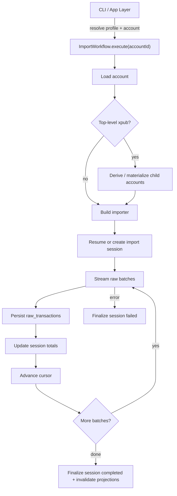

# Streaming Import Pipeline

> Exitbook syncs raw transaction history through an account-owned, memory-bounded streaming pipeline with per-batch crash recovery.

## The Problem

Cryptocurrency history is large, paginated, rate-limited, and failure-prone.

- a single wallet can span tens of thousands of transactions
- blockchain and exchange adapters page differently
- long-running imports must survive crashes and retries
- partial imports must not silently flow into downstream accounting

The pipeline therefore has to do three things well:

1. sync one existing account deterministically
2. persist progress per batch
3. block downstream processing when the latest import is incomplete

## Design Overview

The modern design separates lifecycle from sync execution:


```mermaid
graph TD
    A["CLI / App Layer"] -->|resolve profile + account| B["ImportWorkflow.execute(accountId)"]
    B --> C["Load account"]
    C --> D{"Top-level xpub?"}
    D -->|yes| E["Derive / materialize child accounts"]
    D -->|no| F["Build importer"]
    E --> F
    F --> G["Resume or create import session"]
    G --> H["Stream raw batches"]
    H --> I["Persist raw_transactions"]
    I --> J["Update session totals"]
    J --> K["Advance cursor"]
    K --> L{"More batches?"}
    L -->|yes| H
    L -->|done| M["Finalize session completed + invalidate projections"]
    H -->|error| N["Finalize session failed"]
```

The key boundary is deliberate:

- account creation happens before import
- import never creates user-facing top-level accounts
- ingestion receives an `accountId` and syncs that account
- xpub child-account materialization remains internal to ingestion because it is part of sync execution, not user-facing lifecycle

## Responsibilities

### App Layer

The CLI or future API composes profile/account lifecycle with ingestion:

- resolve the active or overridden profile
- resolve a named account or account ID inside that profile
- call `ImportWorkflow.execute({ accountId })`

Examples:

```bash
exitbook profiles switch business
exitbook accounts add kraken-main --exchange kraken --api-key KEY --api-secret SECRET
exitbook import --account kraken-main
exitbook import --all --profile business
```

### ImportWorkflow

`ImportWorkflow` owns account-scoped sync execution:

- load account metadata
- build the correct importer
- resume or create an import session
- stream raw batches
- persist raw transactions
- update session totals and cursors atomically per batch
- finalize the session
- invalidate processed projections after a successful import

### Importers

Adapters implement `IImporter.importStreaming()` and own:

- pagination
- provider failover / retries
- source-specific fetch logic
- source-specific raw normalization

They yield one batch at a time so the workflow stays memory-bounded.

## Key Design Decisions

### Account-First Import

**Decision**: import syncs an existing account only.

**Why**: account lifecycle and data sync are different capabilities. By forcing import to start from `accountId`, ingestion no longer has to understand profile ownership, account naming, or top-level account creation rules.

### Per-Batch Cursor Persistence

**Decision**: save the cursor after every committed batch.

**Why**: long imports should resume from the last durable batch, not restart from zero after a crash.

### Session Resume Semantics

**Decision**: the latest `started` or `failed` session is resumed instead of starting a new session.

**Why**: one session record should represent the full work of syncing an account, even across retries.

### Incomplete Import Guards

**Decision**: downstream processing is blocked unless the latest import session for each relevant account is `completed`.

**Why**: partial raw history produces wrong accounting outputs. Blocking is safer than silently processing incomplete data.

### Internal Xpub Child Materialization

**Decision**: top-level xpub accounts may create or reuse child account rows during sync.

**Why**: the one-table account model stores both user-facing top-level accounts and internally derived child accounts. The top-level lifecycle boundary remains clean while ingestion still owns derivation details.

## How It Works

### 1. Resolve The Sync Target

The CLI resolves profile scope first, then resolves the target account within that profile:

- `import --account <name>`
- `import --account-id <id>`
- `import --all`

`import --all` enumerates top-level named accounts for one profile and runs each sync sequentially.

### 2. Create Or Resume A Session

For each account:

- if the latest session is `started` or `failed`, resume it
- otherwise create a new `started` session

Session totals (`transactionsImported`, `transactionsSkipped`) accumulate across retries.

### 3. Stream Batches

Each importer yields batches containing:

- `rawTransactions`
- `streamType`
- `cursor`
- `isComplete`
- optional warnings / provider stats

### 4. Commit Each Batch Atomically

For every successful batch, the workflow commits in one transaction:

1. save raw transactions
2. update import-session totals
3. advance the account cursor for that stream

If the commit fails, the session is marked failed and the import stops.

### 5. Finalize And Invalidate

On success:

- finalize the session as `completed`
- mark processed transactions stale
- cascade downstream projection invalidation

On failure:

- finalize the session as `failed`
- keep the latest durable cursor/session state for retry

## Tradeoffs

### Cursor Writes Are Part Of The Batch Commit

The current workflow treats cursor advancement as part of the atomic batch commit, not as a best-effort side effect. That is stricter than the older design and avoids mismatch between saved raw data and saved progress.

### Sequential `import --all`

Batch import runs accounts one at a time.

- simpler rate-limit behavior
- simpler TUI progress reporting
- slower than parallel fan-out

### No Top-Level Bootstrap Import

The CLI no longer supports `import --exchange ...` or `import --blockchain ...` as a top-level shortcut.

That keeps one clear path:

1. `accounts add`
2. `import --account` or `import --all`

## Key Files

| File                                                        | Role                                                         |
| ----------------------------------------------------------- | ------------------------------------------------------------ |
| `apps/cli/src/features/import/command/import.ts`            | CLI surface for `import --account`, `--account-id`, `--all`  |
| `apps/cli/src/features/import/command/run-import.ts`        | CLI orchestration for single-account and batch import runs   |
| `packages/ingestion/src/features/import/import-workflow.ts` | Capability-owned import execution workflow                   |
| `packages/data/src/ingestion/import-ports.ts`               | Data adapters for import sessions, raw transactions, cursors |
| `packages/data/src/projections/projection-invalidation.ts`  | Projection invalidation after successful imports             |
