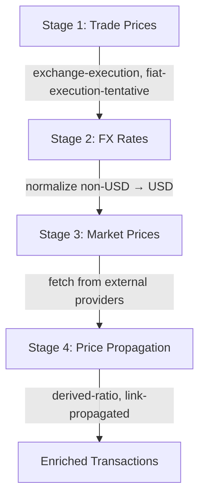

# Price Enrichment Pipeline

> Exitbook values every asset movement through a multi-pass pipeline that prefers exchange execution prices over external market data, derives missing prices from trade ratios, and propagates prices across linked transactions.

## The Problem

Accurate cost-basis calculation requires a price for every asset movement at its exact transaction time. The naive approach — look up the daily close price from CoinGecko — is wrong in several ways:

- **Exchange trades have known execution prices.** When you sell 1 ETH for $2,500 on Kraken, the execution price is $2,500. Using CoinGecko's daily average ($2,480) would misstate your proceeds.
- **Non-USD fiat trades need FX conversion.** A trade on a EUR-denominated exchange produces prices in EUR that must be normalized to USD for cost-basis.
- **Crypto-to-crypto swaps have implicit prices.** Swapping 1 ETH for 3,000 USDC gives you an implied ETH price from the swap ratio, which is more accurate than an external API's hourly candle.
- **Exotic tokens have no external price data.** A newly launched token may not appear on any price provider. But if you swapped ETH for it, the swap ratio gives you a price.
- **Cross-platform transfers carry prices.** When you withdraw ETH from Kraken to your Ethereum wallet, the deposit on-chain should inherit the price from the exchange withdrawal.

A single-pass "fetch prices from provider" approach handles none of these cases.

## Design Overview

The pipeline runs four sequential stages, each building on the results of the previous:

Each stage operates on the full transaction set but only modifies movements that match its criteria. A priority system ensures higher-confidence sources are never overwritten by lower-confidence ones.

## Key Design Decisions

### Exchange execution prices take highest priority

**Decision**: When a transaction is a simple trade (one inflow, one outflow) and one side is a fiat currency, the implied price from the trade ratio gets the highest priority (`exchange-execution`, priority 3 for USD trades).

**Why**: The exchange literally tells you what price you transacted at. No external source can be more accurate for that specific trade. Using a market price instead would misstate the actual proceeds or cost for tax purposes.

For non-USD fiat trades (EUR, CAD, etc.), the execution price is initially tagged as `fiat-execution-tentative` (priority 0) because it needs FX conversion to USD before it's useful. Stage 2 normalizes these to USD and upgrades them to `derived-ratio` (priority 2).

### Derived ratios as a second pass

**Decision**: After execution prices are applied, a second pass derives missing prices from trade ratios. If a swap has a priced outflow but an unpriced inflow, the inflow price is calculated from the swap ratio.

**Why**: This handles the exotic token case. You swap 1 ETH (priced at $2,500 from a previous trade or provider fetch) for 10,000 NEWTOKEN. The derived price for NEWTOKEN is $0.25 per token — a price that no external provider could supply.

This must run after execution price extraction (to have outflow prices available) but before external provider fetches (so the derived price fills gaps before the slower API calls).

### Separate recalculation pass for crypto-crypto swaps

**Decision**: After external prices are fetched (Stage 3), a final pass recalculates crypto-crypto swap ratios. When both sides of a non-fiat trade have prices, the inflow (acquisition) price is recalculated from the outflow (disposal) price using the swap ratio.

**Why**: Consider swapping ETH for SOL. After Stage 3, both ETH and SOL have market prices from a provider. But the swap ratio (how many SOL you got per ETH) represents your actual execution — using the swap ratio with the disposal-side market price gives a more accurate acquisition cost than the market price alone.

This pass only runs on crypto-crypto swaps (neither side is fiat or stablecoin) because fiat-based trades already have execution prices from Stage 1.

### Priority system prevents overwriting better prices

**Decision**: Each price source has a numeric priority. When enriching a movement that already has a price, the new price only overwrites if its priority is higher.

| Source                     | Priority | When assigned                          |
| -------------------------- | -------- | -------------------------------------- |
| `fiat-execution-tentative` | 0        | Non-USD fiat trade (pre-normalization) |
| External providers         | 1        | Stage 3 market price fetch             |
| `derived-ratio`            | 2        | Calculated from trade or swap ratio    |
| `exchange-execution`       | 3        | USD-denominated trade on exchange      |

**Why**: Without priorities, the order of stage execution would determine which price wins. A fetched CoinGecko price (daily granularity) would overwrite a precise exchange execution price. The priority system makes the enrichment order-independent — the most accurate source always wins regardless of when it runs.

### Link-based price propagation

**Decision**: `propagatePricesAcrossLinks()` copies prices from source transactions to linked target transactions. When a Kraken withdrawal is linked to an Ethereum deposit, the deposit inherits the withdrawal's price with source `link-propagated`.

**Why**: On-chain transactions often have no direct price context — the blockchain records amounts but not exchange rates. But if the same transfer was initiated from an exchange, the exchange side has an execution price. Propagating this price across the link fills the gap without an external API call.

The propagation matches movements by asset symbol and validates that amounts are within 10% tolerance (to account for fees deducted during transfer).

## How It Works

### Stage 1: Trade Prices (`inferMultiPass`)

The `inferMultiPass()` function runs three internal passes:

**Pass 0 — Exchange execution prices:**

- Identifies simple trades (1 inflow + 1 outflow)
- If one side is fiat: calculates the implied price of the crypto side
- USD trades get `exchange-execution` (priority 3)
- Non-USD fiat trades get `fiat-execution-tentative` (priority 0)
- Also stamps identity prices ($1 = $1) on unpriced fiat movements

**Pass 1 — Derived inflow prices:**

- For trades where the outflow has a price but the inflow doesn't
- Calculates: `inflowPrice = outflowPrice * (outflowAmount / inflowAmount)`
- Tags as `derived-ratio` (priority 2)

**Pass 2 — Crypto swap recalculation:**

- For crypto-crypto trades where both sides have prices
- Recalculates inflow from outflow using the swap ratio
- Only applies to non-fiat, non-stablecoin pairs

All three passes are pure functions operating on transaction data. No API calls, no database access.

### Stage 2: FX Rates

Normalizes non-USD prices to USD using FX rate providers (ECB, etc.). Upgrades `fiat-execution-tentative` prices to `derived-ratio` upon successful conversion. If FX conversion fails, the tentative price remains at priority 0, allowing Stage 3 providers to overwrite it.

### Stage 3: Market Prices

Fetches prices from external providers (CoinGecko, CoinMarketCap, etc.) for movements that still lack prices after Stages 1 and 2. Results are cached in `prices.db` to avoid redundant API calls on subsequent runs.

### Stage 4: Price Propagation

Runs `inferMultiPass()` again with the newly fetched prices, then propagates prices across transaction links. This final pass ensures that swap recalculations use the best available external prices and that linked transactions share pricing data.

### Fee Price Enrichment

`enrichFeePricesFromMovements()` runs after the main pipeline. For each fee movement without a price, it copies the price from a regular movement with the same asset in the same transaction. Fiat fees get identity prices. This ensures fees have prices for cost-basis calculations without requiring separate price lookups.

## Tradeoffs

**Pipeline complexity vs. price accuracy.** Four stages with a priority system is significantly more complex than "fetch daily price from CoinGecko." The complexity is justified: for a portfolio tracker with tax implications, the difference between an execution price and a daily average can mean hundreds of dollars in misreported gains.

**Cache dependency for performance.** Stage 3 relies heavily on `prices.db` for cached external prices. The first run for a large portfolio can take minutes as prices are fetched for hundreds of unique assets across thousands of timestamps. Subsequent runs reuse the cache. If `prices.db` is deleted, all external prices must be re-fetched.

**10% tolerance on link propagation.** The amount-matching tolerance for cross-platform price propagation (10%) is a heuristic. It handles typical fee deductions but could match incorrect transactions if two transfers of similar amounts happen close together with the same asset. The link system's confirmation status mitigates this — only confirmed links propagate prices.

## Key Files

| File                                                                    | Role                                                                       |
| ----------------------------------------------------------------------- | -------------------------------------------------------------------------- |
| `packages/accounting/src/price-enrichment/price-enrichment-utils.ts`    | Multi-pass inference: execution prices, derived ratios, swap recalculation |
| `packages/accounting/src/price-enrichment/price-calculation-utils.ts`   | Trade extraction and price calculation helpers                             |
| `packages/accounting/src/price-enrichment/movement-enrichment-utils.ts` | Movement-level price application with priority system                      |
| `packages/accounting/src/price-enrichment/types.ts`                     | `TransactionGroup` and enrichment result types                             |
| `apps/cli/src/features/prices/prices-enrich.ts`                         | CLI command registration for the 4-stage pipeline                          |
| `apps/cli/src/features/prices/prices-enrich-handler.ts`                 | Pipeline orchestration: derive → normalize → fetch → propagate             |
| `packages/core/src/schemas/universal-transaction.ts`                    | `PriceAtTxTimeSchema` with source and granularity metadata                 |
