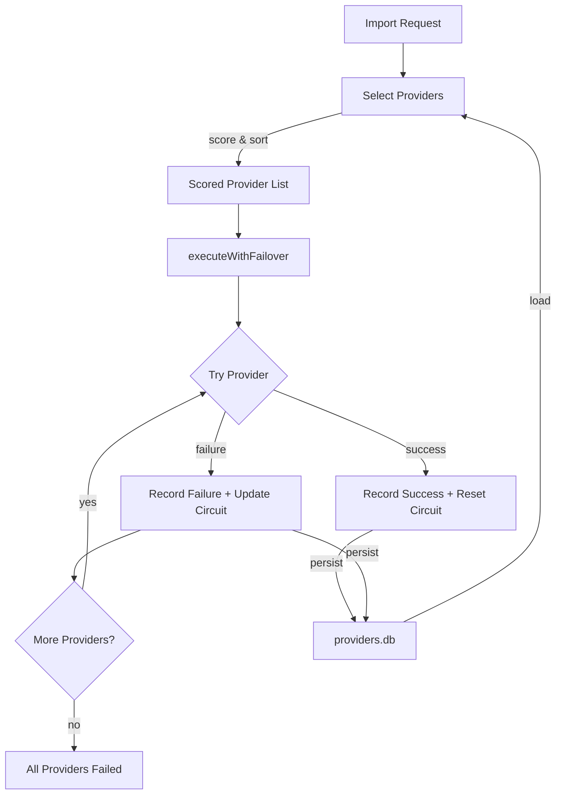

# Provider Resilience

> Exitbook uses scored provider selection, functional circuit breakers, and persisted health state to automatically fail over between blockchain API providers during imports — without user intervention.

## The Problem

Blockchain data comes from third-party API providers (Alchemy, Helius, Blockstream, etc.) that are unreliable in different ways. One provider might rate-limit after 300 requests per minute. Another might have 99.9% uptime but return stale data during block reorganizations. A third might be fast and accurate but only support a subset of chains.

An import that takes 15 minutes should not fail at minute 12 because the provider returned a 429. It should switch to another provider, pick up where it left off, and keep going. And if a provider was flaky yesterday, the system should remember that today instead of trying it first again.

Beyond provider reliability, the system manages four separate SQLite databases to ensure that expensive cached data (prices, token metadata, provider health) survives operations that reset transactional data.

## Design Overview



The resilience system is composed of four independent modules:

- **Provider scoring** ranks available providers by health metrics and circuit breaker state
- **Circuit breakers** track failure counts per provider and block requests to consistently failing providers
- **Failover executor** iterates scored providers, executes the operation, and falls through on failure
- **Provider health store** persists circuit breaker state and health metrics to `providers.db` across CLI invocations

## Key Design Decisions

### Functional circuit breaker (pure state machine)

**Decision**: The circuit breaker is implemented as pure functions that take a `CircuitState` value and return a new `CircuitState` value. No classes, no mutation, no timers.

```typescript
// Pure state transitions
recordFailure(state, now) → newState
recordSuccess(state, now) → newState
getCircuitStatus(state, now) → 'closed' | 'open' | 'half-open'
shouldCircuitBlock(state, now) → boolean
```

**Why**: Pure functions are trivially testable (no setup, no teardown, no time mocking). State is just data — it serializes to JSON for database persistence and deserializes back without reconstruction logic. The three-state model (closed → open → half-open) is a well-understood pattern, and implementing it as pure functions makes the transitions explicit and auditable.

**Alternative considered**: A `CircuitBreaker` class with internal state and timers. This is the common OOP approach, but it couples state management to execution, makes serialization awkward, and requires mocking time in tests.

### Scored provider selection with composable bonuses

**Decision**: Provider selection follows a filter → score → sort pipeline. The base score starts at 100 and applies penalties/bonuses:

| Factor               | Impact        |
| -------------------- | ------------- |
| Circuit open         | -100          |
| Circuit half-open    | -25           |
| Unhealthy            | -50           |
| Response time < 1s   | +20           |
| Response time > 5s   | -30           |
| Error rate           | -(rate x 50)  |
| Consecutive failures | -(count x 10) |

Domain-specific callers can inject additional bonus scoring (e.g., for rate limit headroom or data granularity) via a `bonusScore` callback. Final scores are clamped to `Math.max(0, score)`.

**Why**: Numeric scoring is simple, debuggable (scores appear in logs), and composable. The blockchain provider manager can add chain-specific bonuses without modifying the generic scoring algorithm. A provider with an open circuit breaker scores 0 and falls to the bottom of the list, but isn't permanently excluded — when the recovery timeout expires and it transitions to half-open, it gets a chance to prove itself.

### Persisted health state across CLI invocations

**Decision**: Provider health metrics (failure counts, response times, error rates) and circuit breaker state are persisted to `providers.db` and loaded on each CLI invocation.

**Why**: Exitbook is a CLI tool, not a long-running server. Each command invocation is a fresh process. Without persistence, every invocation starts with a clean slate — a provider that failed 50 times yesterday looks perfectly healthy today. Persisting state means the scoring system has real history to work with.

The CLI applies a 30-second recovery timeout on load (shorter than the standard 5-minute timeout) to account for the time gap between invocations. A provider that was circuit-open 10 minutes ago is given another chance.

### Four-database separation

**Decision**: The system uses four separate SQLite databases:

| Database            | Contents                                                           | Cleared by reprocess? |
| ------------------- | ------------------------------------------------------------------ | --------------------- |
| `transactions.db`   | Accounts, raw transactions, derived transactions, movements, links | Derived data only     |
| `prices.db`         | Historical price cache (external provider responses)               | No                    |
| `token-metadata.db` | ERC-20 token metadata and spam classifications                     | No                    |
| `providers.db`      | Circuit breaker state, health metrics, response times              | No                    |

**Why**: The `reprocess` command needs to clear derived transaction data without losing expensive cached data. Price lookups hit rate-limited external APIs (CoinGecko, CoinMarketCap). Token metadata requires per-contract API calls. Provider health represents accumulated operational knowledge. If these lived in `transactions.db`, every reprocess would wipe them and force re-fetching — a process that can take hours for large portfolios.

Each database is owned by its respective package and initialized independently. The CLI's `command-runtime.ts` initializes `transactions.db`; other databases are initialized by their owning packages on first use.

**Alternative considered**: A single database with selective table deletion. This works but creates coupling between the `clear` command and every cache table. Adding a new cache table requires updating the clear logic. Separate databases make the boundary explicit: "clear derived data" means "operate on `transactions.db`."

## How It Works

### Provider Selection Flow

When a blockchain import begins, the provider manager:

1. Loads all registered providers for the target chain
2. Loads health metrics and circuit breaker state from `providers.db`
3. Calls `selectProviders()` which filters, scores, and sorts providers
4. Passes the sorted list to `executeWithFailover()`

### Failover Execution

`executeWithFailover()` iterates the sorted provider list:

1. For each provider, check the circuit breaker:
   - **Open**: Skip (unless all remaining providers are also open — then try anyway as a last resort)
   - **Half-open**: Allow as a probe attempt, log the test
   - **Closed**: Proceed normally
2. Execute the operation with the provider, racing against optional per-attempt and total timeouts
3. On success: record success (resets circuit breaker), persist metrics, return result
4. On failure: record failure, update circuit breaker, log diagnostics, move to next provider
5. If all providers fail: return a typed error with full attempt diagnostics

The executor supports AbortSignal for cancellation, per-attempt timeouts, and total operation timeouts. Caller-initiated aborts don't penalize the provider (it may have succeeded given more time), but timeout aborts do count as failures since slow responses are a health signal.

### Circuit Breaker State Transitions

```
closed ──[3 failures]──> open ──[5min timeout]──> half-open
  ^                                                    |
  |                                                    |
  └────────────────[1 success]─────────────────────────┘

half-open ──[1 failure]──> open
```

- **Closed** (normal): Requests proceed. Failures increment the counter. After `maxFailures` (default: 3), the circuit opens.
- **Open** (blocking): Requests are skipped. After `recoveryTimeoutMs` (default: 300,000ms / 5 minutes), the circuit transitions to half-open.
- **Half-open** (testing): One request is allowed through as a probe. Success resets to closed. Failure reopens the circuit.

### Streaming Failover

For paginated blockchain imports, failover has additional complexity handled by the provider manager:

- **Same-provider resume**: If the stored cursor is a `pageToken`, only the same provider can resume (page tokens are provider-specific)
- **Cross-provider resume**: If the cursor is a `blockNumber` or `timestamp`, any compatible provider can resume with a replay window to handle potential gaps
- **Dedup window**: The manager maintains an in-memory dedup window (default: 1,000 items) seeded with the last known transaction ID to absorb overlap from replay windows

## Tradeoffs

**Provider-locked cursors limit failover.** Some providers use opaque page tokens that only work with that specific provider. If such a provider fails mid-stream, failover falls back to the last `blockNumber` or `timestamp` alternative cursor, potentially re-fetching some data. The dedup layer handles the overlap, but it's less efficient than a clean resume.

**In-memory dedup window has fixed size.** The 1,000-item window handles normal overlap but could miss duplicates with very large replay windows or very active addresses. A persisted dedup window would solve this but adds complexity and storage overhead.

**Persistence adds startup cost.** Loading health state from `providers.db` on every CLI invocation adds a small overhead. The 30-second recovery timeout heuristic for CLI invocations is a pragmatic compromise — it may be too aggressive (retrying a provider that's genuinely down) or too conservative (waiting to retry a provider that recovered seconds after the last invocation).

## Key Files

| File                                                               | Role                                                             |
| ------------------------------------------------------------------ | ---------------------------------------------------------------- |
| `packages/resilience/src/circuit-breaker/circuit-breaker.ts`       | Pure circuit breaker state machine                               |
| `packages/resilience/src/circuit-breaker/registry.ts`              | Circuit breaker registry (manages state per provider)            |
| `packages/resilience/src/provider-scoring/provider-scoring.ts`     | Health-based scoring algorithm                                   |
| `packages/resilience/src/provider-selection/provider-selection.ts` | Filter → score → sort pipeline                                   |
| `packages/resilience/src/failover/failover.ts`                     | Generic failover executor with timeout and abort support         |
| `packages/resilience/src/provider-stats/provider-health-store.ts`  | SQLite persistence for health metrics                            |
| `packages/blockchain-providers/src/core/`                          | Blockchain-specific provider manager wrapping generic resilience |
