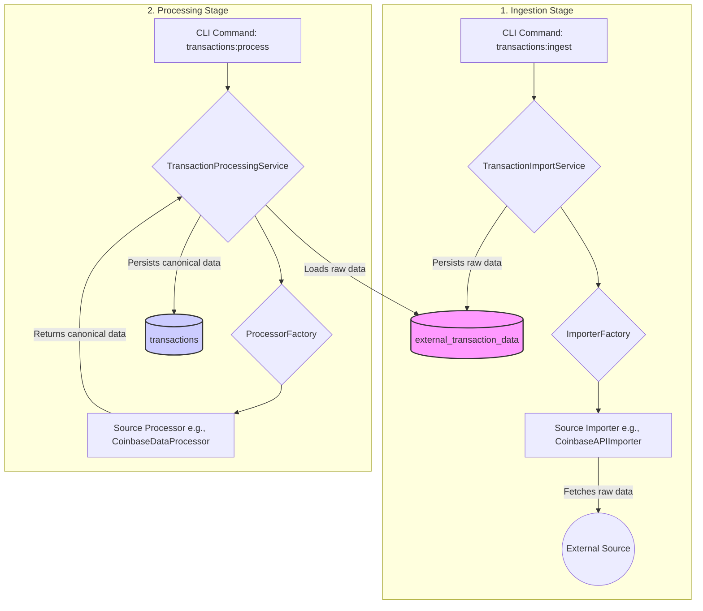
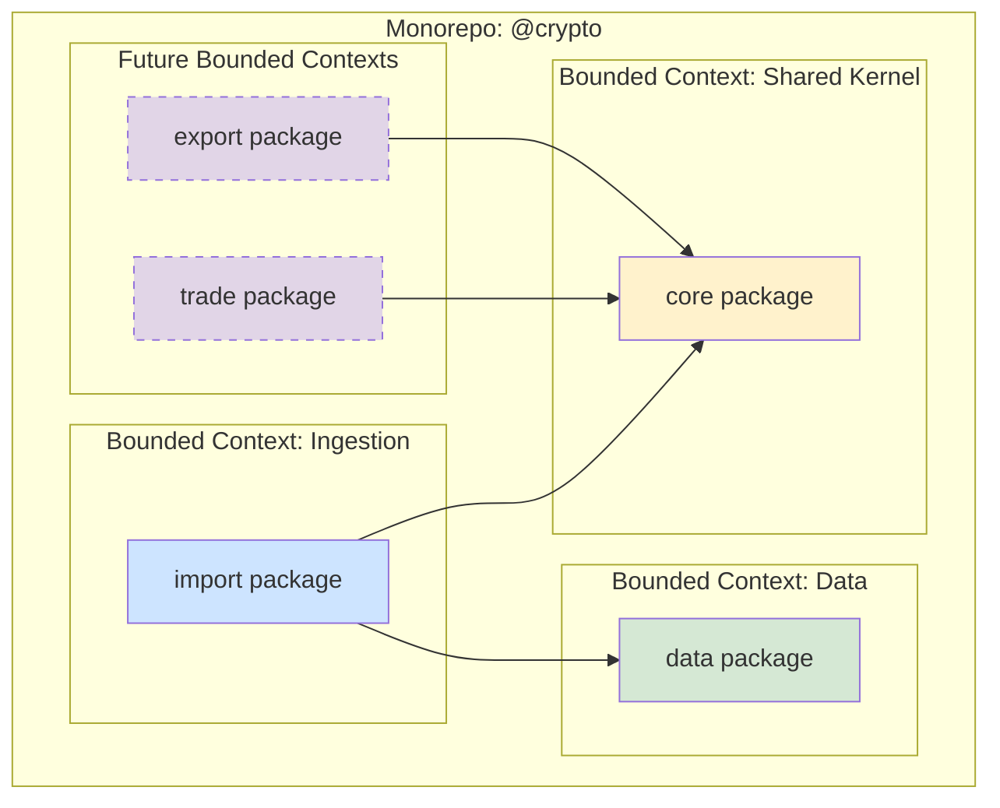

# Project Architecture

## 1. Architectural Philosophy

The architecture of this project is guided by two core principles:
**Domain-Driven Design (DDD)** and **Vertical Slicing**. Our goal is to create a
system that is highly maintainable, scalable, and easy for new developers to
understand because the code's structure directly reflects the business domain it
serves.

The business domain is the management of cryptocurrency transactions, which
involves three primary capabilities:

1.  **Ingesting** data from various external sources (exchanges, blockchains).
2.  **Processing** that data into a single, canonical format.
3.  **Exporting** that canonical data to external formats (e.g., for tax
    software).

This document outlines the design choices made to model these capabilities
effectively.

## 2. The Ubiquitous Language

To ensure clarity between the business domain and the code, we've established a
Ubiquitous Language. These are the core terms used consistently throughout the
codebase, from package names down to class names.

| Term                      | Definition                                                                                                                                                   |
| :------------------------ | :----------------------------------------------------------------------------------------------------------------------------------------------------------- |
| **Ingestion**             | The business process of fetching raw, unprocessed data from an external `Source` and persisting it for later use.                                            |
| **Processing**            | The business process of transforming ingested raw data into our standardized, canonical format.                                                              |
| **Export**                | The business process of converting our canonical data into an external format (e.g., a Koinly CSV).                                                          |
| **Source**                | An external system from which we get data, such as the Coinbase API or the Bitcoin blockchain.                                                               |
| **Canonical Transaction** | The single, authoritative, standardized representation of a transaction within our system. This is our "single source of truth."                             |
| **Importer**              | A component responsible for connecting to a `Source` and fetching its raw data.                                                                              |
| **Processor**             | A component responsible for applying business rules to map raw data from a `Source` into a `CanonicalTransaction`.                                           |
| **Ingestion Service**     | A high-level service that manages the transaction ingestion business process by coordinating the necessary components (Importers, Processors, Repositories). |

## 3. High-Level Architecture: A Decoupled Data Pipeline

The core of the system is a decoupled **ETL (Extract, Transform, Load)**
pipeline, but named according to our Ubiquitous Language. This pipeline ensures
that the high-risk, I/O-bound work of fetching data is cleanly separated from
the CPU-bound, business-logic-heavy work of processing it.

This separation provides resilience: if a processing step fails, it can be
retried without having to re-fetch data from the external source, saving time
and respecting API rate limits.



## 4. Vertical Slicing in Practice

We structure our code around business capabilities (features), not technical
layers. This is **Vertical Slicing**. The best example is how we add support for
a new data source.

**Feature:** "Add support for importing Kraken CSV files."

Instead of scattering code across `services`, `parsers`, and `adapters` folders,
we create a single, self-contained feature slice:

```
packages/import/src/
└── sources/
    ├── coinbase-api/
    │   ├── CoinbaseAPIImporter.ts
    │   ├── CoinbaseDataProcessor.ts
    │   └── types.ts
    └── kraken-csv/          <-- A NEW VERTICAL SLICE
        ├── KrakenCsvImporter.ts   // Implements ITransactionImporter
        ├── KrakenCsvProcessor.ts  // Implements ITransactionProcessor
        ├── types.ts               // Defines the raw Kraken CSV row
        └── index.ts               // Registers the new components with the factories
```

**Benefits of this approach:**

- **High Cohesion:** All the code related to Kraken CSV is in one place.
- **Low Coupling:** The `KrakenCsvImporter` knows nothing about the
  `CoinbaseAPIImporter`. The orchestrating services don't need to be changed;
  they rely on the factory to provide the correct implementation.
- **High Maintainability:** If the Kraken CSV format changes, the development
  team knows exactly which folder to go to, and they can work within that slice
  with high confidence that they won't break other parts of the system.

## 5. Directory Structure: A Monorepo of Bounded Contexts

Our monorepo is not just a code organization strategy; it is a physical
manifestation of our DDD architecture. The project is organized into distinct
packages, where each package represents a **Bounded Context**—a well-defined,
autonomous part of the business domain.

This structure provides the perfect setup for Vertical Slicing on both a macro
(package-level) and micro (feature-level) scale.

```
packages/
├── import/           # The "Import" Bounded Context. Handles all data ingestion and processing.
├── export/           # (Future) The "Export" Bounded Context.
├── trade/            # (Future) The "Trading" Bounded Context for live execution.
├── data/             # The persistence layer, abstracting the database.
└── core/             # Shared Kernel: core domain models like CanonicalTransaction, shared by other contexts.
```



#### Why the Monorepo is the Ideal Choice for This Architecture

1.  **Enforces Clear Boundaries:** Each package is a Bounded Context with its
    own `package.json`. This forces us to be explicit about dependencies. The
    `import` package, for instance, can depend on `core` and `data`, but it
    knows nothing about the `export` package. This prevents the "big ball of
    mud" anti-pattern.

2.  **Supports the Shared Kernel:** A key DDD concept is the **Shared Kernel**,
    where multiple Bounded Contexts share a common subset of the domain model.
    The `@crypto/core` package _is_ our Shared Kernel. It contains critical,
    stable models like `CanonicalTransaction`. The monorepo makes it trivial for
    the `import`, `export`, and `trade` contexts to share this single source of
    truth without code duplication or versioning conflicts.

3.  **Enhances Vertical Slicing:** The monorepo allows us to create vertical
    slices at the package level. The entire "import" feature set lives within
    its own world but can be developed and tested alongside the other parts of
    the system it will eventually interact with.

4.  **Simplified Dependency Management:** Managing dependencies across multiple
    related projects is complex. A monorepo, managed with tools like
    `pnpm workspaces`, streamlines this process. All packages share a single
    `node_modules` directory and a single lock file, ensuring consistency and
    preventing version mismatches.

5.  **Atomic Commits and Refactoring:** Large architectural changes, like the
    refactor described in this document, can be committed atomically across all
    affected packages. This is impossible in a multi-repo setup and dramatically
    reduces the risk of breaking changes.

In summary, the monorepo is not just a folder structure. It is the architectural
foundation that enables our DDD and Vertical Slicing strategies to be
implemented cleanly and effectively. It provides the perfect balance of **strong
boundaries** between contexts and **low friction** for development and
refactoring within the overall system.

## 6. The Role of AI in This Design Process

This architecture was developed through a collaborative process between an
expert developer and an AI model. This is a powerful paradigm that leverages the
strengths of both:

- **The Expert's Role (The Driver):** The developer provided the foundational
  knowledge of software architecture principles (DDD, Vertical Slicing, ETL),
  asked critical questions, and evaluated the AI's suggestions against
  real-world experience and the project's long-term goals. The expert acted as
  the architect, guiding the design.

- **The AI's Role (The Collaborator):** The AI acted as a "Socratic partner" and
  a knowledge accelerator. It was able to:
  1.  Rapidly generate alternative designs based on named patterns (`Extractor`
      vs. `Importer` vs. business-focused terminology).
  2.  Instantly connect high-level principles (like DDD) to concrete
      implementation details (like class and file names).
  3.  Articulate the pros and cons of different approaches, helping to validate
      the expert's instincts.
  4.  Serve as a tireless sounding board for refining the Ubiquitous Language.

The final design is not one that the AI produced on its own, but one that was
arrived at _faster_ and with _higher confidence_ because the expert could use
the AI to explore the solution space and formalize the architecture much more
efficiently than with traditional research alone.
