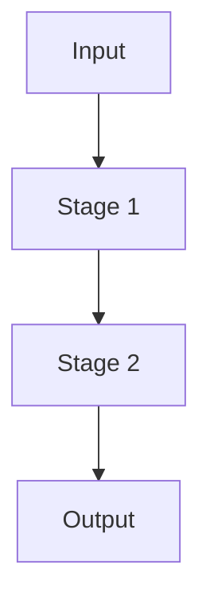

# [Feature/Component Name] Specification

> ⚠️ **Code is law**: If this document disagrees with implementation, the implementation is correct and this spec must be updated.

Brief 1-2 sentence description of what this spec covers.

## Quick Reference

| Concept | Key Rule             |
| ------- | -------------------- |
| `term1` | One-line explanation |
| `term2` | One-line explanation |

## Goals

- **Goal 1**: What this achieves
- **Goal 2**: What this achieves

## Non-Goals

- What this explicitly does NOT handle
- Out-of-scope concerns

## Definitions

### Term 1

Explanation of domain concept. Include schema/shape when helpful:

```ts
{
  field: Type,
  anotherField: Type
}
```

### Term 2

Explanation with semantics that matter.

## Behavioral Rules

### Rule Category 1

How the system behaves in this scenario.

- Sub-rule or constraint
- Another constraint

### Rule Category 2 (Current Behavior)

Description of what the code currently does.

| Condition | Behavior |
| --------- | -------- |
| Case A    | Result A |
| Case B    | Result B |

## Data Model

### Primary Table/Entity

```sql
-- or TypeScript interface, or JSON schema
field1 TEXT NOT NULL,
field2 TEXT
```

#### Field Semantics

- `field1`: What it means, when it's used
- `field2`: Optional context

## Pipeline / Flow (if applicable)



Or describe stages in prose with clear ordering.

## Invariants

- **Required**: `condition` must always hold
- **Enforced**: How/where this is validated

## Edge Cases & Gotchas

- **Gotcha 1**: Non-obvious behavior to watch out for
- **Edge case**: Specific scenario and how it's handled

## Known Limitations (Current Implementation)

- What doesn't work yet or has constraints
- Workarounds if any

## Related Specs

- [Other Spec](./other-spec.md) — how it relates
- [Decision Record](../decisions/001-decision. md) — why a choice was made

---

_Last updated: YYYY-MM-DD_
