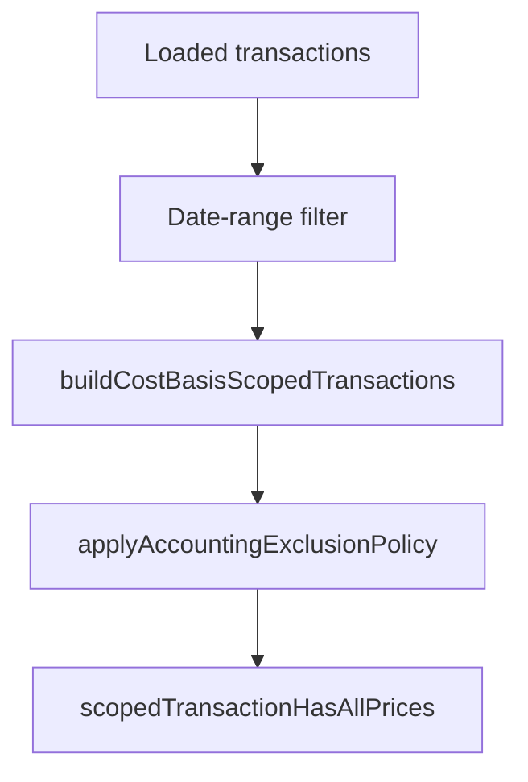
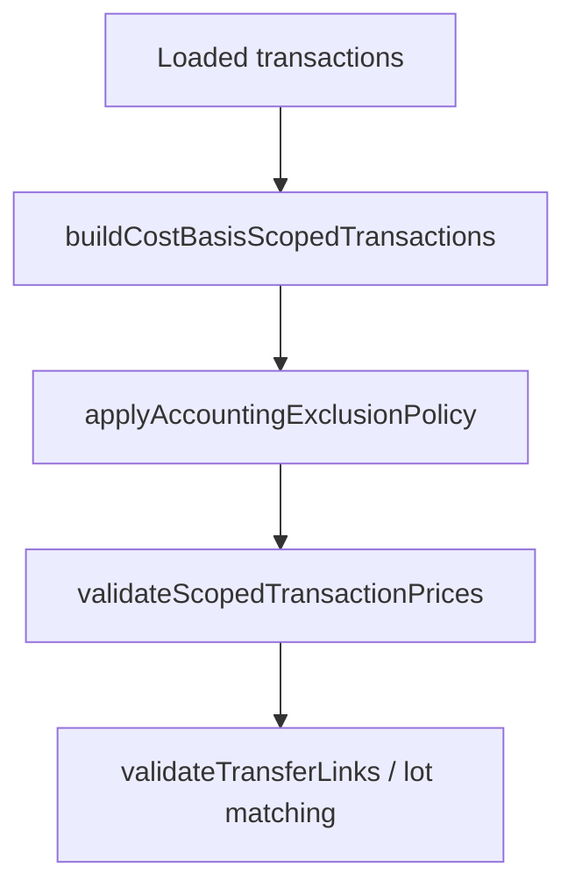

# Accounting Exclusions Specification

> ⚠️ **Code is law**: If this document disagrees with implementation, the implementation is correct and this spec must be updated.

Defines how Exitbook excludes transactions or assets from accounting-facing workflows today. This covers the persistence-owned whole-transaction exclusion layer, the override-driven asset exclusion policy, and the accounting-scoped seam where mixed transactions are pruned without hiding included activity.

## Quick Reference

| Concept              | Key Rule                                                                                          |
| -------------------- | ------------------------------------------------------------------------------------------------- |
| Baseline exclusion   | Whole-transaction exclusion is persisted on `transactions.excluded_from_accounting`               |
| Spam/scam signal     | diagnostics may inform review surfaces, but they do not auto-set baseline exclusion               |
| User policy source   | Asset exclusions come from override events, not a balances projection or cached transaction field |
| Policy identity      | User exclusions are keyed by `profileKey + assetId`, never by display symbol alone                |
| Scoped seam          | Asset exclusion is applied after `buildCostBasisScopedTransactions()`                             |
| Mixed transactions   | Excluded movements and fees are pruned; surviving included activity stays in scope                |
| Price gating         | Price coverage and cost basis validate the post-exclusion scoped result                           |
| Soft price exclusion | `missingPricePolicy: 'exclude'` is a missing-price fallback, not user exclusion policy            |

## Goals

- **Durable user policy**: Keep user inclusion/exclusion decisions in durable override storage instead of derived projections.
- **Correct mixed-transaction handling**: Allow excluded assets to disappear from accounting without dropping included legs from the same transaction.
- **Clear ownership boundaries**: Keep whole-transaction exclusion in persistence and asset-level mixed exclusion inside accounting.
- **Fail-closed accounting**: Invalid override replay or missing required prices must not silently degrade tax-facing behavior.

## Non-Goals

- Making balances or balance verification the source of truth for accounting exclusions.
- Applying partial-asset exclusion inside repositories or the lot matcher.
- Reusing `transactions.excluded_from_accounting` as the effective cache for asset-level override policy.
- Introducing transaction-level user override scopes beyond the existing persisted baseline transaction flag.

## Definitions

### Baseline Transaction Exclusion

Persistence-owned whole-transaction exclusion stored on `transactions.excluded_from_accounting` and materialized as `Transaction.excludedFromAccounting`.

Current write rule:

```text
excluded_from_accounting =
  transaction.excludedFromAccounting ?? false
```

Consequences:

- `excludedFromAccounting` is the only persisted whole-transaction exclusion input.
- spam/scam diagnostics remain available to downstream review and visibility policy, but they do not auto-write the baseline exclusion flag.
- Repository reads round-trip exclusion as `true | undefined`, not strict `true | false`.

### Accounting Exclusion Policy

Accounting-owned asset filter loaded from override events:

```ts
interface AccountingExclusionPolicy {
  excludedAssetIds: ReadonlySet<string>;
}
```

The current override scopes are:

```ts
type AssetExcludeOverride = {
  profile_key: string;
  scope: 'asset-exclude';
  payload: { type: 'asset_exclude'; asset_id: string };
};

type AssetIncludeOverride = {
  profile_key: string;
  scope: 'asset-include';
  payload: { type: 'asset_include'; asset_id: string };
};
```

Replay semantics are strict and deterministic:

- only `asset-exclude` and `asset-include` scopes are accepted
- payload `type` must exactly match the scope
- events replay in append order
- override reads are scoped by top-level `profile_key`
- latest event wins per `asset_id` within that profile stream
- missing `overrides.db` means "no asset exclusions"

### Scoped Exclusion Application

Asset exclusions are applied to the accounting-scoped build result, not to raw repository rows:

```ts
interface AccountingExclusionApplyResult {
  fullyExcludedTransactionIds: Set<number>;
  partiallyExcludedTransactionIds: Set<number>;
  scopedBuildResult: AccountingScopedBuildResult;
}
```

This is the seam that preserves included activity inside mixed transactions.

## Behavioral Rules

### Persistence-Owned Whole-Transaction Exclusion

Default transaction repository reads treat `transactions.excluded_from_accounting = true` as out of scope.

Current default behavior:

- `findAll()` excludes those rows unless `includeExcluded: true`
- `count()` excludes those rows unless `includeExcluded: true`
- `findNeedingPrices()` excludes those rows unconditionally

This is the baseline exclusion layer used before accounting logic starts.

### Override Replay Is The User Policy Source Of Truth

CLI accounting surfaces load asset exclusions from the durable override store by:

1. reading `asset-exclude` and `asset-include` events
2. replaying the active profile's event stream with latest-event-wins semantics
3. constructing `AccountingExclusionPolicy { excludedAssetIds }`

This keeps user policy independent from projection rebuilds and database resets of derived data.

### Asset Exclusion Runs After Scoped Build

`applyAccountingExclusionPolicy(...)` runs after `buildCostBasisScopedTransactions(...)`.

For each scoped transaction it:

- removes inflows whose `assetId` is excluded
- removes outflows whose `assetId` is excluded
- removes fees whose `assetId` is excluded
- drops the entire scoped transaction if nothing remains
- marks the transaction as partially excluded if some activity survives

It also removes `feeOnlyInternalCarryovers` whose carryover `assetId` is excluded.

Raw source transactions are not mutated. Repository-level visibility does not change.

### Mixed Transactions Stay In Scope When Included Activity Survives

Example:

```text
SCAMTOKEN -> ETH
```

With `SCAMTOKEN` excluded:

- scoped `SCAMTOKEN` movements and fees are removed
- scoped `ETH` activity remains in accounting
- the transaction remains in the scoped batch if at least one included movement or fee survives
- price validation no longer requires prices for the pruned `SCAMTOKEN` legs

This is the core reason exclusions belong after scoped build instead of at repository read time.

### Price Coverage And Cost Basis Consume The Post-Exclusion Scoped Boundary

Price coverage flow:



Generic cost-basis flow:



Rules:

- price completeness is evaluated on the scoped result after exclusions
- excluded scoped movements and excluded scoped fees do not block price coverage
- surviving scoped movements and fees still require complete pricing
- soft portfolio-style missing-price handling rebuilds the scoped subset from surviving raw transactions, then reapplies exclusions

### Canada Uses The Same Exclusion Seam

Canada ACB does not bypass exclusions. It follows:

```text
buildCostBasisScopedTransactions()
  -> applyAccountingExclusionPolicy()
  -> validateTransferLinks()
  -> buildCanadaTaxInputContext()
  -> ACB engine
```

That keeps generic and Canada accounting behavior aligned on the same exclusion boundary.

### Operator And Observability Surfaces Can Still Opt Into Excluded Rows

Some surfaces intentionally read excluded rows by passing `includeExcluded: true`.

Current examples:

- transactions view / transactions explore
- transactions export
- assets exclusion commands, which resolve assets against the full known-transaction set
- balance verification, which inspects excluded persisted transactions separately

These are operator surfaces, not accounting filters.

## Data Model

### Transactions

```sql
excluded_from_accounting INTEGER NOT NULL DEFAULT 0
```

Semantics:

- `excluded_from_accounting` is the persisted whole-transaction baseline exclusion flag.

### Override Events

```ts
type Scope = 'asset-exclude' | 'asset-include' | 'price' | 'fx' | 'link' | 'unlink';
```

For accounting exclusions, only these are relevant:

- `asset-exclude`
- `asset-include`

The override store persists events durably in `overrides.db`, scopes them by
top-level `profile_key`, and returns them in append order.

## Invariants

- **Required**: Whole-transaction exclusion remains a persistence concern.
- **Required**: Asset-level mixed exclusion remains an accounting concern applied after scoped build.
- **Required**: User exclusion policy is keyed by `profileKey + assetId`, not symbol text.
- **Required**: Invalid exclusion override scope/payload combinations fail replay instead of being skipped.
- **Required**: Generic cost basis, Canada ACB, and price coverage all apply the same asset exclusion policy shape.
- **Required**: `missingPricePolicy: 'exclude'` never stands in for user-directed exclusion policy.

## Edge Cases & Gotchas

- `transactions.excluded_from_accounting` does not mean "effective asset exclusion state." Asset override policy is ephemeral and scoped-accounting-local.
- A transaction can be fully excluded at the scoped layer without being persisted as `excluded_from_accounting = true`.
- Symbol-based exclusion requests are only a CLI convenience; ambiguous symbols must resolve to a single `assetId` or the command errors.
- Excluding an asset prunes same-asset fees and fee-only internal carryovers for that asset too.
- Repository-level exclusion and accounting-scoped exclusion are additive layers, not substitutes for each other.

## Known Limitations (Current Implementation)

- There is no dedicated user override scope for whole-transaction include/exclude; user policy is asset-scoped.
- Effective asset exclusion is not persisted back onto transaction rows as a cached field.
- Balance verification still reasons about excluded persisted transactions via `tx.excludedFromAccounting === true`; it is not a full consumer of the scoped asset exclusion policy.
- Non-accounting consumers that only use default repository reads still only inherit the persisted whole-transaction exclusion layer.

## Related Specs

- [Cost Basis Accounting Scope](./cost-basis-accounting-scope.md)
- [Transfers & Tax](./transfers-and-tax.md)
- [Canada Average Cost Basis](./average-cost-basis.md)
- [Fees](./fees.md)

---

_Last updated: 2026-03-10_
