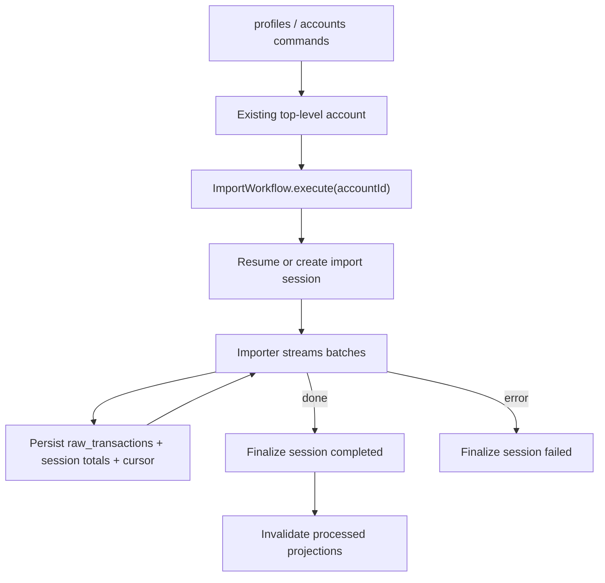

# Accounts & Imports Specification

> ⚠️ **Code is law**: If this disagrees with implementation, update the spec to match code.

How Exitbook models profiles and accounts, and how imports run against those saved accounts.

## Quick Reference

| Concept                     | Key Rule                                                                                                  |
| --------------------------- | --------------------------------------------------------------------------------------------------------- |
| Profile identity            | Profiles have mutable `name` plus immutable `profileKey`                                                  |
| Top-level account lifecycle | Top-level accounts are explicitly created before import                                                   |
| Import entrypoint           | `ImportWorkflow.execute({ accountId })` syncs one existing account                                        |
| Top-level exchange identity | Unique on `(platform_key, COALESCE(profile_id, 0))` for exchange top-level rows                           |
| Blockchain / child identity | Unique on `(account_type, platform_key, identifier, COALESCE(profile_id, 0))` outside top-level exchanges |
| Top-level account naming    | Unique on `(COALESCE(profile_id, 0), lower(name))`                                                        |
| Import resumability         | Latest `started` or `failed` session is resumed                                                           |
| Cursor storage              | Stored per `streamType` in `accounts.lastCursor`; merged, not replaced                                    |
| Raw dedupe                  | `raw_transactions` unique on `(account_id, event_id)`                                                     |
| Xpub child accounts         | Derived child rows remain internal and may be created during sync                                         |

## Core Model

### Profile

Profiles are the CLI ownership and scope model.

```ts
{
  id: number,
  profileKey: string,
  displayName: string,
  createdAt: Date
}
```

Rules:

- `displayName` is the mutable display label
- `profileKey` is the stable identity anchor used by deterministic fingerprints
- `profiles add <profile>` creates the profile with `displayName === profileKey` initially
- `profiles update <profile> --name <display-name>` changes only the display label
- commands use the active profile unless `--profile <profile>` overrides it
- keeping wallets that belong to a different owner or accounting boundary in a
  separate profile can improve wallet-link investigation cues, because
  cross-profile ownership is meaningful evidence that the wallet is not owned
  by the active profile

### Account

Accounts are the named top-level sync targets users create and import.

```ts
{
  id: number,
  profileId: number,
  name?: string,
  parentAccountId?: number,
  accountType: 'blockchain' | 'exchange-api' | 'exchange-csv',
  platformKey: string,
  identifier: string,
  accountFingerprint: string,
  providerName?: string,
  credentials?: { apiKey: string; apiSecret: string; apiPassphrase?: string },
  lastCursor?: Record<string, CursorState>,
  metadata?: {
    xpub?: {
      gapLimit: number,
      lastDerivedAt: number,
      derivedCount: number
    }
  },
  createdAt: Date,
  updatedAt?: Date
}
```

Semantics:

- top-level accounts are user-created and named
- child accounts are internal derived rows and remain unnamed
- every persisted account belongs to exactly one profile
- `accountFingerprint` is the canonical persisted account identity
- exchange API keys and CSV directories are sync config, not top-level exchange identity
- blockchain identifiers remain semantic identity for wallet accounts

### Import Session

```ts
{
  id: number,
  accountId: number,
  status: 'started' | 'completed' | 'failed' | 'cancelled',
  startedAt: Date,
  completedAt?: Date,
  durationMs?: number,
  transactionsImported: number,
  transactionsSkipped: number,
  errorMessage?: string,
  errorDetails?: unknown
}
```

## Behavioral Rules

### Account Lifecycle

- top-level accounts are created through `accounts add`, not through `import`
- `accounts update` mutates sync config for an existing account
- `accounts remove` is destructive for that account and its attached data
- `import --all` enumerates top-level accounts for one profile only

### Account Identity

Current DB constraints:

- top-level account names are unique per profile
- top-level exchange accounts are unique per `profile + platform`
- blockchain accounts and child accounts stay unique by `accountType + platformKey + identifier + profile`

That means:

- one profile can only have one top-level Kraken account, regardless of CSV vs API mode
- switching an exchange account between CSV and API mode updates config instead of defining a new top-level identity
- blockchain addresses/xpubs remain distinct by identifier

### Import Scope

- import syncs one existing account by `accountId`
- CLI resolution from account name to ID happens before ingestion
- ingestion never creates user-facing top-level accounts
- xpub imports may create internal child account rows under the selected parent account

### Sessions & Resumability

| Condition                                   | Behavior                                   |
| ------------------------------------------- | ------------------------------------------ |
| Latest session status `started` or `failed` | Resume same session and continue totals    |
| No incomplete session                       | Create a new session with status `started` |

### Streaming & Cursor Persistence

Importers yield batches:

```ts
{
  (rawTransactions, streamType, cursor, isComplete);
}
```

For each committed batch, Exitbook:

1. saves raw transactions
2. updates import-session totals
3. updates `accounts.lastCursor[streamType]`

Those writes happen atomically per batch.

### Raw Transaction Dedupe

- `raw_transactions` is unique on `(account_id, event_id)`
- duplicate raw rows count as `skipped`, not fatal errors

### Projection Invalidation

After a successful import with inserted raw data:

- `processed-transactions` is marked stale
- downstream projections are invalidated
- links invalidation is profile-scoped
- balance invalidation is balance-scope-scoped

## Data Model

### profiles

```sql
id INTEGER PK,
profile_key TEXT NOT NULL UNIQUE,
name TEXT NOT NULL UNIQUE (case-insensitive),
created_at TEXT NOT NULL
```

### accounts

```sql
id INTEGER PK,
profile_id INTEGER NOT NULL REFERENCES profiles(id),
name TEXT NULL,
parent_account_id INTEGER NULL REFERENCES accounts(id),
account_type TEXT NOT NULL,
platform_key TEXT NOT NULL,
identifier TEXT NOT NULL,
account_fingerprint TEXT NOT NULL,
provider_name TEXT NULL,
credentials TEXT NULL,
last_cursor TEXT NULL,
metadata TEXT NULL,
created_at TEXT NOT NULL,
updated_at TEXT NULL
```

Important indexes:

```sql
UNIQUE (account_fingerprint)

-- Blockchain + child identity
UNIQUE (account_type, platform_key, identifier, COALESCE(profile_id, 0))
WHERE NOT (account_type IN ('exchange-api', 'exchange-csv') AND parent_account_id IS NULL)

-- Top-level exchange identity
UNIQUE (platform_key, COALESCE(profile_id, 0))
WHERE account_type IN ('exchange-api', 'exchange-csv') AND parent_account_id IS NULL

-- Top-level account names
UNIQUE (COALESCE(profile_id, 0), lower(name))
WHERE name IS NOT NULL AND parent_account_id IS NULL
```

### import_sessions

```sql
id INTEGER PK,
account_id INTEGER NOT NULL REFERENCES accounts(id),
status TEXT NOT NULL,
started_at TEXT NOT NULL,
completed_at TEXT NULL,
duration_ms INTEGER NULL,
transactions_imported INTEGER NOT NULL,
transactions_skipped INTEGER NOT NULL,
error_message TEXT NULL,
error_details TEXT NULL,
created_at TEXT NOT NULL,
updated_at TEXT NULL
```

### raw_transactions

```sql
id INTEGER PK,
account_id INTEGER NOT NULL REFERENCES accounts(id),
provider_name TEXT NOT NULL,
event_id TEXT NOT NULL,
source_address TEXT NULL,
blockchain_transaction_hash TEXT NULL,
timestamp INTEGER NOT NULL,
transaction_type_hint TEXT NULL,
provider_data TEXT NOT NULL,
normalized_data TEXT NOT NULL,
processing_status TEXT NOT NULL,
processed_at TEXT NULL,
created_at TEXT NOT NULL
```

Unique index:

```sql
UNIQUE (account_id, event_id)
```

## Flow



## Invariants

- **Required**: top-level imports target existing accounts only.
- **Required**: top-level exchange identity is profile-scoped by platform, not API key or CSV path.
- **Required**: blockchain and child identities remain keyed by identifier.
- **Required**: latest incomplete session is resumed.
- **Required**: raw transaction dedupe is per `(account_id, event_id)`.
- **Required**: xpub child rows stay internal and unnamed.

## Known Limitations

- the data model still permits `profile_id NULL` rows for lower-level tracking use-cases, but the current CLI creates profile-owned accounts
- xpub gap expansion is metadata-driven; already-derived children are reused
- internal child accounts still share the same `accounts` table as top-level user-facing accounts

## Related Specs

- [Streaming Import Pipeline](../architecture/import-pipeline.md)
- [Transaction and Movement Identity](./transaction-and-movement-identity.md)
- [Balance Projection](./balance-projection.md)
