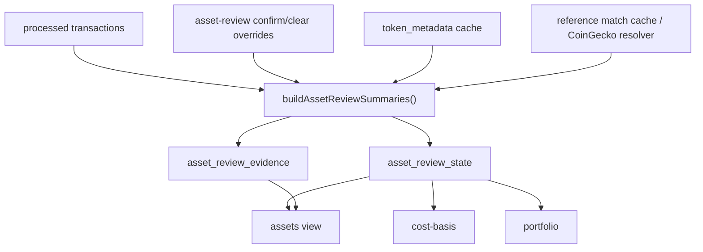

# Asset Review Specification

> ⚠️ **Code is law**: If this document disagrees with implementation, the implementation is correct and this spec must be updated.

Define how Exitbook detects suspicious assets, persists current review state,
and applies review policy to CLI consumers and accounting. Asset review keeps
provider facts, risk evidence, reference status, user review state, and
accounting exclusion as separate concerns even when they are shown together in
`assets view`.

## Quick Reference

| Concept              | Key Rule                                                                 |
| -------------------- | ------------------------------------------------------------------------ |
| `asset facts`        | Descriptive provider facts are not trust decisions                       |
| `risk evidence`      | Additive suspicious/ambiguity signals that drive review                  |
| `reference status`   | `matched`, `unmatched`, or `unknown`; useful context, not a spam verdict |
| `review state`       | Current workflow state: `clear`, `needs-review`, or `reviewed`           |
| `override store`     | Durable audit log for confirm/clear/include/exclude intent               |
| `asset_review_state` | Current per-asset review snapshot stored in `transactions.db`            |
| `accountingBlocked`  | `true` for same-symbol ambiguity or unresolved error evidence            |

## Goals

- Keep asset facts, risk evidence, reference status, review workflow state, and
  accounting exclusion conceptually separate.
- Persist a queryable current-state review projection in `transactions.db`
  instead of rebuilding review summaries ad hoc in each consumer.
- Keep write-side user intent in override events.
- Prevent transaction-level scam signals from smearing across unrelated assets
  in the same transaction.
- Make `assets view`, `cost-basis`, and `portfolio` consume the same projected
  review state.
- Fail closed in accounting only for blocking evidence, not every warning.

## Non-Goals

- Creating a dedicated `asset-review.db`.
- Replacing the override event store.
- Moving `token_metadata`, `token_reference_matches`, or
  `reference_platform_mappings` out of `token-metadata.db`.
- Introducing incremental per-asset merge logic; the current projection rebuild
  is full replace.
- Expanding same-symbol ambiguity and reference-resolution semantics to all
  non-EVM asset types.
- Collapsing review state into accounting exclusion.

## Concern Split

### Asset Facts

Asset facts are descriptive provider facts tied to the asset itself.

Examples:

- blockchain / exchange identity
- contract address or mint
- symbol, name, decimals
- provider-returned metadata

These facts are not trust decisions.

### Risk Evidence

Risk evidence is additive evidence that an asset may be suspicious or ambiguous
and needs review.

Current risk evidence kinds:

- `provider-spam-flag`
- `spam-flag`
- `scam-note`
- `suspicious-airdrop-note`
- `same-symbol-ambiguity`

Risk evidence can drive `needs-review` or `accountingBlocked`, but it does not
exclude an asset by itself.

### Reference Status

Reference status answers whether the asset resolved to an external canonical
registry entry.

Allowed values:

- `matched`
- `unmatched`
- `unknown`

Reference status is useful context for review and ambiguity resolution. It is
not a spam verdict and does not block accounting on its own.

### Review State

Review state is the current workflow answer for an asset:

- `clear`
- `needs-review`
- `reviewed`

It is derived from current evidence plus replayed review overrides.

### Accounting Exclusion

Accounting exclusion is separate from review state.

- exclusion is user accounting policy
- review is investigation workflow

An asset can be included and still need review. An asset can be excluded and
already be reviewed.

## Storage Boundaries

### Override Store

The override store remains the write-side audit log for:

- `asset-review-confirm`
- `asset-review-clear`
- `asset-exclude`
- `asset-include`

Review replay is strict and latest-event-wins per asset.

### `transactions.db`

The persisted asset-review read model lives in `transactions.db`:

- `asset_review_state`
- `asset_review_evidence`

This is current-state projection data, not provider cache data.

### `token-metadata.db`

Provider/reference cache data stays in `token-metadata.db`:

- `token_metadata`
- `token_reference_matches`
- `reference_platform_mappings`

These tables remain external cache/reference inputs for asset review, not the
source of truth for user workflow state.

## Current Summary Shape

```ts
interface AssetReviewSummary {
  assetId: string;
  reviewStatus: 'clear' | 'needs-review' | 'reviewed';
  referenceStatus: 'matched' | 'unmatched' | 'unknown';
  evidenceFingerprint: string;
  confirmationIsStale: boolean;
  accountingBlocked: boolean;
  confirmedEvidenceFingerprint?: string;
  warningSummary?: string;
  evidence: Array<{
    kind:
      | 'provider-spam-flag'
      | 'scam-note'
      | 'suspicious-airdrop-note'
      | 'same-symbol-ambiguity'
      | 'spam-flag'
      | 'unmatched-reference';
    severity: 'warning' | 'error';
    message: string;
    metadata?: Record<string, unknown>;
  }>;
}
```

`warningSummary` is a convenience summary for UI. It is currently built by
joining evidence messages with `; `.

## Data Model

### `asset_review_state`

```sql
asset_id TEXT PRIMARY KEY,
review_status TEXT NOT NULL,
reference_status TEXT NOT NULL,
warning_summary TEXT,
evidence_fingerprint TEXT NOT NULL,
confirmed_evidence_fingerprint TEXT,
confirmation_is_stale INTEGER NOT NULL DEFAULT 0,
accounting_blocked INTEGER NOT NULL DEFAULT 0,
computed_at TEXT NOT NULL
```

Field semantics:

- `asset_id`: stable asset identity from the asset identity model
- `review_status`: current workflow status
- `reference_status`: current canonical-reference resolution state
- `warning_summary`: flattened evidence summary for CLI display
- `evidence_fingerprint`: canonical hash of current evidence plus
  `referenceStatus`
- `confirmed_evidence_fingerprint`: fingerprint last confirmed by the user
- `confirmation_is_stale`: `true` when a confirmation exists but no longer
  matches current evidence
- `accounting_blocked`: derived fail-closed gate consumed by accounting
- `computed_at`: rebuild timestamp for the row set

Enforced constraints:

- `review_status IN ('clear', 'needs-review', 'reviewed')`
- `reference_status IN ('matched', 'unmatched', 'unknown')`
- index on `review_status`
- index on `accounting_blocked`

### `asset_review_evidence`

```sql
id INTEGER PRIMARY KEY AUTOINCREMENT,
asset_id TEXT NOT NULL,
position INTEGER NOT NULL,
kind TEXT NOT NULL,
severity TEXT NOT NULL,
message TEXT NOT NULL,
metadata_json TEXT
```

Field semantics:

- `asset_id`: parent asset
- `position`: stable display/persistence order within an asset
- `kind`: evidence classifier
- `severity`: `warning` or `error`
- `message`: user-facing summary
- `metadata_json`: secondary details for evidence types that need structured
  context

Enforced constraints:

- FK to `asset_review_state.asset_id` with cascade delete
- unique index on `(asset_id, position)`
- index on `asset_id`
- index on `kind`
- `kind` constrained to the current evidence enum
- `severity IN ('warning', 'error')`
- `metadata_json` must be valid JSON when present

`same-symbol-ambiguity` stores `chain`, `normalizedSymbol`, and
`conflictingAssetIds` in `metadata_json` rather than using a separate collision
table.

## Projection Pipeline



Rebuild inputs:

- all processed transactions, including excluded assets
- replayed review decisions from the override store
- optional token metadata reads
- optional reference resolution

Rebuild output:

- a full replacement of `asset_review_state` and `asset_review_evidence`
- `projection_state('asset-review')` marked fresh with metadata
  `{ assetCount }`

## Evidence Collection Rules

### Asset Signal Scope

Signals are collected per asset ID across:

- inflows
- outflows
- fees

Within one transaction, each asset contributes at most one note-derived signal
update. Duplicate movement/fee entries for the same asset in the same
transaction do not double-count evidence.

### Note Targeting Rules

Transaction notes are applied in this order:

1. Exact asset match via `note.metadata.assetId`
2. Contract match via `note.metadata.contractAddress`
3. Symbol match via `note.metadata.assetSymbol` or `note.metadata.scamAsset`,
   but only when that symbol resolves to exactly one asset inside the
   transaction
4. Untargeted note fallback, but only when the transaction has exactly one
   primary movement asset

Implications:

- fee/native assets do not inherit token scam evidence unless the note actually
  targets them
- symbol-targeted notes do not smear across multiple assets that share the same
  symbol in the same transaction
- untargeted notes are only safe when the transaction effectively names one
  primary asset

### Spam and Scam Evidence

Current evidence rules:

- `token_metadata.possibleSpam === true` produces `provider-spam-flag`
  (`error`)
- `transaction.isSpam === true` produces `spam-flag` (`error`) when the asset
  is the only primary asset or a targeted scam note applies to it
- one or more `SCAM_TOKEN` notes produce `scam-note`
- one or more `SUSPICIOUS_AIRDROP` notes produce
  `suspicious-airdrop-note`
- `referenceStatus === 'unmatched'` produces `unmatched-reference`
  (`warning`)

Severity rules:

- `scam-note` is `error` if any contributing `SCAM_TOKEN` note is not
  `warning`; otherwise it is `warning`
- `suspicious-airdrop-note` is `error` only if any contributing
  `SUSPICIOUS_AIRDROP` note is `error`; warning-only airdrop notes stay
  non-blocking

Count-based note evidence stores `{ count }` in metadata.

### Same-Symbol Ambiguity

Same-symbol ambiguity is generated when more than one distinct non-native EVM
asset ID appears with the same normalized symbol on the same chain across
processed movements.

Rules:

- compare `assetSymbol.trim().toLowerCase()`
- group by `<chain>:<normalizedSymbol>`
- ignore exchange assets
- ignore native assets
- ignore non-EVM blockchain assets

Each conflicting asset receives a `same-symbol-ambiguity` evidence item with
metadata:

```ts
{
  chain: string;
  normalizedSymbol: string;
  conflictingAssetIds: string[];
}
```

### Reference Status Semantics

Reference status is resolved separately from risk evidence.

- `matched`: an external canonical contract mapping was found
- `unmatched`: a reference lookup ran and did not find a match
- `unknown`: reference resolution was unavailable, unsupported, or has not yet
  produced a result

`unknown` reference data does not create review evidence by itself.
`unmatched` reference data produces warning evidence so the asset enters review.

### Evidence Ordering

Evidence is sorted before fingerprinting and persistence by:

1. `kind`
2. `severity`
3. `message`

Persisted evidence order must remain stable because `position` is stored in the
read model.

## Review-State Rules

### Evidence Fingerprint

The evidence fingerprint is:

- SHA-256 over canonical JSON
- JSON is recursively key-sorted
- fingerprint input includes:
  - `assetId`
  - `referenceStatus`
  - `evidence[]`
- stored as `asset-review:v1:<hex>`

This fingerprint is the contract between current evidence and a prior user
confirmation.

### Status Derivation

Base status:

- no evidence -> `clear`
- any evidence -> `needs-review`

Replay rules:

- a matching `asset-review-confirm` for the current fingerprint promotes the
  asset to `reviewed`
- a stale confirmation keeps `confirmedEvidenceFingerprint`, sets
  `confirmationIsStale = true`, and reopens the asset to `needs-review`
- `asset-review-clear` removes the effect of any prior confirmation for that
  asset

Override replay is latest-event-wins per asset.

## Accounting Policy

`accountingBlocked` is derived from evidence and review state, then consumed by
accounting preflight.

| Condition                                                         | `accountingBlocked` |
| ----------------------------------------------------------------- | ------------------- |
| Any `same-symbol-ambiguity` evidence                              | `true`              |
| No ambiguity and `reviewStatus !== 'needs-review'`                | `false`             |
| `reviewStatus === 'needs-review'` and any `error` evidence exists | `true`              |
| Warning-only evidence with no ambiguity                           | `false`             |

Implications:

- same-symbol ambiguity stays blocking even after confirmation
- confirming non-ambiguity evidence can unblock accounting when the confirmed
  fingerprint still matches
- warning-only evidence remains visible in `assets view` without breaking
  accounting

Accounting exclusion remains a separate policy layer on top of review state.

## Projection Lifecycle

### Graph Position

`asset-review` is a first-class projection with:

- projection id: `asset-review`
- owner: `ingestion`
- dependency: `processed-transactions`
- no downstream projections today

### Processing-Time Rebuild

After processed transactions are successfully rebuilt:

1. `processed-transactions` is marked fresh
2. downstream projections are marked stale
3. asset review is rebuilt immediately

If the asset-review rebuild fails, processing returns an error instead of
quietly leaving consumers on stale data.

### Read-Time Freshness

CLI consumers call `ensureAssetReviewProjectionFresh()` before reading review
state.

The projection rebuilds when any of the following are true:

- `projection_state('asset-review')` is `stale`
- `projection_state('asset-review')` is `failed`
- `projection_state('asset-review')` is `building`
- processed transactions exist and asset review has never been built
- processed transactions are newer than the latest `asset_review_state.computed_at`
- external asset-review inputs changed after the last fresh build

External freshness currently tracks the latest of:

- `asset-review-confirm` overrides
- `asset-review-clear` overrides
- `token_metadata.refreshed_at`
- `token_reference_matches.refreshed_at`
- `reference_platform_mappings.refreshed_at`

### Replace Semantics

Projection writes are full replace:

1. mark projection `building`
2. compute all summaries
3. delete all evidence rows
4. delete all state rows
5. insert all current state rows
6. insert all current evidence rows
7. mark projection `fresh`

State/evidence replacement plus `projection_state.markFresh()` happens in one
database transaction.

### Reset Semantics

Reset deletes all `asset_review_state` and `asset_review_evidence` rows and
marks the projection stale with reason `reset`.

## CLI and Consumer Behavior

### `assets view`

`assets view` is the primary review surface.

The user-facing TUI contract lives in
[`docs/specs/cli/assets/assets-view-spec.md`](./cli/assets/assets-view-spec.md).
This spec keeps the consumer/data contract here and leaves presentation details
to the CLI spec.

It reads:

- projected review state from `asset_review_*`
- current quantity from balance snapshot assets
- exclusion state from the override store
- known asset symbols/history from processed transactions

`assets view` reads exclusion state from the override store for rows that already
exist in holdings/history/review data. Override-only exclusions are managed via
`assets exclusions`, not synthesized into the main asset browser.

Presentation rules:

- the primary TUI is intentionally simplified and should surface assets plus
  exceptions, not raw projection fields
- default view shows current holdings plus active exceptions, not every
  historical zero-balance asset
- internal fields such as raw `referenceStatus`, `reviewStatus`,
  `accountingBlocked`, and inclusion state may still exist in JSON/output
  contracts, but should not leak into the main TUI copy

`--action-required` and `--needs-review` are aliases. They include:

- `needs-review` assets
- `reviewed` assets that still block accounting
- stale confirmations that need re-confirmation

Excluded assets are not considered action-required.

### TUI Actions

Current TUI actions:

- `x`: exclude/include toggle
- `c`: mark reviewed for `needs-review`
- `u`: reopen review for `reviewed` or stale confirmations

The detail panel remains fixed-height and may truncate long signal lists with an
overflow row.

### Review Commands

`assets confirm`:

1. resolves the selected asset
2. appends `asset-review-confirm` with the current fingerprint
3. marks `asset-review` stale
4. forces a fresh read of the projection
5. returns the updated summary

If the remaining evidence is same-symbol ambiguity, confirmation is recorded but
accounting stays blocked until one conflicting asset is excluded.

`assets clear-review`:

1. appends `asset-review-clear`
2. marks `asset-review` stale
3. forces a fresh read of the projection
4. returns the reopened summary

`assets exclude` and `assets include` do not rebuild the asset-review
projection because exclusion is accounting policy, not review state.

### Accounting Consumers

`cost-basis` and `portfolio` both:

- ensure the asset-review projection is fresh
- read persisted summaries
- use `accountingBlocked` during cost-basis scoping/preflight

No consumer should rebuild review summaries ad hoc in its handler.

## Invariants

- Suspicious assets are imported and persisted; they are not silently dropped.
- Review evidence is asset-scoped, not transaction-smeared.
- Reference status and risk evidence stay separate even when shown together in
  the UI.
- Accounting exclusion is not stored in the asset-review projection.
- `accountingBlocked` is the only accounting-facing gate exported from asset
  review.
- The persisted projection is current-state only; the durable audit trail
  remains the override event log.

## Known Limitations

- Same-symbol ambiguity detection currently applies only to EVM token asset IDs
  on the same chain.
- Asset review state and asset include/exclude decisions are currently global by
  `assetId`, not profile-scoped. If two profiles hold the same asset, review
  confirmations and accounting exclusion decisions are intentionally shared
  across those profiles for now.
- Provider-backed spam/reference enrichment currently flows through the token
  metadata persistence and CoinGecko reference resolver host support.
- Reference evidence is summarized as `referenceStatus`; it does not yet have a
  separate first-class evidence table.
- `warningSummary` is a joined message string, not a curated explanation layer.

## Related Specs

- [Asset Identity](./asset-identity.md)
- [Assets View CLI](./cli/assets/assets-view-spec.md)
- [Balance Projection](./balance-projection.md)
- [Projection System](./projection-system.md)
- [Override Event Store And Replay](./override-event-store-and-replay.md)

---

_Last updated: 2026-03-12_
