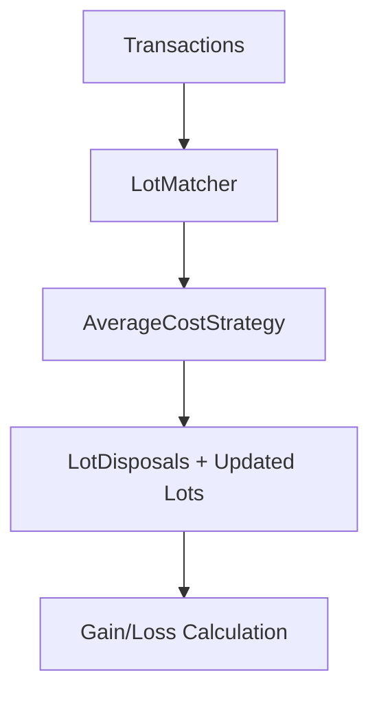

# Average Cost Basis (ACB) Specification

> ⚠️ **Code is law**: If this document disagrees with implementation, the implementation is correct and this spec must be updated.

Defines the Canadian Average Cost Basis (ACB) cost-basis strategy used to match disposals to pooled acquisition lots with deterministic, pro-rata allocation and strict accounting validation.

## Quick Reference

| Concept       | Key Rule                                                        |
| ------------- | --------------------------------------------------------------- |
| `ACB`         | Pooled cost basis per unit across all open lots for an asset    |
| `Allocation`  | Disposals are distributed pro-rata by remaining quantity        |
| `CA-only`     | Average-cost is allowed only when jurisdiction is `CA`          |
| `Determinism` | Lots are sorted by acquisition date, then id, before allocation |
| `Tolerance`   | Tiny rounding drift is allowed; real deviations hard-fail       |

## Goals

- **Canada accuracy**: Implement CRA-style pooled ACB per asset across all holdings for a single taxpayer.
- **Determinism**: Produce identical results regardless of input lot order.
- **Accounting integrity**: Sum of allocations equals disposal quantity (within a tiny tolerance).
- **Auditability**: Fail loudly on precision or allocation bugs with explicit errors.

## CRA Compliance Note

The CRA generally requires the Average Cost method for "identical properties" including cryptocurrencies. While the system technically allows Canadian users to select FIFO/LIFO for flexibility, users are warned that these methods may not be compliant with Canadian tax regulations. Consult a tax professional to determine the appropriate method for your situation.

## Non-Goals

- Automated ACB adjustments for denied losses (superficial loss carry-forward).
- Specific-lot identification or other basis methods beyond FIFO/LIFO/ACB.
- Multi-taxpayer pooling (single taxpayer scope only).
- Cross-asset pooling (pooling is per asset identity).

## Definitions

### ACB Pool

The pooled cost basis per unit for a single asset, derived from all open lots:

```
totalRemainingQty = sum(lot.remainingQuantity)
totalBasis = sum(lot.remainingQuantity * lot.costBasisPerUnit)
pooledCostPerUnit = totalBasis / totalRemainingQty
```

### Open Lot

An acquisition lot whose `remainingQuantity` is greater than 0. Only open lots participate in ACB pooling and disposal allocation.

### Disposal Allocation

Given a disposal quantity, distribute across open lots pro-rata by each lot's remaining quantity, then apply the pooled cost basis per unit to each resulting lot disposal.

### Deterministic Ordering

Open lots are sorted by `acquisitionDate` (oldest first), then by `id` (ascending). The last lot receives the remainder so allocation is stable across input orderings.

### Tolerance

A relative numeric threshold used to tolerate rounding drift during pro-rata allocation. Scales with the smaller of pool size or disposal quantity to handle accumulated rounding without masking real bugs. Currently set to `max(1e-18, min(totalRemainingQty, disposal.quantity) * 1e-10)`. If drift exceeds tolerance, allocation fails hard.

## Behavioral Rules

### Jurisdiction Gating

- `average-cost` is allowed only when `jurisdiction === 'CA'`.
- Enforced in both CLI validation and service layer (defense in depth).

### Pro-Rata Allocation

1. Filter to open lots (`remainingQuantity > 0`).
2. Sort open lots deterministically.
3. Compute pooled ACB per unit across all open lots.
4. Allocate disposal quantity pro-rata by lot remaining quantities.
5. The final lot receives the exact remainder.

### Precision & Validation

- Decimal.js precision is set to 28 significant digits (configured in `@exitbook/core/utils/decimal-utils`).
- Relative tolerance is allowed for rounding drift (currently `max(1e-18, min(totalRemainingQty, disposal.quantity) * 1e-10)`).
- Tolerance scales with the smaller of pool size or disposal quantity to prevent masking allocation bugs.
- Allocation may not exceed a lot's remaining quantity beyond tolerance.
- Any deviation beyond tolerance hard-fails with a descriptive error.
- Zero-quantity disposals return no disposal records.

### Holding Period

Holding period days are computed per lot disposal using the original lot acquisition date, preserving loss-disallowance behavior.

## Data Model

### Entities Used

No schema changes. The strategy emits standard `LotDisposal` records and relies on existing `AcquisitionLot` fields.

#### Key Fields (Behavioral Semantics)

- `AcquisitionLot.remainingQuantity`: Determines pro-rata weights.
- `AcquisitionLot.acquisitionDate`: Used for holding period calculation.
- `LotDisposal.costBasisPerUnit`: Set to pooled ACB per unit for all disposals in a match.
- `LotDisposal.quantityDisposed`: Pro-rata allocation for each lot.

## Algorithm (Pseudo-code)

```
if disposal.quantity == 0:
  return []

lots = openLots.filter(remainingQuantity > 0)
sort lots by acquisitionDate asc, then id asc

totalRemainingQty = sum(lot.remainingQuantity)
if disposal.quantity > totalRemainingQty:
  throw insufficient lots

totalBasis = sum(lot.remainingQuantity * lot.costBasisPerUnit)
pooledCostPerUnit = totalBasis / totalRemainingQty

toleranceBase = min(totalRemainingQty, disposal.quantity)
tolerance = max(1e-18, toleranceBase * 1e-10)
totalAllocated = 0

for each lot in lots:
  if last lot:
    qty = disposal.quantity - totalAllocated
    if qty < -tolerance: throw over-allocation
    if qty < 0: qty = 0
    if qty > lot.remainingQuantity + tolerance: throw over-capacity
    if qty > lot.remainingQuantity: qty = lot.remainingQuantity
  else:
    qty = disposal.quantity * (lot.remainingQuantity / totalRemainingQty)
    if qty > lot.remainingQuantity + tolerance: throw over-capacity
    if qty > lot.remainingQuantity: qty = lot.remainingQuantity

  if qty == 0: continue
  totalAllocated += qty
  emit disposal record with costBasisPerUnit = pooledCostPerUnit

if abs(totalAllocated - disposal.quantity) > tolerance:
  throw allocation mismatch
```

## Pipeline / Flow



## Invariants

- **Required**: `sum(quantityDisposed) == disposal.quantity` within tolerance.
- **Required**: `quantityDisposed <= lot.remainingQuantity` within tolerance.
- **Required**: All ACB disposals use the same pooled cost basis per unit.
- **Enforced**: Strategy hard-fails on violations with descriptive errors.

## Edge Cases & Gotchas

- **Zero disposal**: Returns an empty disposal list (no records).
- **No open lots**: Throws error if disposal is non-zero.
- **Dust rounding**: Tiny drift is tolerated; non-trivial drift fails hard.
- **Order dependence**: Eliminated by deterministic sorting before allocation.

## Known Limitations (Current Implementation)

- **ACB adjustment for denied losses** is not automated (CLI warning).
- **Specific-ID** is not implemented.
- **Non-CA jurisdictions** cannot use average-cost.

## Related Specs

- [Transfers & Tax](./transfers-and-tax.md) — transfer fee policy and tax treatment context
- [Fees](./fees.md) — fee handling for cost basis calculations
- [Asset Identity](./asset-identity.md) — asset identity impacts pooling scope

---

_Last updated: 2026-01-22_
