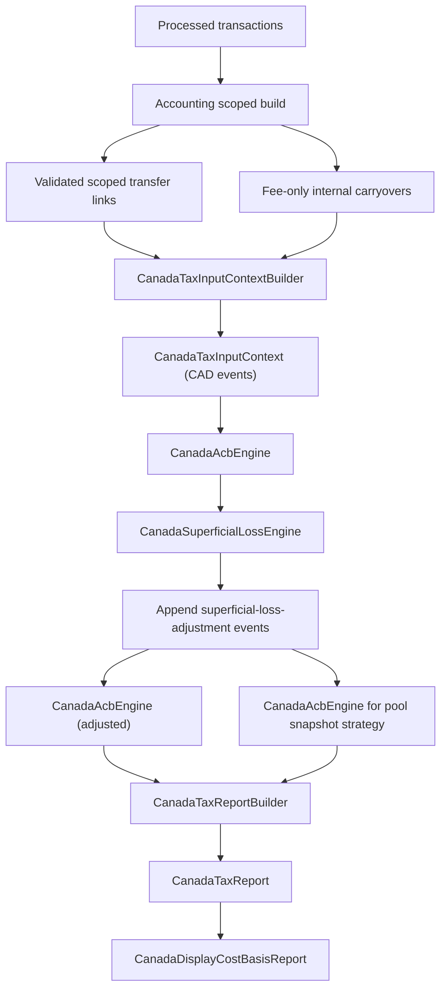

# Canada Average Cost Basis Specification

> ⚠️ **Code is law**: If this document disagrees with implementation, the implementation is correct and this spec must be updated.

Defines the current Canada (`jurisdiction === 'CA'`) cost-basis workflow. Despite the filename, this is no longer just a strategy-level matching spec. It covers the Canada-owned tax pipeline from scoped accounting inputs through CAD valuation, pooled ACB, superficial-loss carry-forward, and CAD-first reporting.

## Quick Reference

| Concept                | Key Rule                                                                                                                                                                          |
| ---------------------- | --------------------------------------------------------------------------------------------------------------------------------------------------------------------------------- |
| `Tax currency`         | All Canada tax math is performed in `CAD` at transaction time                                                                                                                     |
| `Pooling key`          | Pooling uses `taxPropertyKey = ca:${assetIdentityKey}`, not storage `assetId`                                                                                                     |
| `Workflow split`       | `CA` branches before `runCostBasisPipeline()` and uses the Canada workflow                                                                                                        |
| `Input contract`       | Canada builds `CanadaTaxInputContext` from accounting-scoped transactions, validated links, and fee-only carryovers                                                               |
| `Transfers`            | Owned-account transfers preserve pooled economics and emit transfer rows, not gains/losses                                                                                        |
| `Fees`                 | Acquisition and transfer-target fiat fees increase pool cost; eligible on-chain disposition fees reduce proceeds; same-asset transfer fees become explicit pool-adjustment events |
| `Superficial loss`     | Loss denials are computed over a `±30` calendar-day window and carried forward into surviving reacquisition layers                                                                |
| `Authoritative output` | `CanadaTaxReport` is the tax-native result; `CanadaDisplayCostBasisReport` is derived presentation only                                                                           |

## Goals

- **CAD-native tax math**: Compute Canadian proceeds, ACB, gains, denied losses, and taxable amounts in CAD at transaction time.
- **Explicit tax identity**: Pool identical property across venues and accounts using accounting-owned tax identity rules instead of storage identity.
- **Stateful compliance logic**: Model superficial loss and transfer-fee consequences as ACB state changes, not as reporting annotations.
- **Auditability**: Preserve valuation provenance, link provenance, and layer-level pool history needed to explain tax results.

## Non-Goals

- Business-income treatment for active trading.
- Multi-taxpayer or affiliated-person household modeling.
- Reusing the legacy generic lot-pipeline result shape for Canada tax authority.
- Supporting `fifo`, `lifo`, or `specific-id` for `CA`.

## Workflow Boundary

`CostBasisWorkflow` is the host-facing shell. For Canada it returns a dedicated result shape instead of the generic lot-pipeline output:

```ts
type CostBasisWorkflowResult = GenericCostBasisWorkflowResult | CanadaCostBasisWorkflowResult;

interface CanadaCostBasisWorkflowResult {
  kind: 'canada-workflow';
  calculation: CanadaCostBasisCalculation;
  taxReport: CanadaTaxReport;
  displayReport?: CanadaDisplayCostBasisReport;
  executionMeta: {
    missingPricesCount: number;
    retainedTransactionIds: number[];
  };
}
```

Current behavior:

- `config.jurisdiction === 'CA'` branches before `runCostBasisPipeline()`.
- `CostBasisWorkflow` delegates Canada execution to
  `runCanadaCostBasisCalculation(...)` with
  `missingPricePolicy: 'error'` and `poolSnapshotStrategy: 'report-end'`.
- `PortfolioHandler` reuses the same runner with
  `missingPricePolicy: 'exclude'` and
  `poolSnapshotStrategy: 'full-input-range'`.
- Canada requires an `IFxRateProvider` because tax valuation is CAD-native.
- The workflow includes all transactions on or before the effective calculation end date so pre-period acquisitions can seed the pool correctly.
- The workflow expands the transaction window to `endDate + 30 days` so post-period reacquisitions can deny in-period losses.
- Report rows are still filtered to the requested calculation window.
- `displayReport` is typed as optional, but the current workflow always builds one, including an identity-CAD projection when `displayCurrency === 'CAD'`.
- `executionMeta` reports how many scoped transactions were excluded for missing
  prices and which raw transaction IDs were retained for the surviving
  calculation input.

### Shared Canada Runner

Canada orchestration now lives behind one shared seam:

```ts
runCanadaCostBasisCalculation({
  input,
  transactions,
  confirmedLinks,
  fxRateProvider,
  accountingExclusionPolicy,
  assetReviewSummaries,
  missingPricePolicy,
  poolSnapshotStrategy,
});
```

This runner owns:

- price-completeness filtering
- Canada ACB workflow execution
- superficial-loss adjustment generation
- adjusted pool replay
- pool snapshot replay for reporting/portfolio
- tax report generation
- display report generation

The two explicit policy knobs are:

- `missingPricePolicy`
  - `'error'` for `cost-basis`
  - `'exclude'` for `portfolio`
- `poolSnapshotStrategy`
  - `'report-end'` for `cost-basis`
  - `'full-input-range'` for `portfolio`

## Definitions

### Tax Asset Identity

Canada does not pool by storage `assetId` alone. It resolves a tax identity from imported facts:

```ts
type TaxIdentityInput = {
  assetId: string;
  assetSymbol: Currency;
};
```

Rules:

- resolution uses `resolveTaxAssetIdentity(...)`
- exchange assets and blockchain natives stay symbol-based
- on-chain tokens stay strict by default
- confirmed exchange↔blockchain links may install per-run identity overrides so a linked blockchain token inherits the exchange symbol identity for that calculation scope
- unresolved Canada tax identity is a hard error

Historical note:

- earlier revisions had a relaxed symbol-collapse fallback because exchange imports often omit network or contract details
- the current model removes that generic fallback and relies on strict token identity plus validated transfer overrides

### Canada Tax Property Key

The pooling key used by the Canada engine:

```ts
taxPropertyKey = `ca:${assetIdentityKey}`;
```

Examples:

- `ca:btc`
- `ca:eth`
- `ca:erc20:ethereum:0xa0b8...`
- `ca:spl:solana:EPjF...`

### Canada Tax Valuation

Transaction-time CAD valuation attached to every Canada event:

```ts
interface CanadaTaxValuation {
  taxCurrency: 'CAD';
  storagePriceAmount: Decimal;
  storagePriceCurrency: Currency;
  quotedPriceAmount: Decimal;
  quotedPriceCurrency: Currency;
  unitValueCad: Decimal;
  totalValueCad: Decimal;
  valuationSource: 'quoted-price' | 'stored-price' | 'usd-to-cad-fx' | 'fiat-to-cad-fx';
  fxRateToCad?: Decimal;
  fxSource?: string;
  fxTimestamp?: Date;
}
```

### Canada Tax Input Event

The Canada workflow operates on explicit tax events, not generic lot-matcher disposals:

```ts
type CanadaTaxInputEvent =
  | CanadaAcquisitionEvent
  | CanadaDispositionEvent
  | CanadaTransferInEvent
  | CanadaTransferOutEvent
  | CanadaFeeAdjustmentEvent
  | CanadaSuperficialLossAdjustmentEvent;
```

Every event carries:

- `eventId`
- `transactionId`
- `timestamp`
- `assetId`
- `assetIdentityKey`
- `taxPropertyKey`
- `assetSymbol`
- `valuation`
- provenance metadata such as `linkId`, `movementFingerprint`, `sourceMovementFingerprint`, and `targetMovementFingerprint`

### Canada ACB Pool

One live pool exists per `taxPropertyKey`:

```ts
interface CanadaAcbPoolState {
  taxPropertyKey: string;
  assetSymbol: Currency;
  quantityHeld: Decimal;
  totalAcbCad: Decimal;
  acbPerUnitCad: Decimal;
  acquisitionLayers: CanadaAcquisitionLayer[];
}
```

Each acquisition layer retains:

- original acquisition identity and timestamp
- `quantityAcquired`
- `remainingQuantity`
- historical `totalCostCad`
- `remainingAllocatedAcbCad`, which is the current audit projection of pooled ACB assigned to the still-open portion of that layer

### Canada Tax Report

The authoritative tax output for the Canada workflow:

```ts
interface CanadaTaxReport {
  calculationId: string;
  taxCurrency: 'CAD';
  acquisitions: CanadaTaxReportAcquisition[];
  dispositions: CanadaTaxReportDisposition[];
  transfers: CanadaTaxReportTransfer[];
  superficialLossAdjustments: CanadaSuperficialLossAdjustment[];
  summary: CanadaTaxReportSummary;
  displayContext: CanadaTaxReportDisplayContext;
}
```

Key summary fields:

- `totalProceedsCad`
- `totalCostBasisCad`
- `totalGainLossCad`
- `totalTaxableGainLossCad`
- `totalDeniedLossCad`

### Canada Display Report

The optional presentation projection for CLI, JSON, or UI display:

```ts
interface CanadaDisplayCostBasisReport {
  calculationId: string;
  sourceTaxCurrency: 'CAD';
  displayCurrency: Currency;
  acquisitions: CanadaDisplayReportAcquisition[];
  dispositions: CanadaDisplayReportDisposition[];
  transfers: CanadaDisplayReportTransfer[];
  summary: CanadaDisplayReportSummary;
}
```

This report never recalculates tax results. It only converts CAD tax rows into a display currency.

## Behavioral Rules

### Jurisdiction Gating And Dispatch

- `average-cost` is allowed only when `jurisdiction === 'CA'`.
- Unsupported Canada methods are rejected before workflow dispatch.
- Non-CA jurisdictions continue to use the generic lot pipeline.
- Canada loads confirmed links once from persistence and keeps the rest of the workflow inside the accounting capability.
- Canada missing-price handling is consumer-specific but explicit:
  `cost-basis` fails closed, while `portfolio` may exclude incomplete scoped
  transactions and continue.

### CAD Valuation Happens Before Cost Basis

Canada tax valuation is built before any ACB math:

- if `quotedPrice.currency === 'CAD'`, use the quoted CAD price directly
- else if `price.currency === 'CAD'`, use the stored CAD price directly
- else if `price.currency === 'USD'`, fetch `USD -> CAD` from the FX provider
- else if `price.currency` is another fiat currency, normalize `fiat -> USD -> CAD`
- else fail closed because Canada tax valuation requires fiat-denominated price data

Additional rules:

- non-fiat movements require `priceAtTxTime`
- crypto-denominated fees that participate in accounting require `priceAtTxTime`
- fiat fees may use identity pricing such as `1 CAD = 1 CAD`

### Event Projection Uses The Accounting-Scoped Boundary

Canada consumes:

1. `AccountingScopedTransaction[]`
2. `ValidatedTransferSet`
3. `FeeOnlyInternalCarryover[]`

Movement projection rules:

- fiat asset movements do not create Canada pool events
- an unlinked inflow becomes one `acquisition`
- an unlinked outflow becomes one `disposition`
- before projection, validated exchange↔blockchain links may bridge strict blockchain-token identity to the linked exchange symbol so later on-chain movements stay in the carried pool
- a linked inflow emits one `transfer-in` per validated link plus an `acquisition` for any residual quantity
- a linked outflow emits one `transfer-out` per validated link plus a `disposition` for any residual quantity
- linked quantity is based on transfer-comparable movement quantity: `netAmount ?? grossAmount`
- linked quantity may not exceed the projected movement quantity

Event ordering is deterministic:

1. `timestamp`
2. `transactionId`
3. kind priority:
   `transfer-out`, `disposition`, `acquisition`, `transfer-in`, `fee-adjustment`, `superficial-loss-adjustment`
4. `eventId`

### Fee-Only Carryovers Rewrite Internal Targets

For same-hash internal transfers whose external quantity is zero and only fee treatment remains:

- the scoped builder emits a `FeeOnlyInternalCarryover`
- the Canada context builder rewrites the target acquisition event into a `transfer-in`
- the carryover keeps provenance through `sourceTransactionId`, `sourceMovementFingerprint`, and `targetMovementFingerprint`
- proportional fiat fees from source and target sides are converted into `add-to-pool-cost` fee-adjustment events attached to the transfer target

### Generic Fee Adjustments

All scoped transaction fees are valued in CAD before adjustment logic runs.

Acquisition-side rules:

- fees on transactions that create acquisition events increase ACB
- if one transaction yields multiple acquisition events, CAD fee value is allocated across them by their CAD movement value
- if movement CAD value is zero, allocation falls back to equal splitting

Disposition-side rules:

- only on-chain fees reduce proceeds
- if one transaction yields multiple disposition events, residual eligible fee CAD is allocated across them by CAD movement value
- same-asset transfer fee amounts reserved for transfer fee-adjustment events are excluded from ordinary proceeds reduction to avoid double counting

### Transfer Fee Adjustments

Validated transfer target fee rules:

- proportional fiat fees from the source and target transactions are collected with `collectFiatFees(...)`
- they become `fee-adjustment` events with `adjustmentType: 'add-to-pool-cost'`
- these adjustments attach to the target-side pool and preserve `linkId` and movement-fingerprint provenance

Same-asset transfer fee rules:

- source-side crypto fees in the transferred asset are extracted with `extractCryptoFee(...)`
- only the internally transferred portion of the fee is capitalized into the transferred property
- for a source movement linked to multiple confirmed targets, the builder emits one same-asset fee-adjustment event per link
- each same-asset fee-adjustment carries:
  - `adjustmentType: 'same-asset-transfer-fee-add-to-basis'`
  - `quantityReduced`, which removes quantity from the source pool
  - `relatedEventId`, usually the linked `transfer-out`
  - `linkId` plus source/target movement fingerprints when link-scoped

### Canada ACB Pool Engine

`runCanadaAcbEngine(...)` is the authoritative pool-state calculator.

Acquisition behavior:

- add `quantity`
- add `valuation.totalValueCad + costBasisAdjustmentCad`
- create a new acquisition layer
- recompute `acbPerUnitCad`
- rebalance `remainingAllocatedAcbCad` across open layers

Disposition behavior:

- require `quantity <= pool.quantityHeld`
- `costBasisCad = pool.acbPerUnitCad * quantity`
- `proceedsCad = valuation.totalValueCad - proceedsReductionCad`
- `gainLossCad = proceedsCad - costBasisCad`
- reduce `quantityHeld`
- reduce `totalAcbCad`
- deplete acquisition layers pro-rata by remaining quantity
- rebalance `remainingAllocatedAcbCad`

Transfer behavior:

- `transfer-in` and `transfer-out` are pool no-ops
- the engine still captures point-in-time pool snapshots for those events so transfer rows can render carried ACB later

Fee-adjustment behavior:

- `add-to-pool-cost` increases `totalAcbCad` without changing quantity
- `same-asset-transfer-fee-add-to-basis`:
  - requires positive `quantityReduced`
  - depletes that quantity from open layers pro-rata
  - removes the associated ACB from the pool
  - adds the fee's CAD value back into `totalAcbCad`
  - errors if this would leave positive ACB with zero quantity

Superficial-loss adjustment behavior:

- `superficial-loss-adjustment` increases `totalAcbCad`
- it does not change quantity
- it is applied only after the superficial-loss engine creates the explicit adjustment event

### Layer Depletion Is Still Pro-Rata

Although Canada is no longer modeled through the generic `AverageCostStrategy`, the Canada pool engine still depletes acquisition layers pro-rata for audit purposes:

- open layers are sorted by `acquiredAt`, then `layerId`
- each layer receives a proportional share of disposed quantity
- the final layer receives the exact remainder
- drift beyond `1e-18` is a hard error

This layer bookkeeping is for auditability. The authoritative tax state remains the pool totals.

### Superficial Loss Is A Separate Engine

`runCanadaSuperficialLossEngine(...)` runs after the first Canada ACB pass.

Rules:

- only negative-gain dispositions are evaluated
- the window starts at `startOfUtcDay(disposedAt - 30 days)`
- the cutoff is `endOfUtcDay(disposedAt + 30 days)`
- the engine reruns ACB on all input events up to the cutoff to observe pool state at window end
- eligible substituted-property layers must:
  - belong to the same `taxPropertyKey`
  - have `remainingQuantity > 0` at the cutoff
  - have `acquiredAt` inside the superficial-loss window
- `deniedQuantity = min(disposition.quantityDisposed, substitutedQuantity)`
- `deniedLossCad = abs(disposition.gainLossCad) * deniedQuantity / disposition.quantityDisposed`

Outputs:

- one `CanadaSuperficialLossDispositionAdjustment` per denied disposition
- one explicit `CanadaSuperficialLossAdjustmentEvent` per denied disposition, timestamped at the window cutoff
- one or more `CanadaSuperficialLossAdjustment` rows allocating denied quantity and denied loss across eligible remaining acquisition layers

After that:

- the workflow appends the adjustment events to the Canada input context
- reruns `runCanadaAcbEngine(...)`
- uses the adjusted result as the authoritative disposition and pool state

### Reporting Is CAD-Native

`buildCanadaTaxReport(...)` consumes:

- workflow calculation metadata
- the original Canada input context
- the adjusted ACB engine result
- a second ACB snapshot filtered to the requested report end date
- superficial-loss engine output

Report rules:

- `taxReport` is the authoritative Canada tax output
- dispositions are filtered to `startDate <= disposedAt <= endDate`
- superficial-loss adjustments are filtered to reported dispositions only
- acquisitions come from the report-end pool snapshot, not from the lookahead window
- transfer rows are built from Canada transfer events and settled using event pool snapshots plus linked fee-adjustment events
- transfer rows carry pooled ACB, not market value, as tax authority
- summary totals are recomputed from the reported disposition rows so lookahead-only activity cannot leak into the published tax summary

Taxable capital gain rule:

```ts
taxableGainLossCad = (gainLossCad + deniedLossCad) * 0.5;
```

This uses the current Canada capital-gains inclusion rate hardcoded in the report builder.

### Display Conversion Is Derived Only From Tax Rows

`buildCanadaDisplayCostBasisReport(...)` converts from the tax report only:

- source currency is always `CAD`
- conversion is cached by `(displayCurrency, calendar date)`
- `CAD` uses an identity conversion
- `USD` uses `getRateToUSD('CAD', timestamp)`
- other display currencies use `CAD -> USD -> displayCurrency`

Converted fields:

- acquisitions: cost basis per unit, total cost, remaining allocated cost
- dispositions: proceeds, cost basis, gain/loss, denied loss, taxable gain/loss, ACB per unit
- transfers: carried ACB, carried ACB per unit, informational market value, fee adjustment
- summary totals are recomputed from converted disposition rows

Display conversion may change presentation. It must never change CAD tax amounts or Canada tax summary math.

## Data Model

### Canada Input Context

```ts
interface CanadaTaxInputContext {
  taxCurrency: 'CAD';
  inputTransactionIds: number[];
  validatedTransferLinkIds: number[];
  internalTransferCarryoverSourceTransactionIds: number[];
  inputEvents: CanadaTaxInputEvent[];
}
```

### Canada Disposition Record

```ts
interface CanadaDispositionRecord {
  dispositionEventId: string;
  transactionId: number;
  taxPropertyKey: string;
  assetSymbol: Currency;
  disposedAt: Date;
  quantityDisposed: Decimal;
  proceedsCad: Decimal;
  costBasisCad: Decimal;
  gainLossCad: Decimal;
  acbPerUnitCad: Decimal;
  layerDepletions: CanadaLayerDepletion[];
}
```

### Canada Transfer Row

```ts
interface CanadaTaxReportTransfer {
  id: string;
  direction: 'in' | 'internal' | 'out';
  linkId?: number;
  taxPropertyKey: string;
  quantity: Decimal;
  carriedAcbCad: Decimal;
  carriedAcbPerUnitCad: Decimal;
  feeAdjustmentCad: Decimal;
}
```

Semantics:

- `direction: 'internal'` means both source and target transfer events were present for one confirmed link
- `direction: 'in'` or `'out'` means only one side is represented in the current report window
- `feeAdjustmentCad` is derived from linked or related Canada fee-adjustment events, not from market value

## Pipeline / Flow


```mermaid
graph TD
    A["Processed transactions"] --> B["Accounting scoped build"]
    B --> C["Validated scoped transfer links"]
    B --> D["Fee-only internal carryovers"]
    C --> E["CanadaTaxInputContextBuilder"]
    D --> E
    E --> F["CanadaTaxInputContext (CAD events)"]
    F --> G["CanadaAcbEngine"]
    G --> H["CanadaSuperficialLossEngine"]
    H --> I["Append superficial-loss-adjustment events"]
    I --> J["CanadaAcbEngine (adjusted)"]
    I --> K["CanadaAcbEngine for pool snapshot strategy"]
    J --> L["CanadaTaxReportBuilder"]
    K --> L
    L --> M["CanadaTaxReport"]
    M --> N["CanadaDisplayCostBasisReport"]
```

Pool snapshot strategy notes:

- `report-end` filters the augmented input context to `endDate` before the
  second replay so tax reports only surface report-window pool state.
- `full-input-range` replays the full augmented input range so portfolio can
  shape holdings from the complete `asOf` horizon it already requested.

## Invariants

- **Required**: Canada tax currency is always `CAD`.
- **Required**: `CA` must bypass `runCostBasisPipeline()` and the generic `CostBasisReportGenerator`.
- **Required**: `taxPropertyKey` must be derivable from explicit tax identity rules or the workflow fails closed.
- **Required**: Canada dispositions compute proceeds and cost basis from CAD values before any display conversion.
- **Required**: transfer events do not directly mutate pooled ACB state.
- **Required**: same-asset transfer fee capitalization is represented by explicit fee-adjustment events.
- **Required**: superficial-loss denial mutates future ACB through explicit adjustment events.
- **Required**: `displayReport` is derived from `taxReport`, never the reverse.

## Edge Cases & Gotchas

- **Identity is strict unless proven otherwise**: exchange assets and blockchain natives pool by symbol, on-chain tokens stay contract-specific by default, and validated exchange↔blockchain links can collapse a proven-equivalent token into the exchange symbol identity.
- **Lookahead without row leakage**: post-period reacquisitions within `endDate + 30 days` can deny an in-period loss, but the future acquisition itself is excluded from report rows because acquisitions are snapped at report end.
- **Acquisitions are layer rows, not just open lots**: the tax report acquisition section is built from report-end pool layers and includes depleted layers with `remainingQuantity = 0`.
- **Transfer rows can be one-sided**: when only one side of a transfer falls in the reporting window, the tax report emits an `in` or `out` row instead of `internal`.
- **Shared config naming is still generic**: public config still uses `currency`, but in the Canada workflow that field means display currency, not tax currency.
- **Result optionality is looser than behavior**: `displayReport` is optional in the type but currently always returned for Canada workflow executions.

## Known Limitations (Current Implementation)

- Multi-taxpayer and affiliated-person superficial-loss modeling are not implemented.
- The Canada inclusion rate is hardcoded to `0.5` in the report builder.
- Public config and result naming still mix generic `currency` terminology with Canada-specific `taxCurrency` and `displayCurrency`.
- Non-CA jurisdictions still rely on the generic lot pipeline, so public cost-basis results remain a union of two different authority shapes.

## Related Specs

- [Cost Basis Orchestration](./cost-basis-orchestration.md) — consumer boundaries and shared Canada runner ownership
- [Cost Basis Artifact Storage](./cost-basis-artifact-storage.md) — artifact persistence, `executionMeta`, and failure snapshot storage
- [Cost Basis Accounting Scope](./cost-basis-accounting-scope.md) — scoped transaction boundary consumed by the Canada context builder
- [Transfers & Tax](./transfers-and-tax.md) — validated-link semantics, fee-only carryovers, and transfer fee treatment
- [Fees](./fees.md) — raw fee semantics that feed Canada fee-adjustment rules
- [Asset Identity](./asset-identity.md) — storage identity vs economic identity context for pooling
- [Price Derivation](./price-derivation.md) — price provenance feeding Canada tax valuation

---

_Last updated: 2026-03-14_
