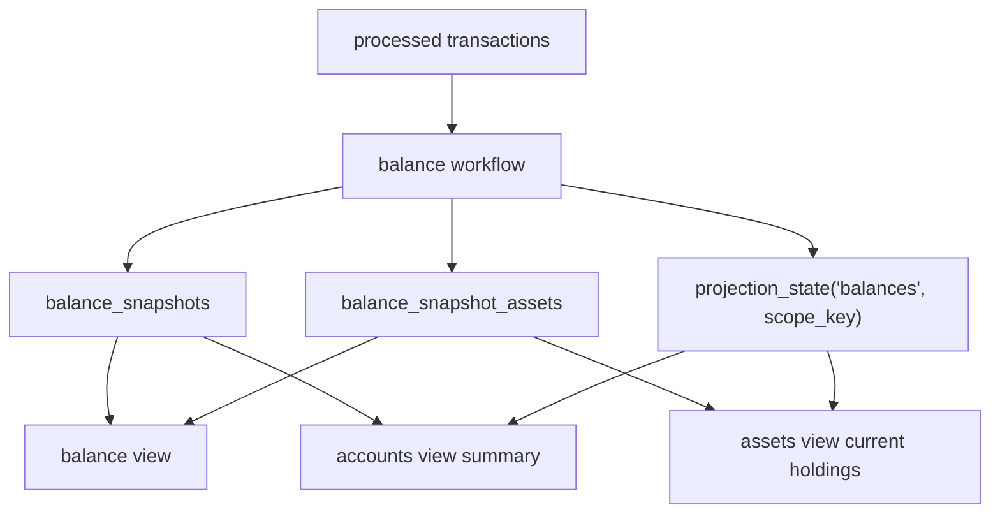

# Balance Projection Specification

> ⚠️ **Code is law**: If this document disagrees with implementation, update the spec to match code.

How Exitbook persists current balance snapshots, scopes them to owning accounts, and exposes them to `balance`, `accounts`, and `assets` consumers.

## Quick Reference

| Concept           | Key Rule                                                                                                  |
| ----------------- | --------------------------------------------------------------------------------------------------------- |
| Scope ownership   | Every balance snapshot is keyed by the owning root account scope                                          |
| Projection id     | Balance freshness lives in `projection_state` under `projection_id='balances'`                            |
| Scope key         | Scoped state rows use `balance:<scopeAccountId>`                                                          |
| Live fetches      | `balance refresh` is the only CLI command that calls live providers                                       |
| Read policy       | `balance view` and `assets view` read stored snapshots only and fail closed when freshness is not `fresh` |
| Account summaries | `accounts view` shows projection freshness separately from verification outcome                           |

## Goals

- Persist current balance state as first-class SQL rows instead of account-owned metadata.
- Make balance freshness participate in the shared projection lifecycle.
- Resolve child accounts to one owning scope consistently across workflow, storage, and reads.
- Keep live provider work explicit and separate from read-only views.

## Non-Goals

- Storing historical balance verification runs.
- Creating independent snapshots for child accounts inside one hierarchy.
- Auto-refreshing balances on read.
- Reusing balance snapshots as a generic historical holdings model.

## Definitions

### Scope Account

The account that owns a balance snapshot.

Rules:

- Accounts with no parent own their own balance scope.
- Child accounts resolve upward to the highest ancestor.
- A child request may still appear as `requestedAccount` in CLI output, but the stored snapshot belongs to the owning scope account.

### Balance Snapshot

The current persisted summary for one owning scope.

```ts
type BalanceSnapshotVerificationStatus = 'never-run' | 'match' | 'warning' | 'mismatch' | 'unavailable';
type BalanceSnapshotCoverageStatus = 'complete' | 'partial';
type BalanceSnapshotCoverageConfidence = 'high' | 'medium' | 'low';

interface BalanceSnapshot {
  scopeAccountId: number;
  calculatedAt?: Date | undefined;
  lastRefreshAt?: Date | undefined;
  verificationStatus: BalanceSnapshotVerificationStatus;
  coverageStatus?: BalanceSnapshotCoverageStatus | undefined;
  coverageConfidence?: BalanceSnapshotCoverageConfidence | undefined;
  requestedAddressCount?: number | undefined;
  successfulAddressCount?: number | undefined;
  failedAddressCount?: number | undefined;
  totalAssetCount?: number | undefined;
  parsedAssetCount?: number | undefined;
  failedAssetCount?: number | undefined;
  matchCount: number;
  warningCount: number;
  mismatchCount: number;
  statusReason?: string | undefined;
  suggestion?: string | undefined;
  lastError?: string | undefined;
}
```

### Balance Snapshot Asset

The current persisted balance row for one asset within one owning scope.

```ts
type BalanceSnapshotAssetComparisonStatus = 'match' | 'warning' | 'mismatch' | 'unavailable';

interface BalanceSnapshotAsset {
  scopeAccountId: number;
  assetId: string;
  assetSymbol: string;
  calculatedBalance: string;
  liveBalance?: string | undefined;
  difference?: string | undefined;
  comparisonStatus?: BalanceSnapshotAssetComparisonStatus | undefined;
  excludedFromAccounting: boolean;
}
```

### Balance Projection Freshness

Balance freshness is tracked in `projection_state`:

- `projection_id = 'balances'`
- `scope_key = 'balance:<scopeAccountId>'`

Unlike global projections, freshness and resets are scoped per owning balance account.

## Behavioral Rules

### Scope Ownership

- One owning scope account has one current balance snapshot.
- Child accounts do not create independent snapshot rows during normal balance refresh or view flows.
- Workflow orchestration, account summaries, and CLI views all resolve the same owning scope before reading or writing snapshot state.

### Build And Refresh Flows

The balance workflow has two persisted paths:

- a calculated rebuild path that writes calculated balances and a summary with `verificationStatus = 'never-run'`
- a refresh path that recalculates balances, fetches live balances, compares them, and overwrites the scope snapshot

Persistence errors are surfaced as command failures; the workflow does not silently report success when snapshot writes fail.

### Consumer Rules

#### `balance view`

- Reads stored snapshots only.
- Never calls live providers.
- Requires the owning scope snapshot to be readable and fresh.
- Fails closed when the scope is missing a snapshot or the scoped projection state is `stale`, `building`, or `failed`.

#### `balance refresh`

- Is the only balance CLI command that calls live providers.
- Resolves child requests upward to the owning scope.
- Persists the refreshed snapshot back onto the owning scope.

#### `accounts view`

- Reads balance projection freshness and snapshot summary data per owning scope.
- Separates projection freshness from verification result:
  - `balanceProjectionStatus` describes whether the persisted projection is fresh enough to trust
  - `verificationStatus` describes the last stored verification outcome
- Uses `never-built` when no snapshot exists for the owning scope.

#### `assets view`

- Reads current holdings from `balance_snapshot_assets`, grouped by `assetId` across all scope snapshots.
- Requires fresh balance snapshots for every loaded scope before the view is readable.
- Uses processed transactions only for historical asset knowledge, symbol resolution, and transaction counts, not for current quantity.

### Freshness And Invalidation

- `balances` depends on `processed-transactions`.
- Import completion, reprocess, and reset flows invalidate affected balance scopes rather than marking balances stale globally.
- Missing snapshot state is interpreted as:
  - `stale` with reason `balance snapshot has never been built` for fail-closed readers
  - `never-built` for account summaries

### Reset And Replace Semantics

- Balance snapshots are current-state only.
- Writing a scope snapshot fully replaces the existing summary row and asset rows for that scope.
- Reset deletes snapshot rows for the affected scopes and marks the scoped projection state stale.

## Data Model

### `balance_snapshots`

```sql
scope_account_id          INTEGER PRIMARY KEY REFERENCES accounts(id),
calculated_at             TEXT NULL,
last_refresh_at           TEXT NULL,
verification_status       TEXT NOT NULL,
coverage_status           TEXT NULL,
coverage_confidence       TEXT NULL,
requested_address_count   INTEGER NULL,
successful_address_count  INTEGER NULL,
failed_address_count      INTEGER NULL,
total_asset_count         INTEGER NULL,
parsed_asset_count        INTEGER NULL,
failed_asset_count        INTEGER NULL,
match_count               INTEGER NOT NULL DEFAULT 0,
warning_count             INTEGER NOT NULL DEFAULT 0,
mismatch_count            INTEGER NOT NULL DEFAULT 0,
status_reason             TEXT NULL,
suggestion                TEXT NULL,
last_error                TEXT NULL
```

#### Field Semantics

- `scope_account_id`: owning root account for the snapshot.
- `calculated_at`: when calculated balances were rebuilt from imported transactions.
- `last_refresh_at`: when live provider verification last ran successfully enough to persist a refresh result.
- `verification_status`: summary outcome of the last stored refresh or calculated-only rebuild.
- `status_reason`, `suggestion`, `last_error`: operator-facing explanation fields from the stored verification result.

### `balance_snapshot_assets`

```sql
scope_account_id          INTEGER NOT NULL REFERENCES balance_snapshots(scope_account_id) ON DELETE CASCADE,
asset_id                  TEXT NOT NULL,
asset_symbol              TEXT NOT NULL,
calculated_balance        TEXT NOT NULL,
live_balance              TEXT NULL,
difference                TEXT NULL,
comparison_status         TEXT NULL,
excluded_from_accounting  INTEGER NOT NULL DEFAULT 0,
PRIMARY KEY (scope_account_id, asset_id)
```

Indexes:

- `idx_balance_snapshot_assets_asset_id`
- `idx_balance_snapshot_assets_symbol`

#### Field Semantics

- `calculated_balance`: current persisted quantity derived from imported transactions.
- `live_balance`, `difference`, `comparison_status`: last stored verification comparison fields from a refresh run.
- `excluded_from_accounting`: persisted exclusion signal for downstream consumers that need snapshot-backed holdings.

### Account Read Model Fields

Account summaries derived from the balance projection expose:

```ts
interface AccountSummary {
  balanceProjectionStatus?: 'fresh' | 'stale' | 'building' | 'failed' | 'never-built';
  balanceProjectionReason?: string | undefined;
  lastCalculatedAt?: string | undefined;
  lastRefreshAt?: string | undefined;
  verificationStatus?: 'match' | 'warning' | 'mismatch' | 'unavailable' | 'never-checked';
}
```

## Pipeline / Flow



## Invariants

- **Required**: There is at most one current snapshot per owning scope account.
- **Required**: There is at most one current asset row per `(scope_account_id, asset_id)`.
- **Required**: Child accounts never own independent balance snapshot rows for normal hierarchy-backed refresh flows.
- **Required**: `balance view` and `assets view` never fetch live balances.
- **Required**: Freshness is scoped by owning balance account, not global.
- **Required**: Projection freshness and verification outcome remain separate concepts in read models.

## Edge Cases & Gotchas

- A direct child-account request may return both the owning scope account and a separate `requestedAccount` in CLI JSON output.
- A scope with no snapshot row is treated as unreadable for fail-closed consumers, not as an empty balance.
- `balance view` reads stored asset rows but still enriches them with diagnostics derived from imported transactions at read time.

## Known Limitations (Current Implementation)

- Balance history is not stored; only the latest scope snapshot exists.
- Generic projection readiness does not auto-build `balances`; the explicit user-facing rebuild path is `balance refresh`.
- `assets view` still loads transactions for historical counts and symbol lookup even though current quantity comes from balance snapshots.

## Related Specs

- [Projection System](./projection-system.md)
- [Accounts & Imports](./accounts-and-imports.md)
- [Balance CLI](./cli/balance/balance-view-spec.md)
- [Asset Review](./asset-review.md)
- [Assets View CLI](./cli/assets/assets-view-spec.md)

---

_Last updated: 2026-03-12_
