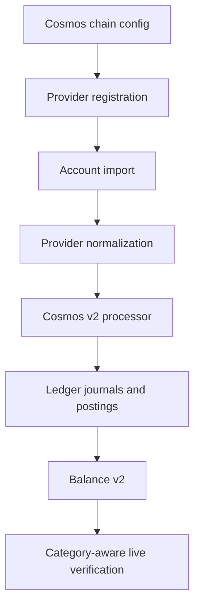

# Cosmos SDK Processing Specification

> ⚠️ **Code is law**: If this spec drifts from implementation, update the spec.

How Exitbook imports, normalizes, and processes Cosmos SDK chains. Cosmos SDK
support is chain-specific: a chain can exist in the registry for parsing and
tests without being exposed as a user-facing import target.

## Quick Reference

| Concept                | Key Rule                                                                             |
| ---------------------- | ------------------------------------------------------------------------------------ |
| Chain registry         | `cosmos-chains.json` is the source of chain metadata                                 |
| Import enablement      | `accountHistorySupport: "verified"` is required before a chain is exposed for import |
| Current import targets | `injective`, `akash`, and `fetch`                                                    |
| Disabled chain configs | May remain available for parser fixtures and future enablement                       |
| Provider routing       | Chain-specific providers are preferred when generic LCD history is incomplete        |
| Staking principal      | Delegation, undelegation, and redelegation principal is accounting data              |
| Staking rewards        | Claimed rewards are processor-owned ledger facts, not semantic annotations           |
| IBC denoms             | IBC denoms must preserve the full `ibc/...` identity                                 |
| Non-native bank denoms | Unknown SDK bank denoms must preserve their raw denom identity                       |
| Balance verification   | Cosmos live checks must compare liquid, staked, unbonding, and rewards separately    |

## Goals

- **Expose only defensible chains:** Do not advertise a Cosmos SDK chain unless
  imported history and live balance verification are good enough for accounting.
- **Preserve chain-owned evidence:** Keep message types, denoms, validator
  addresses, staking principal, claimed rewards, and fees in normalized provider
  data so processors do not infer accounting facts from display semantics.
- **Model staking in the ledger:** Treat staking custody and rewards as
  accounting-owned processor output, not future semantic annotations.
- **Keep Cosmos support reusable:** Share parser and processor behavior across
  Cosmos SDK chains while allowing provider routing to stay chain-specific.

## Non-Goals

- Generic support for every chain listed in `cosmos-chains.json`.
- Mintscan API integration until keys and terms are reliable enough for normal
  user imports.
- Semantic annotations for staking reward components. Staking is accounting
  behavior because it affects balances, cost basis, and inventory ownership.
- Cost-basis policy decisions for rewards, transfers, or unbonding inventory.

## Definitions

### Cosmos Chain Config

Cosmos chain metadata lives in
`packages/blockchain-providers/src/blockchains/cosmos/cosmos-chains.json`.

```ts
interface CosmosChainConfig {
  chainId: string;
  chainName: string;
  displayName: string;
  nativeCurrency: Currency;
  nativeDecimals: number;
  nativeDenom: string;
  bech32Prefix: string;
  restEndpoints?: string[];
  rpcEndpoints?: string[];
  restTxSearchEnabled?: boolean;
  restTxSearchEventParam?: 'events' | 'query';
  accountHistorySupport?: 'verified' | 'disabled';
  accountHistoryDisabledReason?: string;
}
```

`accountHistorySupport` controls the user-facing import boundary. Unset means
the chain is configured but not exposed for account-history import.

### Verified Account-History Chain

A verified account-history chain is a Cosmos SDK chain whose provider,
normalizer, processor, and live balance checks have been tested with real data.

Current verified chains:

| Chain     | Key         | Provider                             |
| --------- | ----------- | ------------------------------------ |
| Injective | `injective` | `injective-explorer`                 |
| Akash     | `akash`     | `akash-console`                      |
| Fetch.ai  | `fetch`     | `cosmos-rest` with `events=` queries |

### Cosmos Transaction

Provider-normalized Cosmos rows use `CosmosTransaction`. The important
accounting fields are:

```ts
{
  id: string,
  timestamp: number,
  status: 'success' | 'failed' | 'pending',
  from?: string,
  to?: string,
  amount?: string,
  currency?: string,
  denom?: string,
  tokenAddress?: string,
  tokenType?: 'native' | 'ibc',
  feeAmount?: string,
  feeCurrency?: string,
  messageType?: string,
  txType?: string,
  stakingPrincipalAmount?: string,
  stakingPrincipalCurrency?: string,
  stakingPrincipalDenom?: string,
  stakingValidatorAddress?: string,
  stakingDestinationValidatorAddress?: string
}
```

### Staking Categories

Cosmos staking creates multiple owned balance categories:

- **Liquid:** Spendable bank balance.
- **Staked:** Delegated principal controlled by a validator relationship.
- **Unbonding:** Principal in the unbonding period.
- **Reward receivable:** Claimable rewards exposed by distribution state.

These categories are accounting categories, not semantic labels.

## Behavioral Rules

### Chain Enablement

- Provider and ingestion registries expose only chains where
  `accountHistorySupport === "verified"`.
- `getAllCosmosChainNames()` returns configured Cosmos chains.
- `getCosmosAccountHistoryChainNames()` returns user-facing importable chains.
- `isCosmosChainSupported()` means "configured", not "importable".
- `isCosmosAccountHistorySupported()` is the import support check.

### Provider Routing

| Chain       | Rule                                                                          |
| ----------- | ----------------------------------------------------------------------------- |
| `injective` | Use `injective-explorer`; generic Cosmos REST is disabled for account history |
| `akash`     | Use `akash-console`; generic Cosmos REST is disabled for account history      |
| `fetch`     | Use generic Cosmos REST with `events=` event parameters                       |
| `cosmoshub` | Do not register providers while account-history support is disabled           |

Generic LCD/RPC endpoints must not be assumed to provide complete account
history. False-empty history is worse than an explicit unsupported chain.

### Normalization

- Bank sends preserve native denom, IBC denom, and arbitrary non-native SDK bank
  denom identity.
- IBC transfers preserve full channel/source denom evidence where providers
  expose it.
- Staking messages preserve principal separately from claimed reward amount.
- Fees remain explicit even for staking-only and governance-like transactions.
- Unsupported messages may be skipped only with logged diagnostic context from
  the provider mapper.

### Ledger Processing

Cosmos v2 emits ledger journals directly from normalized provider rows:

| Source case         | Ledger behavior                                                     |
| ------------------- | ------------------------------------------------------------------- |
| Bank send / receive | Transfer postings for liquid principal plus fee when paid by wallet |
| Reward claim        | Liquid `staking_reward` posting plus fee when paid by wallet        |
| Delegation          | Liquid `protocol_deposit` out plus staked `principal` in            |
| Undelegation        | Staked `principal` out plus unbonding `protocol_refund` in          |
| Redelegation        | Staked principal out plus staked principal in                       |
| Fee-only activity   | Fee posting without invented principal movement                     |

Staking reward components must not be recreated as semantic facts. The
processor has the chain-specific message evidence, so the ledger should own the
reward and custody facts directly.

### Live Balance Verification

Cosmos live balance verification must compare ledger state against state reads
by category:

| Ledger category   | Live source                                                                    |
| ----------------- | ------------------------------------------------------------------------------ |
| Liquid            | `/cosmos/bank/v1beta1/balances/{address}`                                      |
| Staked            | `/cosmos/staking/v1beta1/delegations/{delegator_address}`                      |
| Unbonding         | `/cosmos/staking/v1beta1/delegators/{delegator_address}/unbonding_delegations` |
| Reward receivable | `/cosmos/distribution/v1beta1/delegators/{delegator_address}/rewards`          |

A liquid-bank-only comparison is not sufficient for Cosmos accounts with
staking history.
Ledger balance projections must keep the category in the balance key; delegation
must not net a liquid outflow against a staked inflow into a zero asset total.

## Data Model

### Chain Config Fields

- `nativeDenom`: Raw bank denom used by provider APIs.
- `nativeDecimals`: Decimal precision for native denom conversion.
- `restTxSearchEnabled`: Set `false` when generic REST tx search is known
  unsuitable for account history.
- `restTxSearchEventParam`: Selects `events` vs `query` REST filtering.
- `accountHistorySupport`: Import exposure decision.
- `accountHistoryDisabledReason`: Human-readable rationale for disabled
  chains.

### Provider-Normalized Staking Fields

- `stakingPrincipalAmount`: Principal moved between liquid, staked, or
  unbonding categories.
- `stakingPrincipalCurrency`: Currency symbol for staking principal.
- `stakingPrincipalDenom`: Raw denom for staking principal.
- `stakingValidatorAddress`: Source/current validator for delegation,
  undelegation, and redelegation.
- `stakingDestinationValidatorAddress`: Destination validator for redelegation.

## Pipeline / Flow



Registration filters happen before import. Disabled chains should not reach
account creation, import, or provider selection from the user-facing CLI.

## Invariants

- **Import exposure:** A Cosmos chain must not have provider or ingestion
  adapters unless `accountHistorySupport === "verified"`.
- **No false support:** A configured chain without verified account history is
  not a supported import target.
- **Denom identity:** Non-native bank denoms must not collapse to the chain
  native asset.
- **Staking ownership:** Delegation, undelegation, redelegation, and reward
  claims are accounting-owned processor facts.
- **Balance category parity:** Cosmos live verification must compare like with
  like: liquid to liquid, staked to staked, unbonding to unbonding, rewards to
  rewards.

## Edge Cases & Gotchas

- **False-empty generic LCD history:** Some Cosmos REST endpoints respond
  successfully but do not return complete account timelines. These chains need
  chain-specific providers or must stay disabled.
- **Partial history with current live balances:** Imported partial history cannot
  reconcile live balances unless an opening-state model establishes starting
  liquid, staked, unbonding, and reward balances.
- **Unknown bank denoms:** Spam or module-created denoms may look like arbitrary
  strings. Preserve the raw denom as asset identity instead of treating it as
  native currency.
- **Reward-with-staking transactions:** A single staking transaction can contain
  both reward and principal effects. Normalization must keep them separate.
- **IBC decimals:** IBC denom display precision is not guaranteed by the denom
  hash alone. Balance tooling must resolve metadata before comparing human
  amounts.

## Known Limitations (Current Implementation)

- **Cosmos Hub is disabled:** Cosmos Hub (`cosmoshub`) remains configured for
  parser and processor fixtures, but it is not exposed as a user-facing import
  target. Available public/provider APIs did not provide reliable full
  account-history backfill, and imported partial history cannot reconcile live
  liquid, staked, unbonding, and reward balances without opening-state support.
- **Opening-state snapshots are not implemented:** Re-enabling Cosmos Hub likely
  requires ledger-native opening snapshots for liquid, staked, unbonding, and
  reward receivable state at a pinned height, unless a provider can supply
  reliable full account history.
- **Category-aware Cosmos live verification is still maturing:** The support bar
  requires category-aware verification before new Cosmos SDK chains are exposed.
- **`tokenType: "native"` is overloaded for arbitrary SDK bank denoms:** The raw
  denom is preserved as `tokenAddress`, but a future asset-identity pass may want
  a clearer `sdk_denom`/`bank_denom` classification.

## Related Specs

- [Canonical Accounting Layer](./canonical-accounting-layer.md) - ledger journal
  and posting model.
- [Asset Identity](./asset-identity.md) - asset ID and token identity rules.
- [Balance Projection](./balance-projection.md) - balance read model.
- [Accounts & Imports](./accounts-and-imports.md) - account creation and import
  lifecycle.
- [Accounting Ledger Rewrite Plan](../dev/accounting-ledger-rewrite-plan-2026-04-23.md)
  - current implementation plan and migration status.

---

_Last updated: 2026-04-26_
