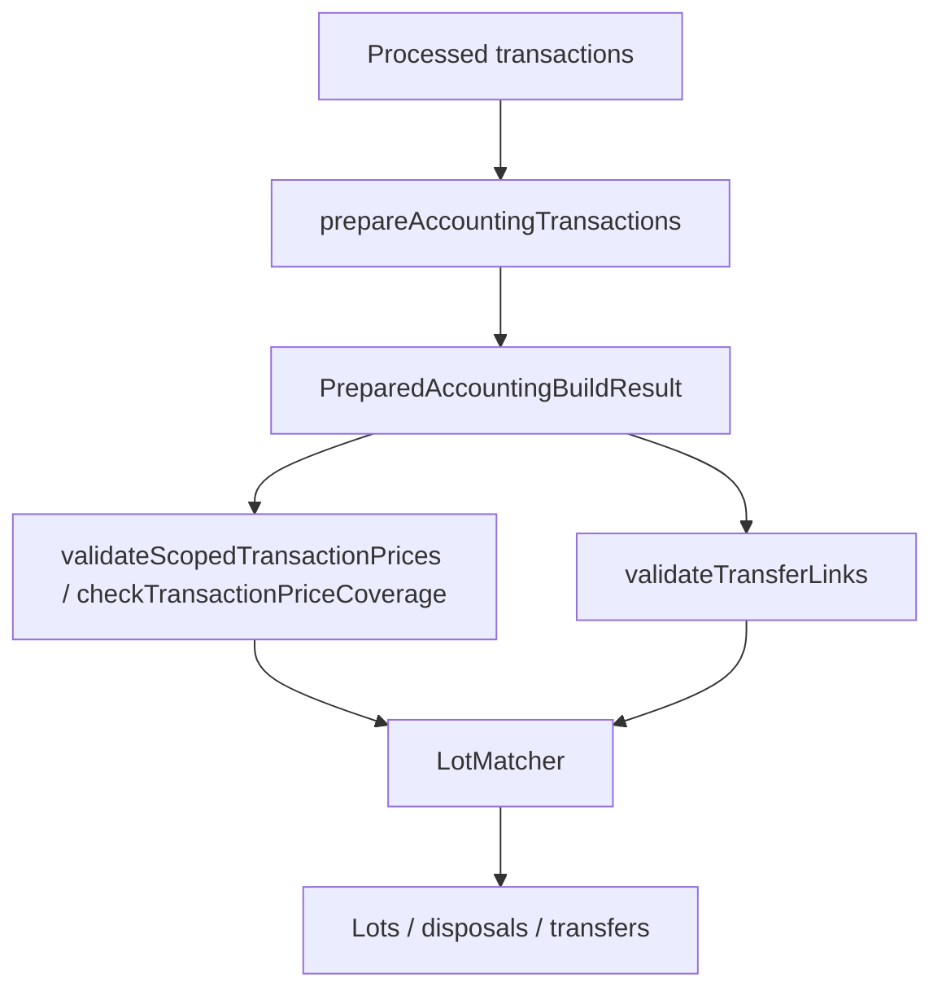

# Cost Basis Accounting Scope Specification

> ⚠️ **Code is law**: If this document disagrees with implementation, the implementation is correct and this spec must be updated.

Defines the accounting-owned boundary that cost basis builds from processed transactions before price validation, confirmed-link validation, and lot matching.

## Quick Reference

| Concept                | Key Rule                                                                                                                 |
| ---------------------- | ------------------------------------------------------------------------------------------------------------------------ |
| Preparation boundary   | Cost basis builds `PreparedAccountingBuildResult` in memory from processed transactions                                  |
| Same-hash grouping     | Blockchain transactions group by `(blockchain, normalizedHash, assetId)`                                                 |
| Ambiguity policy       | Same-hash asset identity collisions and mixed/multi-movement topologies return `Err`                                     |
| Movement identity      | Prepared inflows/outflows keep persisted `movementFingerprint`; prepared rewrites preserve fingerprint-targeted identity |
| Fee ownership          | Same-asset on-chain fees are deduplicated to one sender-owned prepared fee using `max(...)`                              |
| Fee-only internal case | Purely internal same-hash groups emit `InternalTransferCarryoverDraft` sidecars                                          |
| Price gating           | Price coverage and hard price validation run on prepared movements and prepared fees                                     |
| Link eligibility       | Cost basis validates only `status='confirmed'` non-`blockchain_internal` links                                           |
| Exclusions seam        | Accounting exclusions belong after preparation and before downstream validation/matching                                 |

## Goals

- **Accounting-owned meaning**: Cost basis must derive its own accounting view instead of inferring behavior from linker-era internal-link heuristics.
- **Deterministic identity**: Prepared movement rewriting must preserve raw movement identity so persisted links can validate without symbol or amount guessing.
- **Fail-closed safety**: Ambiguous same-hash groups, invalid prepared links, and missing required prepared prices must stop the run rather than degrade silently.
- **Clean downstream boundary**: Price validation, transfer validation, and lot matching should all consume the same prepared contract.

## Non-Goals

- Defining how persisted `transaction_links` are discovered or suggested upstream.
- Persisting the scoped accounting view as a database projection.
- Redesigning raw `transactions` / `transaction_movements`.
- Applying mixed-transaction accounting exclusions inside the matcher.
- Reintroducing `blockchain_internal` links as a cost-basis side channel.

## Definitions

### PreparedAccountingTransaction

Cost-basis-local transaction shape derived from one `Transaction`:

```ts
interface PreparedFeeMovement extends FeeMovement {
  originalTransactionId: number;
}

interface PreparedAccountingTransaction {
  tx: Transaction;
  rebuildDependencyTransactionIds: number[];
  movements: {
    inflows: AssetMovement[];
    outflows: AssetMovement[];
  };
  fees: PreparedFeeMovement[];
}
```

Semantics:

- `tx` remains the immutable raw source fact.
- `rebuildDependencyTransactionIds` records sibling raw transactions that must accompany this prepared row if the pipeline rebuilds after price filtering.
- `movements` and `fees` are the authoritative accounting input for cost basis.
- `movementFingerprint` always points back to the persisted processed movement identity, even after prepared rewriting.
- prepared fees are cloned and normalized separately from raw `tx.fees`.

### InternalTransferCarryoverDraft

Cost-basis-local sidecar for a same-hash internal transfer where no external transfer quantity remains but fee treatment still matters:

```ts
interface InternalTransferCarryoverDraftTarget {
  targetTransactionId: number;
  targetMovementFingerprint: string;
  quantity: Decimal;
}

interface InternalTransferCarryoverDraft {
  assetId: string;
  assetSymbol: Currency;
  fee: PreparedFeeMovement;
  retainedQuantity: Decimal;
  sourceTransactionId: number;
  sourceMovementFingerprint: string;
  targets: InternalTransferCarryoverDraftTarget[];
}
```

This is not a persisted `TransactionLink`. It exists only inside the cost-basis pipeline.

### PreparedAccountingBuildResult

```ts
interface PreparedAccountingBuildResult {
  inputTransactions: Transaction[];
  transactions: PreparedAccountingTransaction[];
  internalTransferCarryoverDrafts: InternalTransferCarryoverDraft[];
}
```

This is the handoff contract for prepared price checks, confirmed-link validation, and lot matching.

### ValidatedTransferSet

Confirmed external links after scoped validation:

```ts
interface ValidatedTransferLink {
  isPartialMatch: boolean;
  link: TransactionLink;
  sourceAssetId: string;
  sourceMovementAmount: Decimal;
  sourceMovementFingerprint: string;
  targetAssetId: string;
  targetMovementAmount: Decimal;
  targetMovementFingerprint: string;
}

interface ValidatedTransferSet {
  bySourceMovementFingerprint: Map<string, ValidatedTransferLink[]>;
  byTargetMovementFingerprint: Map<string, ValidatedTransferLink[]>;
  links: ValidatedTransferLink[];
}
```

These indexes are matcher-facing lookup structures, not persistence.

## Behavioral Rules

### Scoped Build

`prepareAccountingTransactions(...)` is the first accounting step after processed transactions are loaded.

For every raw transaction it:

- reuses the persisted transaction fingerprint
- reuses the persisted inflow/outflow movement fingerprints
- clones inflows, outflows, and fees into scoped arrays
- clones numeric amounts into new `Decimal` instances
- initializes `rebuildDependencyTransactionIds` for later same-hash dependency tracking

Raw source facts are never mutated. All same-hash reduction happens against the cloned scoped view.

### Same-Hash Grouping

Only blockchain transactions with a normalized hash, at least one movement, and at least two distinct accounts are considered for same-hash scoping.

Grouping rules:

- group by `(blockchain, normalizedHash)` first
- then derive one asset group per `assetId`
- reject any same-hash asset-identity collision:
  - one `assetId` rendered with multiple symbols
  - one symbol mapped to multiple `assetId`s

Each participant is summarized with:

- gross inflow amount for the asset
- gross outflow amount for the asset
- inflow movement count
- outflow movement count
- same-asset on-chain fee amount
- single-movement fingerprints when exactly one scoped inflow/outflow exists

Non-blockchain transactions and non-grouped transactions pass through unchanged.

### Same-Hash Topology Rules

For each `(blockchain, normalizedHash, assetId)` group:

1. Only pure outflow participants:
   no scoped rewrite; this is treated as an external send candidate.
2. Any participant with both inflow and outflow for the asset:
   return `Err`.
3. Pure outflow participants plus pure inflow participants:
   deterministically allocate external quantity across senders in ascending `txId` order after deduplicating the same-asset fee onto one fee owner.
4. Any sender with anything other than exactly one outflow movement:
   return `Err`.
5. Any receiver with anything other than exactly one inflow movement:
   return `Err`.

The error is fail-closed because cost basis cannot safely invent accounting meaning from mixed ownership or multi-movement same-hash groups.

### Internal With External Amount

When a group has pure outflow participants plus one or more pure inflow participants, and external quantity remains after internal change plus fee deduction:

```text
scoped sender gross outflow = allocated external quantity + allocated fee share
scoped sender net outflow   = allocated external quantity
```

Behavior:

- remove same-asset inflows from scoped receiver transactions
- rewrite each contributing sender scoped outflow amount
- deduplicate same-asset on-chain fees across the group using the maximum fee amount seen
- remove same-asset on-chain fees from all participants
- re-add one normalized same-asset on-chain fee to the chosen fee-owner transaction

This keeps fee treatment explicit at the scoped boundary instead of burying it in matcher-local amount heuristics.

### Fee-Only Internal Carryover

When the same-hash group has zero external quantity after internal inflows and deduplicated fee:

- remove the sender scoped outflow for that asset
- keep receiver scoped inflows in place
- normalize same-asset on-chain fee ownership onto the sender prepared transaction
- emit one `InternalTransferCarryoverDraft` with movement-fingerprint-targeted receiver bindings

If internal inflows plus deduplicated fee exceed the sender outflow, return `Err`.

### Scoped Price Validation And Coverage

Price coverage and hard price validation operate on the scoped boundary, not raw processed rows.

Consequences:

- movements removed by same-hash scoping do not require prices
- fees removed by fee normalization do not require prices
- surviving scoped inflows, outflows, and fees must still carry complete USD-denominated pricing plus FX audit trail when needed

`validateScopedTransactionPrices(...)` returns the raw transactions whose scoped forms are still price-complete. In soft-exclusion flows, the pipeline must rebuild the scoped result from that filtered raw subset so same-hash reductions and carryovers are recomputed against the surviving transactions.

### Confirmed Link Validation

`validateTransferLinks(...)` validates confirmed external links against the
canonical `AccountingTransactionView[]`.

Accepted links:

- `status === 'confirmed'`
- `linkType !== 'blockchain_internal'`

Validation rules:

- both source and target transactions must either both be in scope or both be out of scope
- a one-sided in-scope link is a hard error
- source and target movement fingerprints must resolve to exactly one scoped outflow/inflow
- resolved transaction IDs must match the persisted link endpoints
- resolved `assetId` values must match `sourceAssetId` / `targetAssetId`
- resolved symbols must match persisted `assetSymbol`
- non-partial links must match the full scoped movement amount exactly
- partial links must each be positive, within movement bounds, and reconcile to the full movement total per fingerprint
- one movement cannot mix partial and full links

The output is indexed by source and target movement fingerprint so the matcher does not rebuild symbol-based or amount-based lookup heuristics.

### Matcher Handoff

The lot matcher consumes:

1. `PreparedAccountingBuildResult`
2. `ValidatedTransferSet`
3. jurisdiction rules

At this boundary:

- same-hash internal accounting meaning is already resolved
- `blockchain_internal` links are no longer part of matcher behavior
- fee-only internal carryovers participate via local dependency edges and local provenance
- transfer lookup is movement-fingerprint targeted

The matcher is allowed to treat a scoped outflow or inflow as an ordinary disposal/acquisition only when no validated link or carryover binding targets that movement.

### Exclusions Seam

Accounting exclusions belong after the scoped build and before scoped validation/matching:

```text
processed transactions
        ↓
prepareAccountingTransactions()
        ↓
accounting exclusion policy
        ↓
scoped price validation / scoped link validation / lot matching
```

The matcher must not become the place where excluded movements are re-decided.

## Pipeline / Flow



## Invariants

- **Required**: `tx` remains the immutable raw fact; only scoped clones are rewritten.
- **Required**: scoped movement identity survives rewriting via `movementFingerprint`.
- **Required**: same-hash grouping keys by `assetId`, not symbol alone.
- **Required**: mixed or multi-movement same-hash groups fail closed.
- **Required**: same-asset on-chain fee ownership is normalized to one scoped sender fee after same-hash reduction.
- **Required**: only confirmed external links are eligible for scoped transfer validation.
- **Required**: partial-link groups reconcile exactly to the scoped movement amount.
- **Enforced**: price validation, link validation, and lot matching all operate on the scoped boundary.

## Edge Cases & Gotchas

- Same-hash asset identity collisions are hard errors even when linking could have tolerated skipping them.
- A confirmed link whose endpoints straddle the scoped batch boundary is a hard error.
- A fee-only internal group keeps receiver inflows alive; removing them would destroy the basis-carryover target.
- Deduplicated same-asset on-chain fee uses `max(...)`, not sum, across participants.
- Scoped fee normalization can remove every same-asset fee from receivers and then re-create one normalized sender fee.
- Soft missing-price exclusion must rebuild the scoped subset; filtering raw transactions without rebuilding can leave stale carryover state.

## Known Limitations (Current Implementation)

- Mixed-transaction user-controlled accounting exclusions are not yet implemented as a first-class scoped policy.
- The scoped accounting view is ephemeral; it is rebuilt for each cost-basis or price-coverage run.
- This spec defines the accounting boundary, not jurisdiction-specific lot allocation strategy behavior.

## Related Specs

- [Transaction and Movement Identity](./transaction-and-movement-identity.md) — canonical processed identity contracts that scoped accounting reuses
- [Cost Basis Orchestration](./cost-basis-orchestration.md) — workflow ownership and consumer execution boundaries above the scoped input layer
- [Cost Basis Artifact Storage](./cost-basis-artifact-storage.md) — persisted debug/artifact surfaces built from scoped execution results
- [Transaction Linking](./transaction-linking.md) — persisted link contract and link-generation rules
- [Transfers & Tax](./transfers-and-tax.md) — transfer preservation, fee policy, and tax-facing matcher behavior
- [Lot Matcher Transaction Dependency Ordering](./lot-matcher-transaction-dependency-ordering.md) — dependency ordering once scoped links and carryovers are prepared
- [Average Cost Basis](./average-cost-basis.md) — Canada-specific workflow from scoped boundary to CAD tax output
- [Fees](./fees.md) — fee treatment that applies after scoped fee normalization

---

_Last updated: 2026-03-19_
