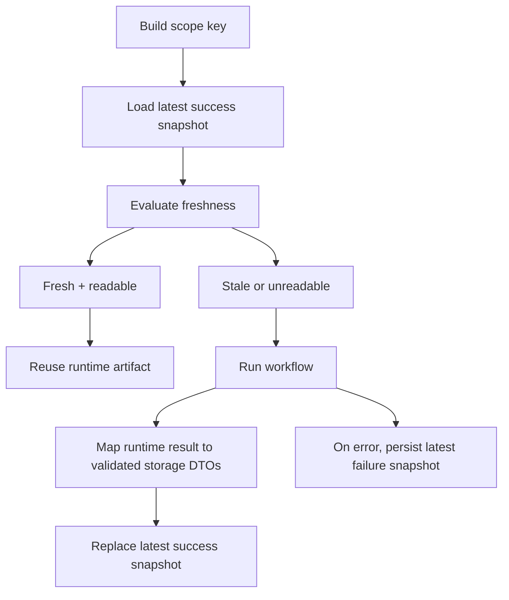

# Cost Basis Artifact Storage Specification

Defines how Exitbook persists, reloads, and invalidates cost-basis artifacts and failure snapshots. This spec covers latest-success snapshot reuse, dependency watermark freshness, storage DTO boundaries, and latest-failure persistence.

## Quick Reference

| Concept                 | Key Rule                                                                                        |
| ----------------------- | ----------------------------------------------------------------------------------------------- |
| Latest success snapshot | One mutable latest row per cost-basis scope in `cost_basis_snapshots`                           |
| Latest failure snapshot | One mutable latest row per `(scope_key, consumer)` in `cost_basis_failure_snapshots`            |
| Scope identity          | Scope key is profile-qualified and includes a stable config fingerprint, not presentation flags |
| Freshness gate          | Reuse requires matching versions, fresh projections, matching timestamps, and same exclusions   |
| Price freshness         | Reuse compares `pricesLastMutatedAt`, not a projection-state row                                |
| Storage boundary        | Persisted payloads are explicit JSON DTOs validated with Zod on write and read                  |
| Unreadable snapshot     | A fresh-but-unreadable latest artifact is rebuilt rather than partially trusted                 |
| History / pins          | Not implemented; only mutable latest success and latest failure snapshots exist                 |

## Goals

- **Safe reuse**: Reuse a latest cost-basis artifact only when freshness can be proven.
- **Debuggability**: Persist enough success and failure state to inspect cost-basis behavior after command exit.
- **Explicit storage contract**: Separate runtime accounting objects from stored JSON DTOs.
- **Clear ownership**: Keep artifact freshness, mapping, and parsing rules inside the accounting capability.

## Non-Goals

- Cost-basis as a projection in `projection_state`.
- Immutable pinning/history for successful artifacts.
- Normalized persisted tables for lots, disposals, transfers, or Canada tax rows.
- Reusing a snapshot when any freshness input is missing or uncertain.
- A shared read API for failure snapshots.

## Definitions

### Scope Key

The latest-success and latest-failure surfaces are keyed by the cost-basis calculation scope:

```ts
buildCostBasisScopeKey(profileId, config);
```

Current full scope identity includes:

- `profileId`
- stable config fingerprint

The stable config fingerprint includes:

- `method`
- `jurisdiction`
- `taxYear`
- `startDate`
- `endDate`
- `currency`
- `specificLotSelectionStrategy`

The stable config fingerprint excludes:

- `asset`
- `json`

Those are presentation concerns, not calculation identity.

The config-only fingerprint is built separately via:

```ts
buildCostBasisConfigScopeKey(config);
```

### Dependency Watermark

Artifact freshness compares persisted metadata against a current dependency watermark:

```ts
interface CostBasisDependencyWatermark {
  links: { status: ProjectionStatus | 'missing'; lastBuiltAt?: Date };
  assetReview: { status: ProjectionStatus | 'missing'; lastBuiltAt?: Date };
  pricesLastMutatedAt?: Date;
  exclusionFingerprint: string;
}
```

Current sources:

- `links` and `asset-review` come from `projection_state`
- `pricesLastMutatedAt` comes from `prices.db`
- `exclusionFingerprint` is derived from the effective excluded asset-id set

### Latest Success Snapshot

One mutable latest row per scope in `cost_basis_snapshots`.

Semantics:

- every successful rebuild replaces the prior latest row for that scope
- the current exact built artifact instance is identified by `snapshot_id`
- persisted JSON is split into:
  - `artifact_json`
  - `debug_json`

### Latest Failure Snapshot

One mutable latest row per `(scope_key, consumer)` in `cost_basis_failure_snapshots`.

Current consumers:

- `cost-basis`
- `portfolio`

Failure snapshots are persisted only for debugging and latest-state inspection. They are not reused as execution inputs.

### Storage Envelope

Artifact JSON is persisted through a versioned envelope defined in accounting-owned Zod schemas.

Key fields:

- `storageSchemaVersion`
- `calculationEngineVersion`
- `artifactKind`
- `scopeKey`
- `snapshotId`
- `calculationId`
- `createdAt`
- `artifact`
- `debug`

## Behavioral Rules

### Success Snapshot Reuse

`CostBasisArtifactService` owns latest-success reuse for the `cost-basis` consumer.

Rules:

1. Build `scopeKey` from the profile-qualified calculation scope.
2. If `refresh !== true`, try `artifactStore.findLatest(scopeKey)`.
3. If a latest row exists, evaluate freshness against the current dependency watermark.
4. If freshness is `fresh`, parse the stored payload back into runtime artifact/debug objects.
5. If parsing succeeds, reuse the artifact immediately.
6. If parsing fails, log a warning and rebuild.
7. If freshness is stale or refresh is forced, execute the workflow and replace the latest row.

Portfolio does not participate in this reuse path.

### Freshness Contract

A latest success snapshot is reusable only if all of the following hold:

- `storageSchemaVersion` matches `COST_BASIS_STORAGE_SCHEMA_VERSION`
- `calculationEngineVersion` matches `COST_BASIS_CALCULATION_ENGINE_VERSION`
- `links.status === 'fresh'` and `links.lastBuiltAt` exists
- `assetReview.status === 'fresh'` and `assetReview.lastBuiltAt` exists
- `links.lastBuiltAt === snapshot.linksBuiltAt`
- `assetReview.lastBuiltAt === snapshot.assetReviewBuiltAt`
- `pricesLastMutatedAt === snapshot.pricesLastMutatedAt`
- `exclusionFingerprint === snapshot.exclusionFingerprint`

If any check fails, the artifact is stale and must be rebuilt.

### Storage DTO Boundary

Stored payloads are explicit JSON DTOs, not raw runtime objects.

Current conversion rules:

- `Decimal` values persist as fixed-point strings
- `Date` values persist as ISO 8601 strings
- `Map` values persist as plain objects or arrays
- payloads validate on write and read via Zod schemas

Current artifact families:

- generic lot-pipeline artifact DTO
- Canada artifact DTO
- generic debug DTO
- Canada debug DTO

### Success Snapshot Contents

#### `artifact_json`

`artifact_json` stores the user-facing render payload needed to reconstruct the runtime artifact:

- generic path:
  - calculation
  - lots
  - disposals
  - lot transfers
  - optional converted report
  - `executionMeta`
- Canada path:
  - calculation
  - tax report
  - display report
  - `executionMeta`

#### `debug_json`

`debug_json` stores reference-first debug context rather than every reachable runtime object.

Current generic debug payload:

- `inputTransactionIds`
- `appliedConfirmedLinkIds`

Current Canada debug payload:

- `inputTransactionIds`
- `appliedConfirmedLinkIds`
- `acquisitionEventIds`
- `dispositionEventIds`
- `transferIds`
- `superficialLossAdjustmentIds`

### Failure Snapshot Contents

Failure snapshots persist:

- scope identity
- consumer
- projection freshness status/timestamps
- `pricesLastMutatedAt`
- exclusion fingerprint
- config summary
- error name/message/stack
- `debugJson`
- timestamps

Current `debugJson` intentionally stores only:

- `stage`
- optional `context`

Dependency watermark details are stored in dedicated columns rather than duplicated inside the JSON payload.

### Failure Persistence Semantics

Failure snapshots are persisted through a shared accounting helper:

```ts
persistCostBasisFailureSnapshot(store, {
  consumer,
  input,
  dependencyWatermark,
  error,
  stage,
  context,
});
```

Rules:

- the snapshot is keyed by the same scope logic as success artifacts
- latest failure is replaced for the same `(scope_key, consumer)`
- persistence errors are not swallowed
- if failure persistence also fails, the surfaced user-facing error leads with the original execution failure and appends the persistence failure

### Reset / Clear Behavior

Current derived-data cleanup deletes both:

- latest success snapshots
- latest failure snapshots

Cost-basis snapshots are persisted artifacts, not projections, so they do not participate in projection-native reset planning.

## Data Model

### `cost_basis_snapshots`

```sql
scope_key                  TEXT PRIMARY KEY,
snapshot_id                TEXT NOT NULL,
storage_schema_version     INTEGER NOT NULL,
calculation_engine_version INTEGER NOT NULL,
artifact_kind              TEXT NOT NULL,
links_built_at             TEXT NOT NULL,
asset_review_built_at      TEXT NOT NULL,
prices_last_mutated_at     TEXT,
exclusion_fingerprint      TEXT NOT NULL,
calculation_id             TEXT NOT NULL,
jurisdiction               TEXT NOT NULL,
method                     TEXT NOT NULL,
tax_year                   INTEGER NOT NULL,
display_currency           TEXT NOT NULL,
start_date                 TEXT NOT NULL,
end_date                   TEXT NOT NULL,
artifact_json              TEXT NOT NULL CHECK(json_valid(artifact_json)),
debug_json                 TEXT NOT NULL CHECK(json_valid(debug_json)),
created_at                 TEXT NOT NULL,
updated_at                 TEXT NOT NULL
```

#### Field Semantics

- `scope_key`: latest-snapshot identity for one calculation scope
- `snapshot_id`: exact built artifact instance id
- `artifact_kind`: `generic` or `canada`
- `artifact_json`: validated render payload
- `debug_json`: validated debug payload

### `cost_basis_failure_snapshots`

```sql
scope_key              TEXT NOT NULL,
consumer               TEXT NOT NULL,
snapshot_id            TEXT NOT NULL,
links_status           TEXT NOT NULL,
links_built_at         TEXT,
asset_review_status    TEXT NOT NULL,
asset_review_built_at  TEXT,
prices_last_mutated_at TEXT,
exclusion_fingerprint  TEXT NOT NULL,
jurisdiction           TEXT NOT NULL,
method                 TEXT NOT NULL,
tax_year               INTEGER NOT NULL,
display_currency       TEXT NOT NULL,
start_date             TEXT NOT NULL,
end_date               TEXT NOT NULL,
error_name             TEXT NOT NULL,
error_message          TEXT NOT NULL,
error_stack            TEXT,
debug_json             TEXT NOT NULL CHECK(json_valid(debug_json)),
created_at             TEXT NOT NULL,
updated_at             TEXT NOT NULL,
PRIMARY KEY (scope_key, consumer)
```

#### Field Semantics

- `consumer`: `cost-basis` or `portfolio`
- status columns: persisted projection freshness/debug context at failure time
- `debug_json`: stage/context JSON only
- primary key: latest failure only per scope + consumer

## Pipeline / Flow



## Invariants

- **Required**: Success snapshots are reused only when freshness can be proven.
- **Required**: Stored payloads are validated on both write and read.
- **Required**: Cost-basis artifacts remain outside the projection graph.
- **Required**: Success and failure persistence remain separate storage concerns.
- **Required**: Only the latest mutable success/failure rows exist; there is no immutable history surface today.

## Edge Cases & Gotchas

- **Fresh but unreadable**: a fresh snapshot with invalid JSON/schema is rebuilt, not partially trusted.
- **Price freshness is external to projection_state**: price mutation time comes from `prices.db`, not a projection row.
- **Scope key is calculation identity only**: asset filtering or output format flags do not create separate artifacts.
- **Debug payloads are intentionally lossy**: they preserve ids and derived context, not full raw transaction/link duplication.

## Known Limitations (Current Implementation)

- No immutable pinning/history or labeling surface exists.
- No shared failure read API exists.
- Only the `cost-basis` consumer reuses success artifacts; portfolio always computes fresh.
- Latest success snapshots still overwrite the mutable row for a scope rather than preserving prior latest-row history.

## Related Specs

- [Cost Basis Orchestration](./cost-basis-orchestration.md) — execution ownership and consumer boundaries
- [Canada Average Cost Basis](./average-cost-basis.md) — Canada artifact payload semantics
- [Cost Basis Accounting Scope](./cost-basis-accounting-scope.md) — prepared transaction/debug identity inputs
- [Projection System](./projection-system.md) — upstream freshness model consumed by the watermark

---

_Last updated: 2026-03-14_
