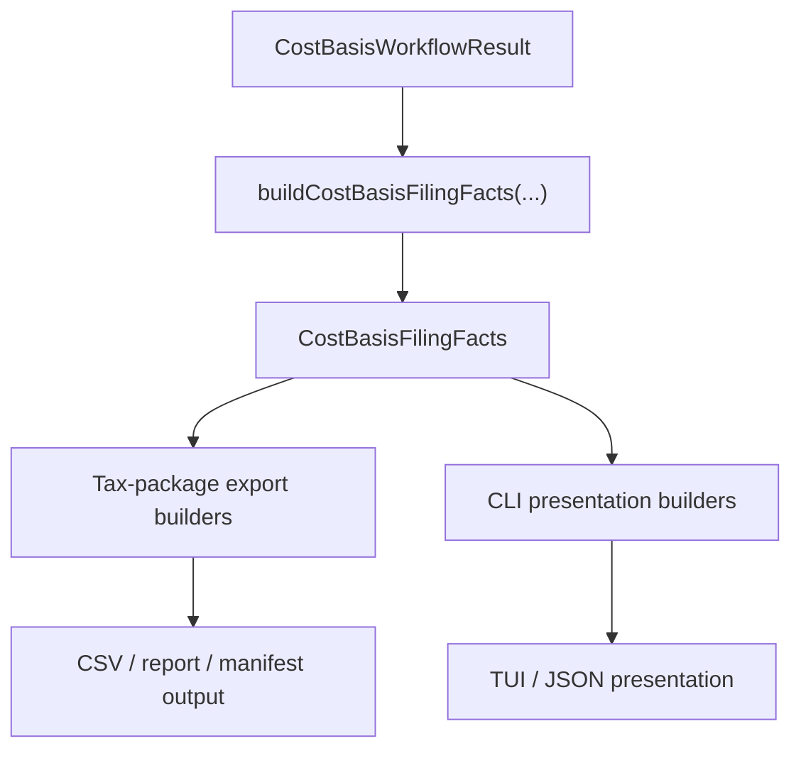

# Cost Basis Filing Facts Specification

> ⚠️ **Code is law**: If this document disagrees with implementation, the implementation is correct and this spec must be updated.

Defines the accounting-owned filing-facts seam shared by tax-package export and the regular `cost-basis` CLI presentation. This spec covers the facts boundary, normalization rules, currency semantics, and the adapter responsibilities on either side of the seam.

## Quick Reference

| Concept            | Key Rule                                                                                |
| ------------------ | --------------------------------------------------------------------------------------- |
| Shared seam        | `buildCostBasisFilingFacts(...)` is the durable accounting-owned facts boundary         |
| Consumers          | Tax-package export and CLI presentation both consume `CostBasisFilingFacts`             |
| Currency           | Filing facts are canonical in tax currency, not display currency                        |
| Standard facts     | Standard workflow artifacts map to lot-based filing facts                               |
| Canada facts       | Canada workflow artifacts map to tax-report-based filing facts                          |
| Source labels      | Account labels and source URLs stay adapter-level, outside the filing-facts builder     |
| US holding period  | Filing facts normalize US tax treatment from calendar dates, not a fixed 365-day cutoff |
| Export-only fields | Package-local refs, CSV headers, and software-specific mappings stay outside core facts |

## Goals

- **One accounting-owned contract**: Export and CLI must read the same canonical tax facts instead of re-deriving them independently.
- **Fact-first boundary**: The seam should expose tax facts Exitbook actually knows, not downstream filing placement guesses.
- **Jurisdiction-aware without adapter leakage**: Canada and standard workflows both map into one shared contract while preserving their different tax models.
- **Thin adapters**: Presentation, CSV naming, source-label resolution, and software-specific shaping remain outside the core facts builder.

## Non-Goals

- Building tax-return interview logic, e-file assembly, or vendor-specific import contracts inside accounting.
- Resolving account labels, source URLs, or package-local row refs inside the facts seam.
- Treating unsupported downstream filing placement as a core fact.
- Making display-currency conversion part of the filing-facts builder.

## Definitions

### `CostBasisFilingFacts`

The top-level shared contract built from a `CostBasisWorkflowResult`:

```ts
interface CostBasisFilingFactsBase {
  calculationId: string;
  jurisdiction: string;
  method: CostBasisMethod;
  taxYear: number;
  taxCurrency: string;
  scopeKey?: string | undefined;
  snapshotId?: string | undefined;
  summary: CostBasisFilingFactsSummary;
  assetSummaries: CostBasisFilingAssetSummary[];
}

interface StandardCostBasisFilingFacts extends CostBasisFilingFactsBase {
  kind: 'standard';
  acquisitions: StandardCostBasisAcquisitionFilingFact[];
  dispositions: StandardCostBasisDispositionFilingFact[];
  transfers: StandardCostBasisTransferFilingFact[];
}

interface CanadaCostBasisFilingFacts extends CostBasisFilingFactsBase {
  kind: 'canada';
  acquisitions: CanadaCostBasisAcquisitionFilingFact[];
  dispositions: CanadaCostBasisDispositionFilingFact[];
  transfers: CanadaCostBasisTransferFilingFact[];
  superficialLossAdjustments: CanadaSuperficialLossAdjustmentFilingFact[];
}
```

Semantics:

- `summary` is a cross-asset aggregate in tax currency.
- `assetSummaries` are per-asset or per-tax-property aggregates in tax currency.
- `scopeKey` and `snapshotId` are passthrough artifact metadata for downstream export/presentation traceability.

### Asset Identity

Every filing fact carries a user-facing asset symbol plus the jurisdiction-appropriate technical identity:

- standard facts use `assetId`
- Canada facts use `taxPropertyKey`

Adapters may convert these into collision-safe display labels, but the filing-facts seam keeps the canonical identity fields.

### Filing-Facts Consumers

Current consumers:

- tax-package export builders in `packages/accounting/src/cost-basis/export/`
- CLI presentation builders in `apps/cli/src/features/cost-basis/`

Future software adapters may consume the same seam, but they remain an edge concern rather than part of the filing-facts contract itself.

## Behavioral Rules

### Build Entrypoint

The shared seam is built from the workflow artifact:

```ts
buildCostBasisFilingFacts({
  artifact: CostBasisWorkflowResult,
  scopeKey?: string,
  snapshotId?: string,
}): Result<CostBasisFilingFacts, Error>
```

Rules:

- the builder dispatches by workflow kind, not by CLI mode or export format
- `standard-workflow` maps to `StandardCostBasisFilingFacts`
- `canada-workflow` maps to `CanadaCostBasisFilingFacts`
- the builder returns `Err(...)` on missing required workflow linkage, such as a disposal whose source lot cannot be found

### Ownership Boundary

Accounting owns:

- acquisition, disposition, and transfer facts
- per-asset and cross-asset filing summaries
- jurisdiction-specific tax-treatment facts
- denied-loss and taxable-gain semantics already present in the workflow/tax report
- canonical US filing tax-treatment normalization for the filing-facts seam

Adapters own:

- CSV column names
- markdown report wording
- package-local refs such as `DISP-0001`
- account labels and source traceability appendices
- display-currency overlays
- software-specific mappings at the edge

Adapters must not invent:

- unsupported `form_8949_*` placement
- unsupported adjustment-code mappings
- generic wash-sale behavior not justified by the artifact model

### Standard Workflow Mapping

For `standard-workflow` artifacts, filing facts are built from:

- `lots`
- `disposals`
- `lotTransfers`
- `summary`

Required standard facts include:

- asset identity
- acquisition date
- disposal date
- transaction ids
- lot linkage
- gross proceeds
- selling expenses
- net proceeds
- cost basis
- gain/loss
- taxable gain/loss
- holding-period information
- tax-treatment classification
- transfer linkage and carryover basis

Standard transfers may also carry:

- `linkedConfirmedLinkId` for confirmed-link provenance
- `sameAssetFeeAmount` when same-asset transfer fee value was capitalized into the carryover amount

### Canada Workflow Mapping

For `canada-workflow` artifacts, filing facts are built from:

- `calculation`
- `taxReport`

Required Canada facts include:

- tax property grouping
- acquisition facts
- disposition facts
- transfer facts
- ACB facts
- gain/loss facts
- taxable gain/loss facts
- superficial-loss adjustments already present in the tax report

Canada filing facts do not carry source-label resolution or package-local export identities.

### Currency Rule

Filing facts are canonical in tax currency.

Rules:

- standard filing facts use the workflow artifact monetary values
- Canada filing facts use the Canada tax-report monetary values
- export consumes filing facts directly in tax currency
- CLI may overlay converted display amounts from the display report, but the filing-facts seam itself stays in tax currency

### US Tax-Treatment Normalization

For `jurisdiction === 'US'`, filing facts normalize `taxTreatmentCategory` from acquisition and disposal calendar dates.

Rules:

- the exact one-year anniversary date is still `short_term`
- long-term treatment starts only after the one-year anniversary date
- the filing-facts builder does not trust persisted `taxTreatmentCategory` blindly for US artifacts
- older stored artifacts without `taxTreatmentCategory` still normalize correctly from dates

This is the canonical rule for export and CLI consumers of the filing-facts seam.

### Consumer Rules

Tax-package export:

- consumes filing facts plus source context and readiness metadata
- keeps row refs, source-link appendices, and file-format concerns in export builders

CLI presentation:

- builds filing facts once in the command layer
- maps filing facts into view models
- keeps formatting, sorting, and display-currency overlays in the CLI adapter

## Data Model

### Shared Summary Shape

```ts
interface CostBasisFilingFactsSummary {
  assetCount: number;
  acquisitionCount: number;
  dispositionCount: number;
  transferCount: number;
  totalProceeds: Decimal;
  totalCostBasis: Decimal;
  totalGainLoss: Decimal;
  totalTaxableGainLoss: Decimal;
  totalDeniedLoss: Decimal;
  byTaxTreatment: CostBasisFilingTaxTreatmentSummary[];
}
```

Field semantics:

- `totalDeniedLoss` is always positive when a denied-loss amount exists
- `byTaxTreatment` is meaningful for standard workflows; Canada currently leaves it empty

### Standard-Only Facts

Standard dispositions add:

- `lotId`
- `acquiredAt`
- `holdingPeriodDays`
- `acquisitionTransactionId`
- `disposalTransactionId`
- `grossProceeds`
- `sellingExpenses`
- `netProceeds`
- `lossDisallowed`

Standard transfers add:

- `sourceLotId`
- `sourceTransactionId`
- `targetTransactionId`
- `provenanceKind`
- optional `linkedConfirmedLinkId`
- optional `sourceAcquiredAt`
- optional `sameAssetFeeAmount`

### Canada-Only Facts

Canada acquisitions add:

- `acquisitionEventId`
- `taxPropertyKey`
- `remainingAllocatedCostBasis`

Canada dispositions add:

- `dispositionEventId`
- `taxPropertyKey`
- `transactionId`

Canada transfers add:

- `direction`
- `taxPropertyKey`
- `transactionId`
- optional source/target transfer ids
- optional source/target transaction ids
- optional `linkedConfirmedLinkId`
- `feeAdjustment`

Canada superficial-loss adjustments add:

- `adjustedAt`
- `taxPropertyKey`
- `deniedLossAmount`
- `deniedQuantity`
- `relatedDispositionId`
- `substitutedPropertyAcquisitionId`

## Pipeline



## Invariants

- `summary`, `assetSummaries`, and row-level facts are all in the same tax currency.
- Filing facts never depend on source-label resolution.
- Filing facts never depend on CSV headers, markdown wording, or CLI formatting.
- Export-only grouping fields and package-local refs do not belong in `CostBasisFilingFacts`.
- Export and CLI must consume the same canonical US filing tax-treatment result from filing facts, not re-derive it independently.

## Edge Cases & Gotchas

- **US anniversary boundary**: A disposal on the exact one-year anniversary remains `short_term` in the filing-facts seam.
- **Legacy artifact drift**: Older persisted standard artifacts may store outdated or missing US `taxTreatmentCategory`; the filing-facts seam corrects that for downstream consumers.
- **Collision-safe labels are adapter logic**: When one symbol maps to multiple `assetId`s or `taxPropertyKey`s, adapters may append the identity in parentheses, but that is not part of the filing-facts contract.
- **Denied losses vs taxable gains**: Filing facts expose denied-loss amounts explicitly; consumers must not recompute taxable amounts from display-converted gain/loss approximations.

## Known Limitations (Current Implementation)

- US calendar-date normalization currently lives in the filing-facts seam, not in `IJurisdictionRules` or the persisted generic workflow calculation path.
- Canada export still reconstructs some adapter-only disposition fields such as gross proceeds and selling expenses from `inputContext` rather than from Canada filing facts alone.
- No software-adapter layer exists yet for vendor-specific tax-import formats.

## Related Specs

- [Cost Basis Tax Package Export](./cost-basis-tax-package-export.md)
- [Cost Basis Orchestration](./cost-basis-orchestration.md)
- [Cost Basis Accounting Scope](./cost-basis-accounting-scope.md)
- [Average Cost Basis](./average-cost-basis.md)
- [CLI Cost Basis View](./cli/cost-basis/cost-basis-view-spec.md)

---

_Last updated: 2026-03-15_
