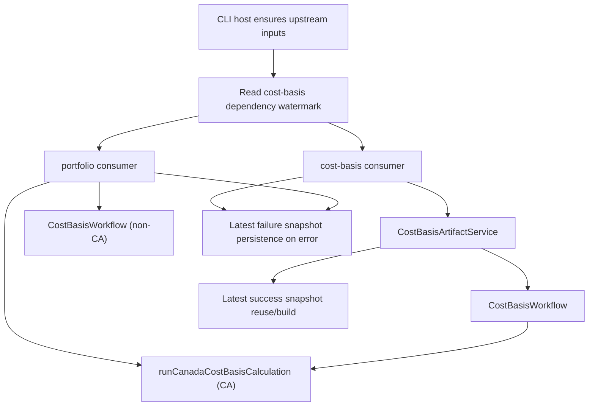

# Cost Basis Orchestration Specification

> ⚠️ **Code is law**: If this document disagrees with implementation, the implementation is correct and this spec must be updated.

Defines the accounting-owned orchestration boundary for cost-basis execution across the `cost-basis` and `portfolio` consumers. This spec covers jurisdiction dispatch, consumer-specific execution policy, and the separation between workflow execution, artifact reuse, and failure persistence.

## Quick Reference

| Concept              | Key Rule                                                                               |
| -------------------- | -------------------------------------------------------------------------------------- |
| Dispatcher           | `CostBasisWorkflow` owns jurisdiction dispatch inside `@exitbook/accounting`           |
| Generic path         | Non-`CA` jurisdictions use the generic lot pipeline through the workflow               |
| Canada path          | `CA` reuses `runCanadaCostBasisCalculation(...)`, not duplicated handler orchestration |
| Consumer policy      | `missingPricePolicy` is explicit per consumer, not hardcoded in handlers               |
| Artifact reuse       | Only the `cost-basis` consumer uses artifact reuse through `CostBasisArtifactService`  |
| Portfolio execution  | `portfolio` always calculates fresh and shapes results locally                         |
| Failure persistence  | Both consumers persist latest failure snapshots through a shared accounting helper     |
| Abstraction boundary | No registry or `IJurisdictionCostBasisEngine` abstraction exists in the current code   |

## Goals

- **Accounting-owned dispatch**: Jurisdiction branching stays inside the accounting capability rather than spreading into CLI handlers.
- **Explicit consumer policy**: `cost-basis` and `portfolio` can differ on missing-price behavior without rebuilding separate execution stacks.
- **Shared Canada seam**: Canada math is orchestrated once and reused by both workflow and portfolio.
- **Separated concerns**: Successful artifact reuse and failure snapshot persistence remain distinct capabilities.

## Non-Goals

- Introducing a registry, plugin system, or `supports()`-based jurisdiction resolution.
- Forcing Canada and the generic lot pipeline into one internal artifact shape.
- Moving portfolio position shaping into accounting.
- Making portfolio depend on artifact caching or snapshot reuse.

## Definitions

### Workflow Execution Options

The generic workflow boundary accepts explicit calculation-policy inputs:

```ts
interface CostBasisWorkflowExecutionOptions {
  accountingExclusionPolicy?: AccountingExclusionPolicy;
  assetReviewSummaries?: ReadonlyMap<string, AssetReviewSummary>;
  missingPricePolicy: 'error' | 'exclude';
}
```

Semantics:

- `missingPricePolicy` controls whether incomplete price coverage hard-fails or excludes affected scoped transactions.
- `accountingExclusionPolicy` and `assetReviewSummaries` are accounting-policy inputs, not CLI rendering concerns.

### Execution Metadata

Both generic and Canada execution results expose calculation metadata:

```ts
interface CostBasisExecutionMeta {
  missingPricesCount: number;
  retainedTransactionIds: number[];
}
```

This metadata is consumed by:

- portfolio warnings about excluded transactions
- persisted artifact payloads
- Canada and generic execution parity at the workflow boundary

### Workflow Result Boundary

```ts
type CostBasisWorkflowResult = GenericCostBasisWorkflowResult | CanadaCostBasisWorkflowResult;
```

Current semantics:

- generic results expose lot-based reporting state plus `executionMeta`
- Canada results expose Canada-native tax/display reports plus `executionMeta`

## Behavioral Rules

### Jurisdiction Dispatch

`CostBasisWorkflow.execute(...)` is the primary accounting-owned dispatcher.

Rules:

- `config.jurisdiction === 'CA'` routes to the Canada path
- all other jurisdictions route to the generic lot pipeline
- non-CA consumers do not call `runCostBasisPipeline(...)` directly from CLI handlers

The workflow also owns transaction-window filtering before execution:

- generic path includes all transactions up to report end
- Canada path includes transactions up to `endDate + 30 days` so post-period reacquisitions can affect superficial-loss denial

### Generic Execution Policy

For non-CA execution:

- `missingPricePolicy` is threaded directly into the generic pipeline
- the workflow returns `executionMeta` with:
  - `missingPricesCount`
  - `retainedTransactionIds` from the surviving rebuild transaction set

Current consumer split:

- `cost-basis` passes `missingPricePolicy: 'error'`
- `portfolio` passes `missingPricePolicy: 'exclude'`

### Canada Execution Policy

Canada orchestration is shared through:

```ts
runCanadaCostBasisCalculation({
  input,
  transactions,
  confirmedLinks,
  fxRateProvider,
  accountingExclusionPolicy,
  assetReviewSummaries,
  missingPricePolicy,
  poolSnapshotStrategy,
});
```

The shared runner owns:

- missing-price filtering
- Canada ACB workflow execution
- superficial-loss adjustment generation
- adjusted ACB replay
- pool snapshot replay
- tax report generation
- display report generation

Current caller policy:

- `CostBasisWorkflow` calls it with:
  - `missingPricePolicy: 'error'`
  - `poolSnapshotStrategy: 'report-end'`
- `PortfolioHandler` calls it with:
  - `missingPricePolicy: 'exclude'`
  - `poolSnapshotStrategy: 'full-input-range'`

### Consumer Boundaries

#### `cost-basis`

The `cost-basis` consumer:

- ensures upstream inputs are ready in the host
- reads the current dependency watermark
- delegates reuse vs rebuild to `CostBasisArtifactService`
- fails closed on missing-price coverage
- persists a latest failure snapshot when execution fails

#### `portfolio`

The `portfolio` consumer:

- ensures its own prerequisites and spot-price inputs separately
- reads the same dependency watermark for failure persistence
- calculates fresh every run
- uses `CostBasisWorkflow` for non-CA execution
- uses `runCanadaCostBasisCalculation(...)` for CA execution
- builds user-facing warnings from `executionMeta`
- persists a latest failure snapshot when execution fails

### Artifact Reuse vs Fresh Execution

Artifact reuse is intentionally consumer-specific:

- `cost-basis` may reuse a fresh latest artifact snapshot
- `portfolio` does not reuse cached cost-basis artifacts

This split exists because:

- tax reporting benefits from deterministic latest-snapshot reuse
- portfolio values change with `asOf` and spot-price context, so it remains a fresh calculation surface

### Failure Snapshot Persistence

Failure persistence is a separate accounting capability from success artifact reuse.

Rules:

- execution failures in both `cost-basis` and `portfolio` route through `persistCostBasisFailureSnapshot(...)`
- failure snapshots are latest-only per `(scope_key, consumer)`
- combined user-facing errors lead with the original cost-basis failure message, then append failure-persistence failure details if that secondary write fails

## Data Model

### Workflow-Owned Result Shapes

```ts
interface GenericCostBasisWorkflowResult {
  kind: 'generic-pipeline';
  summary: CostBasisSummary;
  report?: CostBasisReport;
  lots: AcquisitionLot[];
  disposals: LotDisposal[];
  lotTransfers: LotTransfer[];
  executionMeta: CostBasisExecutionMeta;
}

interface CanadaCostBasisWorkflowResult {
  kind: 'canada-workflow';
  calculation: CanadaCostBasisCalculation;
  taxReport: CanadaTaxReport;
  displayReport?: CanadaDisplayCostBasisReport;
  inputContext?: CanadaTaxInputContext;
  executionMeta: CostBasisExecutionMeta;
}
```

### Orchestration Components

Current responsibilities are split as:

- `CostBasisWorkflow`
  - jurisdiction dispatch
  - transaction-window filtering
  - generic workflow execution
  - workflow-level Canada execution for the `cost-basis` consumer path
- `CostBasisArtifactService`
  - latest artifact reuse vs rebuild for `cost-basis`
- `PortfolioHandler`
  - holdings/position shaping
  - consumer-specific warning text
  - CA vs non-CA presentation branching
- `persistCostBasisFailureSnapshot(...)`
  - latest failure persistence for both consumers

## Pipeline / Flow



## Invariants

- **Required**: Jurisdiction dispatch lives inside accounting, not in ad hoc CLI branching for the generic pipeline.
- **Required**: `missingPricePolicy` is explicit at the workflow/shared-runner boundary.
- **Required**: `portfolio` builds warnings from `executionMeta`, not by bypassing the workflow to inspect raw pipeline internals.
- **Required**: Failure persistence remains separate from success artifact reuse.
- **Required**: No consumer may silently suppress execution failure or failure-persistence failure.

## Edge Cases & Gotchas

- **Canada still branches outside `CostBasisWorkflow` in portfolio**: this is intentional because portfolio needs a different `poolSnapshotStrategy` than the workflow-owned `cost-basis` path.
- **Workflow result is a union of authority shapes**: non-CA and CA execution results are intentionally not normalized into one internal reporting model.
- **`displayReport` is typed optional for Canada**: current execution still always builds it.
- **`retainedTransactionIds` can be large**: portfolio warning logic currently pays that cardinality cost to identify excluded transactions precisely.

## Known Limitations (Current Implementation)

- No jurisdiction-engine registry or plugin abstraction exists.
- Canada-specific orchestration is shared as a function, not a polymorphic engine surface.
- `CostBasisWorkflow` still carries an optional constructor-level FX provider rather than fully parameterizing every execution path.
- Future jurisdictions with distinct tax math may eventually justify a different abstraction, but the current implementation does not.

## Related Specs

- [Cost Basis Artifact Storage](./cost-basis-artifact-storage.md) — latest success snapshots, failure snapshots, and freshness rules
- [Canada Average Cost Basis](./average-cost-basis.md) — Canada-specific execution semantics behind the shared runner
- [Cost Basis Accounting Scope](./cost-basis-accounting-scope.md) — scoped transaction boundary consumed by both generic and Canada execution
- [Projection System](./projection-system.md) — upstream freshness model that cost-basis consumes but does not extend

---

_Last updated: 2026-03-14_
