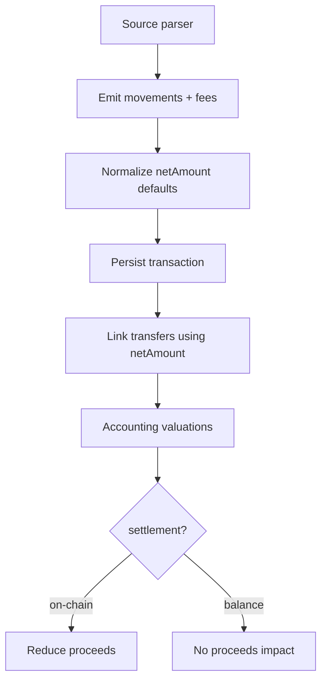

# Fees Specification

> ⚠️ **Code is law**: If this disagrees with implementation, update the spec to match code.

How Exitbook models, ingests, stores, links, and accounts for fees across blockchains and exchanges.

## Quick Reference

| Concept             | Key Rule                                                                                               |
| ------------------- | ------------------------------------------------------------------------------------------------------ |
| Movement amounts    | `grossAmount` required; `netAmount` defaults to `grossAmount` and must be `<= grossAmount`             |
| On-chain settlement | When fee asset matches movement asset, processors emit `netAmount = grossAmount - feeSum`              |
| Fee structure       | Fees are an array; each entry requires `asset`, `amount`, `scope`, `settlement`                        |
| Transfer matching   | Uses `netAmount ?? grossAmount`; prevents mismatches caused by carved-out fees                         |
| Accounting proceeds | Only `settlement='on-chain'` fees reduce outflow proceeds; all fees increase inflow cost basis         |
| Price requirements  | Crypto-denominated fees used in accounting must include `priceAtTxTime` or valuation errors are raised |
| Proceeds vs basis   | On-chain fees reduce proceeds; all fees increase cost basis                                            |

## Goals

- **Deterministic transfer linking**: Prevent mismatches by aligning observable on-chain amounts via `netAmount`.
- **Reliable accounting inputs**: Provide consistent fee semantics for cost basis and proceeds.
- **Auditability**: Make every fee explicit, attributable, and priced when required.

## Non-Goals

- Tax reporting rules or jurisdiction-specific fee treatments.
- Describing pricing/linking algorithms beyond their fee interactions.

## Definitions

### Movement Amounts

```ts
type Movement = {
  asset: string;
  grossAmount: Decimal;
  netAmount?: Decimal;
  priceAtTxTime?: PriceAtTxTime;
};
```

- `grossAmount` (required): portfolio/accounting amount.
- `netAmount` (optional input): amount expected by the counterparty for matching; persisted as `grossAmount` when omitted.
- Invariant: `netAmount <= grossAmount` (schema enforced).

### Fee Entry

```ts
type Fee = {
  asset: string;
  amount: Decimal;
  scope: 'network' | 'platform' | 'spread' | 'tax' | 'other';
  settlement: 'on-chain' | 'balance' | 'external';
  priceAtTxTime?: PriceAtTxTime;
};
```

- `scope` explains _why_ the fee exists (network gas, exchange revenue, spreads, tax, other).
- `settlement` dictates _how amounts relate_: `on-chain` (carved out of movement) vs `balance` (separate debit) vs `external` (out-of-band).

### Settlement Semantics

- `settlement='balance'`: movement amounts match counterparty (`netAmount === grossAmount`); fee is an additional balance decrement.
- `settlement='on-chain'`: fee represented by `grossAmount - netAmount` for matching; used when broadcast amount is smaller than reported gross.
- `settlement='external'`: reserved; fee is paid outside tracked balances.

Examples:

- `settlement='balance'`: EVM gas — you send 1 ETH, recipient gets 1 ETH; gas is a separate balance debit.
- `settlement='on-chain'`: Coinbase withdrawal — you withdraw 1 BTC gross, 0.999 BTC arrives on-chain; 0.001 BTC is carved out as fee.

## Behavioral Rules

### Movement Amount Semantics

- Persistence layer normalizes missing `netAmount` to `grossAmount`.
- Processors must emit `netAmount = grossAmount - sum(on-chain fees in same asset)` when a movement’s own asset pays the on-chain fee.
- `netAmount` is never greater than `grossAmount`.

### Fee Scopes & Structure

- Fees are stored as an array; multiple entries per transaction are allowed.
- Each fee must include `asset`, `amount`, `scope`, and `settlement`; omissions are schema errors.

### Settlement by Source (Current Behavior)

| Source type                             | Fee scope/settlement                                 | Movement amount rule                                |
| --------------------------------------- | ---------------------------------------------------- | --------------------------------------------------- |
| Bitcoin / UTXO blockchains              | `network`, `on-chain`; fee deducted from `netAmount` | Outflow `net = gross - fee` (same asset)            |
| Account-based chains (EVM, Solana, …)   | `network`, `balance`                                 | `netAmount === grossAmount`; gas is separate fee    |
| Standard exchanges (ccxt-style ledgers) | `platform`, `balance` (fee currency may differ)      | `netAmount === grossAmount`; fees logged separately |
| Coinbase carved-out withdrawals         | `platform`, `on-chain`                               | Outflow `net = gross - fee`                         |

### Transfer Linking

- Candidate matching uses `amount = netAmount ?? grossAmount`.
- Outflow validation expects `netAmount = grossAmount - sum(on-chain fees in same asset)` within tolerance; mismatches mark the transaction invalid/mis-modeled.

### Accounting Treatment

- Inflows: all fees contribute to cost basis regardless of settlement.
- Outflows: only `settlement='on-chain'` fees reduce proceeds; balance-settled platform fees do not.
- Crypto-denominated fees used in these calculations must carry `priceAtTxTime`; fiat fees rely on FX normalization when needed.

### Pricing & FX

- Fee `priceAtTxTime` is required when the fee asset is crypto and participates in accounting; missing prices raise errors.
- Non-USD fiat fee prices are normalized to USD alongside movement prices; crypto-denominated “prices” are rejected as unexpected.

### Data Quality Checks

- Missing fee prices are surfaced by the **Prices** gap category (covers all movements and fees missing `priceAtTxTime`).
- Structural fee issues (missing fee fields, fees in movements instead of fee entries) belong in processor tests or the future **Validation** gap category.

## Data Model

### Transactions (fee-related fields)

```ts
type Transaction = {
  movements: Movement[];
  fees: Fee[];
};
```

#### Field Semantics

- `movements.grossAmount`: canonical portfolio amount.
- `movements.netAmount`: matching amount; defaults to `grossAmount` on persistence.
- `fees[]`: one row per distinct fee; array order not significant.

## Pipeline / Flow



## Invariants

- **Required**: `netAmount <= grossAmount`; enforced by schema validation.
- **Required**: Missing `netAmount` is stored as `grossAmount`; enforced in persistence layer.
- **Required**: On-chain fee in same asset implies `netAmount = grossAmount - feeSum`; processors responsible for emitting.
- **Required**: Each fee entry must include `asset`, `amount`, `scope`, and `settlement`; schema-enforced.
- **Required**: Transfer matching always uses `netAmount ?? grossAmount`.

## Edge Cases & Gotchas

- Coinbase withdrawals report gross + fee; must be modeled as `settlement='on-chain'` or transfers will mismatch.
- UTXO semantics pay fees from inputs; Exitbook still models them as `on-chain` carved-out fees to keep matching stable.
- Cursor/gap analyses may surface fees inferred from metadata (`fee_in_movements`); these require processor fixes, not runtime defaults.

## Known Limitations (Current Implementation)

- No automated detection of exchange-ledger fee consolidation errors beyond `gaps` checks.
- `settlement='external'` is reserved; processors rarely populate it and downstream consumers may treat it as balance-settled.

## Related Specs

- [Pagination and Streaming](./pagination-and-streaming.md) — cursor model underpinning ingestion batches
- [Accounts & Imports](./accounts-and-imports.md) — where raw fees enter the system via imports
- [Transfers & Tax](./transfers-and-tax.md) — transfer matching and tax semantics that rely on `netAmount`

---

_Last updated: 2025-12-12_
