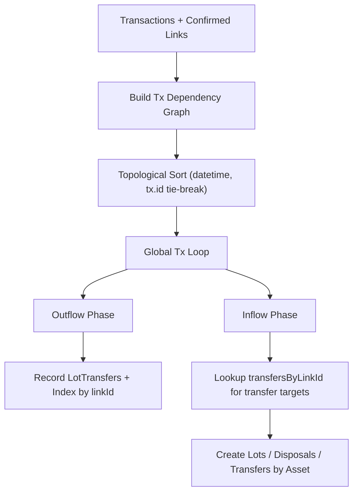

# Lot Matcher Transaction Dependency Ordering Specification

> ⚠️ **Code is law**: If this document disagrees with implementation, implementation is correct and this spec must be updated.

Defines the target end-state behavior for lot matching after the transaction-level dependency refactor is complete.

## Quick Reference

| Concept           | Key Rule                                                 |
| ----------------- | -------------------------------------------------------- |
| `Dependency node` | Transaction ID                                           |
| `Dependency edge` | `sourceTransactionId -> targetTransactionId`             |
| `Ordering`        | Topological order, then `datetime ASC`, then `tx.id ASC` |
| `Processing unit` | One global transaction pass (not per-asset group pass)   |
| `Within-tx order` | Outflows first, inflows second                           |
| `Transfer lookup` | `Map<linkId, LotTransfer[]>` (`linkId` is UUID string)   |
| `Cycle handling`  | Fail fast with `Err`, include cycle diagnostics          |

## Goals

- **Correct transfer sequencing**: Ensure transfer targets never run before required source transfers in valid acyclic histories.
- **Deterministic outcomes**: Same inputs produce same lots/disposals/transfers across runs.
- **Behavioral preservation**: Keep existing disposal, acquisition, fee, and transfer math intact while changing orchestration.

## Non-Goals

- Changing transfer-link discovery heuristics.
- Changing fee valuation formulas or tax policy decisions.
- Introducing schema or migration changes.

## Definitions

### Transaction Dependency Graph

Directed graph over transaction IDs in the current batch:

- Node: transaction ID
- Edge: `link.sourceTransactionId -> link.targetTransactionId`
- Only edges where both endpoints exist in current batch are included
- Self edges are ignored

### Asset Processing State

In-memory state for each asset ID during the global pass:

```ts
interface AssetProcessingState {
  assetSymbol: string;
  lots: AcquisitionLot[];
  disposals: LotDisposal[];
  lotTransfers: LotTransfer[];
}
```

### Transfer Index

Fast lookup map used during transfer-target processing:

```ts
Map<string, LotTransfer[]>;
```

Key is `TransactionLink.id` / `LotTransfer.linkId` (UUID string).

## Behavioral Rules

### 1. Transaction Ordering

Transactions are ordered using `sortTransactionsByDependency`:

1. Build graph from confirmed links.
2. Run Kahn topological sort.
3. Break ties by:
   - `datetime ASC` (canonical time source)
   - `tx.id ASC`
4. If not all nodes are resolved, return `Err` with cycle details.

### 2. Global Processing Pass

`LotMatcher.match()` processes one sorted transaction list, not asset groups:

```text
for tx in sortedTransactions:
  processOutflows(tx)
  processInflows(tx)
```

Asset state is resolved per movement asset ID, so multi-asset transactions are handled correctly.

### 3. Outflow Phase

For each outflow movement:

- Skip fiat assets.
- Resolve effective source link (including blockchain-internal skip behavior).
- If transfer link exists:
  - Run transfer-source logic.
  - Update asset lots/disposals.
  - Record every produced `LotTransfer` into:
    - global transfer list
    - source asset's `lotTransfers`
    - `transfersByLinkId`
- If no link:
  - Run regular disposal matching.

### 4. Inflow Phase

For each asset in the transaction inflows:

- Skip fiat assets.
- Resolve effective target link.
- If transfer link exists:
  - Aggregate same-asset inflows for that tx (existing behavior).
  - Load `transfersForLink = transfersByLinkId.get(link.id) ?? []`.
  - Run transfer-target lot creation from inherited basis.
- If no link:
  - Run regular acquisition-lot creation.

### 5. Error Semantics

Must return `Err` (no silent fallback) for:

- Invalid `datetime` in dependency sort input.
- Transaction dependency cycles.
- Transfer target with no source transfers for its link.
- Any existing fatal transfer/disposal/acquisition validation failures.

## Data Model

No persistent schema changes are required.

### In-Memory Structures

```ts
const lotStateByAssetId = new Map<string, AssetProcessingState>();
const sharedLotTransfers: LotTransfer[] = [];
const transfersByLinkId = new Map<string, LotTransfer[]>();
```

### Persisted Outputs (unchanged)

- `AcquisitionLot[]`
- `LotDisposal[]`
- `LotTransfer[]`

Grouped into `assetResults` by asset ID in `LotMatchResult`.

## Pipeline / Flow



## Invariants

- **Dependency correctness**: If link `A -> B` exists in batch, tx `A` must be processed before tx `B`.
- **Within-transaction ordering**: Outflows are always processed before inflows.
- **Determinism**: Ordering is stable under identical inputs.
- **Link-key consistency**: Transfer indexing uses string UUID link IDs.
- **Transfer integrity**: Transfer-target lot creation requires source-side `LotTransfer` records for the same link.

## Edge Cases & Gotchas

- **Duplicate links**: Multiple links with same source/target edge do not multiply indegree.
- **Self-referential links**: Ignored for dependency graph purposes.
- **External links**: Links referencing tx IDs outside current batch are ignored for ordering.
- **Datetime vs timestamp mismatch**: Dependency sort uses `datetime` as canonical ordering source.
- **Multi-asset transactions**: Must be processed per movement asset ID, not by a single tx asset field.

## Known Limitations (Target Implementation)

- Dependency ordering only knows about links present in input; missing links can still lead to non-transfer disposal behavior.
- True transaction cycles are treated as data integrity errors and fail the run.
- Existing transfer matching constraints (confidence/status rules, link availability) remain unchanged.

## Related Specs

- [Transfers & Tax](./transfers-and-tax.md) - transfer linkage and tax behavior
- [Average Cost Basis](./average-cost-basis.md) - strategy-level disposal allocation
- [Fees](./fees.md) - fee semantics used during cost-basis calculations

---

_Last updated: 2026-02-13_
