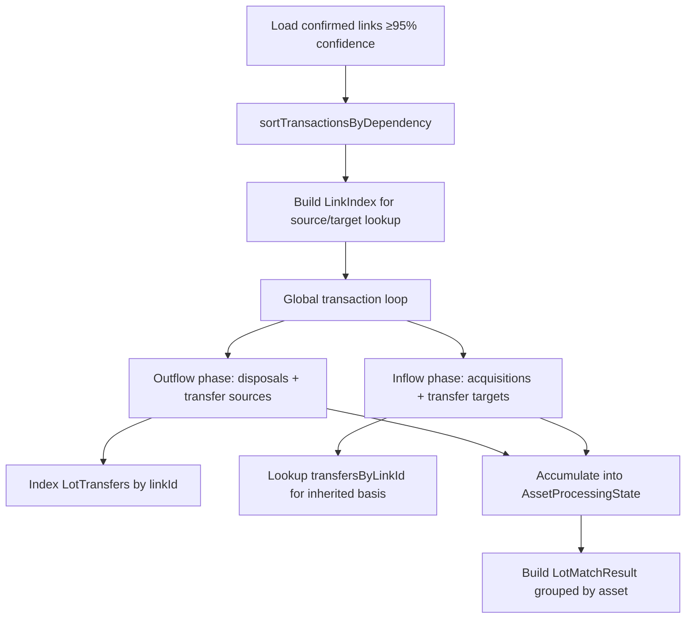

# Lot Matcher Transaction Dependency Ordering

> **Code is law**: If this document disagrees with implementation, implementation is correct and this spec must be updated.

## Quick Reference

| Concept         | Rule                                                     |
| --------------- | -------------------------------------------------------- |
| Dependency node | Transaction ID (`number`)                                |
| Dependency edge | `sourceTransactionId → targetTransactionId`              |
| Ordering        | Topological order, then `datetime ASC`, then `tx.id ASC` |
| Processing unit | Single global transaction pass                           |
| Within-tx order | Outflows first, inflows second                           |
| Transfer lookup | `Map<string, LotTransfer[]>` keyed by link ID (UUID)     |
| Cycle handling  | `Err` with DFS-derived cycle path                        |
| Fiat assets     | Skipped in both outflow and inflow phases                |

## Goals

- **Correct transfer sequencing**: Transfer targets never process before their source in valid acyclic histories.
- **Deterministic outcomes**: Same inputs produce identical lots/disposals/transfers across runs.
- **Behavioral preservation**: Existing disposal, acquisition, fee, and transfer math is unchanged; only orchestration differs.

## Non-Goals

- Changing transfer-link discovery heuristics (`TransactionLinkingService`).
- Changing fee valuation formulas or tax policy decisions.
- Schema or migration changes.

## Core Data Structures

### Transaction Dependency Graph

Directed graph built from confirmed links over the current transaction batch:

- **Node**: `tx.id` (integer)
- **Edge**: `link.sourceTransactionId → link.targetTransactionId`
- Only edges where both endpoints exist in the batch are included
- Self-referential edges (`source === target`) are ignored
- Duplicate edges between the same pair are deduplicated (indegree incremented once)

### Per-Asset Mutable State

Each asset ID encountered during processing gets its own state container:

```ts
interface AssetProcessingState {
  assetSymbol: string;
  lots: AcquisitionLot[];
  disposals: LotDisposal[];
  lotTransfers: LotTransfer[];
}
```

Initialized lazily on first encounter via `getOrInitAssetState`.

### Transfer Index

O(1) lookup map for transfer-target processing, populated as transfers are created:

```ts
const transfersByLinkId = new Map<string, LotTransfer[]>();
```

Key is `TransactionLink.id` / `LotTransfer.linkId` (UUID string). `processTransferTarget` receives pre-filtered transfers directly — no runtime filter scan.

## Processing Pipeline



### 1. Transaction Ordering (`sortTransactionsByDependency`)

Kahn's algorithm with deterministic tie-breaking:

1. Build adjacency list and indegree map from confirmed links.
2. Seed queue with zero-indegree nodes, sorted by `(datetime ASC, tx.id ASC)`.
3. Pop from queue front, decrement neighbor indegrees, insert newly-freed nodes at sorted position (binary-style insertion maintaining `datetime ASC, tx.id ASC`).
4. If `sorted.length < transactions.length`, unresolved nodes form a cycle — return `Err` with DFS-derived cycle path.

Canonical time source is `tx.datetime` (ISO string parsed via `Date.parse`), not `tx.timestamp`.

### 2. Outflow Phase (per transaction)

For each outflow movement in the transaction:

1. Skip if fiat asset (`Currency.create(symbol).isFiat()`).
2. Resolve `AssetProcessingState` by `outflow.assetId`.
3. Find effective source link via `findEffectiveSourceLink`:
   - Consumes `blockchain_internal` links first (change outputs).
   - Returns first non-internal link, or signals `internal_only` / `none`.
   - When internal links were consumed before a cross-source link, `isPartialOutflow=true` — use `link.sourceAmount` instead of outflow amount.
4. **Transfer**: call `handleTransferSource` → record each `LotTransfer` into shared list, asset state, and `transfersByLinkId` → consume source link.
5. **None**: call `matchOutflowDisposal` → update lots/disposals.
6. **Internal only**: skip.

### 3. Inflow Phase (per transaction)

Inflows are grouped by asset ID within the transaction, then processed per group:

1. Skip fiat assets.
2. Resolve `AssetProcessingState` by `inflow.assetId`.
3. Find effective target link via `findEffectiveTargetLink` (same internal-skip behavior as source).
4. **Transfer**: aggregate same-asset inflows → `transfersForLink = transfersByLinkId.get(link.id) ?? []` → call `handleTransferTarget` with pre-filtered transfers → push lot → consume target link.
5. **None**: create acquisition lot per inflow via `buildAcquisitionLotFromInflow`.
6. **Internal only**: skip.

### 4. Result Assembly

After the global loop, `lotStateByAssetId` entries become `AssetLotMatchResult[]` with totals.

## Error Semantics

All errors return `Err<Error>` (no throws, no silent fallbacks):

| Condition                                   | Error source                   |
| ------------------------------------------- | ------------------------------ |
| Invalid `datetime` string                   | `sortTransactionsByDependency` |
| Transaction dependency cycle                | `sortTransactionsByDependency` |
| Transfer target with no source transfers    | `processTransferTarget`        |
| Transfer variance exceeding error threshold | `validateTransferVariance`     |
| Missing jurisdiction config for transfers   | `handleTransferSource`         |
| Missing prices on non-fiat movements        | `match()` pre-validation       |

Cycle errors include a DFS-traced path (e.g., `1 → 2 → 1`) for diagnostics.

## Invariants

1. **Dependency correctness**: If link `A → B` exists in batch, tx `A` is processed before tx `B`.
2. **Within-transaction ordering**: Outflows always processed before inflows.
3. **Determinism**: Identical inputs produce identical output ordering and results.
4. **Transfer integrity**: Transfer-target lot creation requires pre-existing `LotTransfer` records for the same link ID.
5. **Asset isolation**: Lots, disposals, and transfers accumulate into the correct asset state based on movement `assetId`, not transaction-level fields.

## Edge Cases

- **Duplicate links**: Same `(source, target)` pair from multiple links increments indegree only once (Set-based edge tracking).
- **Self-referential links**: Ignored (`source !== target` guard).
- **External links**: Links referencing tx IDs outside the current batch are ignored.
- **Datetime vs timestamp**: Sort uses `datetime` (ISO string) as canonical source, not the numeric `timestamp` field.
- **Multi-asset transactions**: A single transaction can touch multiple asset states; each movement resolves its own `AssetProcessingState`.
- **UTXO partial outflows**: When `blockchain_internal` links are consumed before a cross-source link, the link's `sourceAmount` (gross minus change) is used for variance checks and disposal quantity.

## Limitations

- Dependency ordering only considers links present in the input batch; missing links can cause non-transfer (regular disposal) behavior.
- True transaction cycles are treated as data integrity errors — the entire matching run fails.
- Link confidence threshold (≥95%) and status filtering are applied before dependency analysis.

## Implementation Files

| File                   | Role                                          |
| ---------------------- | --------------------------------------------- |
| `lot-matcher.ts`       | Orchestration: global loop, state management  |
| `lot-matcher-utils.ts` | Pure functions: sort, disposal, transfer math |
| `link-index.ts`        | Source/target link lookup and consumption     |

## Related Specs

- [Transfers & Tax](./transfers-and-tax.md) — transfer linkage and tax behavior
- [Average Cost Basis](./average-cost-basis.md) — strategy-level disposal allocation
- [Fees](./fees.md) — fee semantics used during cost-basis calculations
