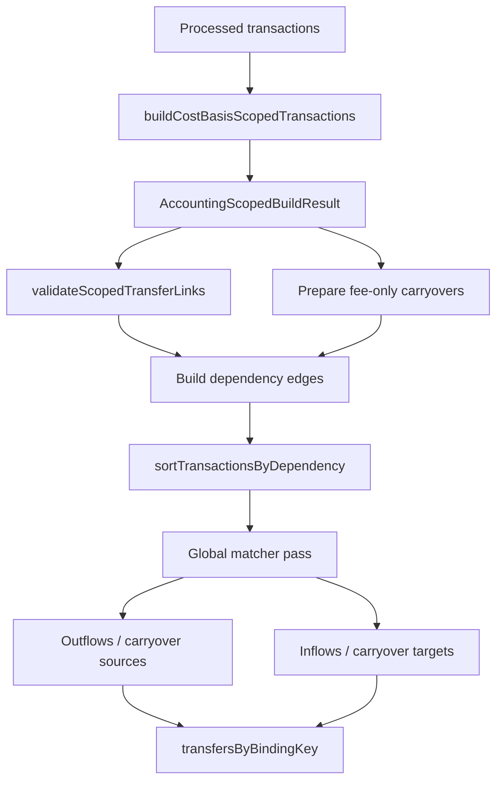

# Lot Matcher Transaction Dependency Ordering

> **Code is law**: If this document disagrees with implementation, implementation is correct and this spec must be updated.

## Quick Reference

| Concept         | Rule                                                                                              |
| --------------- | ------------------------------------------------------------------------------------------------- |
| Dependency node | Transaction ID (`number`)                                                                         |
| Dependency edge | `sourceTransactionId → targetTransactionId`                                                       |
| Edge sources    | Validated confirmed external links and fee-only internal carryovers                               |
| Ordering        | Topological order, then `datetime ASC`, then `tx.id ASC`                                          |
| Processing unit | Single global pass over `AccountingScopedTransaction[]`                                           |
| Within-tx order | Carryover sources and outflows first, then inflows and carryover targets                          |
| Transfer lookup | `Map<string, LotTransfer[]>` keyed by binding key                                                 |
| Binding keys    | `link:${linkId}` for confirmed links; `carryover:${sourceFp}:${targetFp}` for fee-only carryovers |
| Cycle handling  | `Err` with DFS-derived cycle path                                                                 |
| Link lookup     | Movement-fingerprint targeted only                                                                |

## Goals

- Ensure every transfer target is processed after its source lots exist.
- Keep ordering deterministic across identical inputs.
- Make fee-only internal carryovers use the same dependency machinery as ordinary transfers.
- Keep the matcher independent from `blockchain_internal` links and other linker-era UTXO hints.

## Non-Goals

- Discovering links or same-hash accounting meaning inside the matcher.
- Applying exclusions inside the matcher. Exclusions belong before matching, on the accounting-scoped boundary.
- Changing fee policy or disposal strategy math.

## Core Data Structures

### Dependency Graph

`sortTransactionsByDependency(...)` consumes `TransactionDependencyEdge[]`.

- Node: `tx.id`
- Edge: `sourceTransactionId → targetTransactionId`
- Edges are built from:
  - validated confirmed external transfer links
  - fee-only internal carryover source-to-target relationships
- Only edges whose endpoints both exist in the current batch are included
- Self-referential edges are ignored
- Duplicate edges are deduplicated before indegree updates

### Scoped Transaction Input

The matcher runs only on `AccountingScopedBuildResult`, not raw processed transactions.

That means same-hash internal reductions, scoped movement identity, and fee-only carryover sidecars are already resolved before dependency ordering begins.

### Transfer Binding Map

As transfer sources are processed, `LotTransfer` rows are stored in:

```ts
const transfersByBindingKey = new Map<string, LotTransfer[]>();
```

Binding keys are provenance-aware:

- confirmed persisted link: `link:${linkId}`
- fee-only internal carryover: `carryover:${sourceMovementFingerprint}:${targetMovementFingerprint}`

Targets never scan all transfers. They resolve directly through the binding key implied by the validated link or carryover target.

## Processing Pipeline


```mermaid
graph TD
    A["Processed transactions"] --> B["buildCostBasisScopedTransactions"]
    B --> C["AccountingScopedBuildResult"]
    C --> D["validateScopedTransferLinks"]
    C --> E["Prepare fee-only carryovers"]
    D --> F["Build dependency edges"]
    E --> F
    F --> G["sortTransactionsByDependency"]
    G --> H["Global matcher pass"]
    H --> I["Outflows / carryover sources"]
    H --> J["Inflows / carryover targets"]
    I --> K["transfersByBindingKey"]
    J --> K
```

### 1. Ordering

`sortTransactionsByDependency(...)` uses Kahn's algorithm with deterministic tie-breaking:

1. Build adjacency + indegree from dependency edges.
2. Seed zero-indegree queue.
3. Sort queue by `datetime ASC`, then `tx.id ASC`.
4. Pop, emit, decrement neighbors, and insert newly freed nodes in sorted order.
5. If unresolved nodes remain, return `Err` with a DFS-derived cycle path.

Canonical time source is `tx.datetime`, not `tx.timestamp`.

### 2. Source-Side Phase

For each sorted scoped transaction:

1. Process any fee-only internal carryovers sourced by this transaction.
2. Process each non-fiat scoped outflow.
3. Resolve source links by exact `sourceMovementFingerprint`.
4. If no validated links exist, treat the outflow as a disposal.
5. If validated links exist:
   - require one full link or a set of partial links for that one movement
   - process transfer-source math once for the scoped movement
   - emit `LotTransfer` rows under the appropriate binding key

No internal-link consumption happens here. Same-hash internal behavior was already encoded in the scoped build result.

### 3. Target-Side Phase

For each non-fiat scoped inflow:

1. Resolve validated links by exact `targetMovementFingerprint`.
2. Resolve fee-only carryover targets by exact `targetMovementFingerprint`.
3. Error if both mechanisms target the same scoped inflow.
4. If validated external links exist:
   - fetch source-side transfers by confirmed-link binding key
   - build target acquisition lots from inherited basis plus eligible fiat fees
5. If carryover targets exist:
   - fetch carryover transfers by carryover binding key
   - build target acquisition lots from inherited basis plus eligible fiat fees
6. If neither exists, create a normal acquisition lot from the inflow.

Inflows are movement-targeted. The matcher does not aggregate sibling inflows by asset symbol before link lookup.

## Error Semantics

All failures return `Err<Error>` and abort the matching run.

| Condition                                               | Error source                              |
| ------------------------------------------------------- | ----------------------------------------- |
| Invalid `datetime`                                      | `sortTransactionsByDependency`            |
| Dependency cycle                                        | `sortTransactionsByDependency`            |
| Missing jurisdiction config for transfers/carryovers    | `LotMatcher.match`                        |
| Missing carryover source/target transaction or movement | carryover preparation / target processing |
| Transfer source/target amount reconciliation failure    | transfer processing utils                 |
| Transfer target with no source-side transfers           | transfer target processing                |
| Lot depletion / negative remaining quantity             | disposal or lot update utils              |

The matcher no longer returns partial-success asset results.

## Invariants

1. If a validated dependency edge `A → B` exists in the batch, `A` is processed before `B`.
2. Same-hash internal reductions are decided before matching, not by consuming internal links at runtime.
3. Transfer source and target lookup are both keyed by scoped movement fingerprints.
4. Fee-only internal carryovers participate in dependency ordering exactly like ordinary transfers.
5. Asset state is isolated by `assetId`, not by transaction-level symbol guesses.

## Edge Cases

- Links whose endpoints are both outside the batch produce no dependency edge.
- Cross-boundary confirmed links fail earlier during scoped validation; they do not reach the sorter.
- Multiple validated links may share one source movement only when all are partial matches.
- Multiple validated links may share one target movement only when scoped validation accepted that target fingerprint grouping.
- Missing validated links still degrade to disposal/acquisition behavior; the matcher does not invent transfers.

## Related Specs

- [Cost Basis Accounting Scope](./cost-basis-accounting-scope.md)
- [Transfers & Tax](./transfers-and-tax.md)
- [Fees](./fees.md)
- [Average Cost Basis](./average-cost-basis.md)
