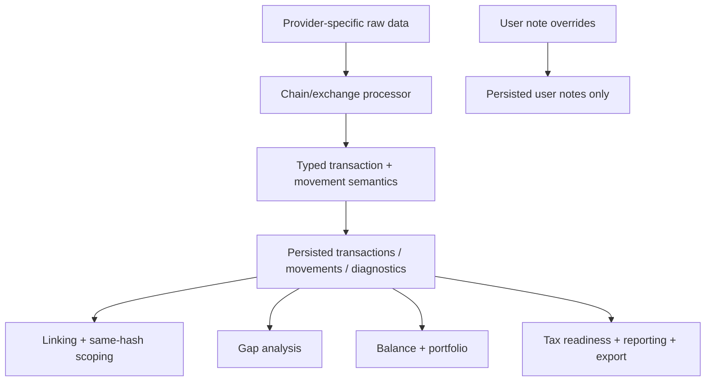

# Movement Semantics and Diagnostics Specification

> ⚠️ **Code is law**: If this document disagrees with implementation, update the spec.

Defines the canonical processed-transaction contract for movement roles, machine-authored diagnostics, and user-authored notes.

## Quick Reference

| Concept              | Key Rule                                                                  |
| -------------------- | ------------------------------------------------------------------------- |
| `movementRole`       | Every inflow/outflow has an effective generic semantic role               |
| Transfer eligibility | Derived from `movementRole`, never from chain-specific downstream logic   |
| `diagnostics`        | Machine-authored typed diagnostics replace machine use of free-form notes |
| `userNotes`          | Free-form notes are user-authored only and never drive machine workflows  |
| Spam state           | Derived from diagnostics only; there is no persisted `isSpam` flag        |
| Movement identity    | Semantic refactors must not churn `movementFingerprint` by themselves     |

## Goals

- Separate **balance impact** from **transfer intent**.
- Let chain-specific processors emit generic semantics that downstream packages can consume without chain-specific conditionals.
- Eliminate machine dependence on free-form note text.
- Preserve a clean place for human-authored notes that does not leak into accounting, linking, or review logic.

## Non-Goals

- Auto-resolving ambiguous cases from weak evidence.
- Replacing or blurring the existing `fees[]` model from [fees.md](./fees.md).
- Using diagnostics as a backdoor for transfer linking.
- Letting user-authored notes mutate machine semantics.

## Problem Statement

Every inflow/outflow affects balances, but not every movement is transfer principal.

Without a first-class semantic layer, downstream consumers confuse:

- staking withdrawals with transfer candidates
- protocol-overhead legs with unmatched sends
- bridge and classification signals with free-form note parsing
- spam state with duplicated booleans and note strings

The missing abstraction is a generic semantic layer between processing and downstream accounting, linking, gap, review, and export consumers.

## Definitions

### Movement Role

`movementRole` is the machine semantic for an inflow or outflow.

It answers:

- what economic role this movement plays
- whether it should participate in transfer analysis

Canonical role set:

```ts
type MovementRole = 'principal' | 'staking_reward' | 'protocol_overhead' | 'refund_rebate';
```

Semantics:

- `principal`
  - primary economic asset movement
  - eligible for transfer analysis
- `staking_reward`
  - consensus/staking reward withdrawal or accrual
  - not eligible for transfer analysis
- `protocol_overhead`
  - non-fee protocol-side balance movement such as rent, storage, account funding, or protocol rebate legs
  - not eligible for transfer analysis
- `refund_rebate`
  - non-principal refund or rebate movement
  - not eligible for transfer analysis

Constraint:

> Processors may only emit generic roles. No chain-specific roles such as `cardano_staking_withdrawal` or `solana_ata_rent` are allowed in the shared contract.

### Transfer Eligibility

Transfer eligibility is **derived**, not stored.

```ts
function isTransferEligible(role: MovementRole): boolean {
  return role === 'principal';
}
```

Downstream packages must use transfer eligibility instead of raw inflow/outflow presence when doing:

- transfer linking
- same-hash scoping
- link-gap analysis
- transfer completeness checks

### Transaction Diagnostic

`diagnostics` are machine-authored typed diagnostics for review surfaces, conservative policy, and export.

They replace system use of `Transaction.notes`.

```ts
interface TransactionDiagnostic {
  code: string;
  severity?: 'info' | 'warning' | 'error' | undefined;
  message: string;
  metadata?: Record<string, unknown> | undefined;
}
```

Current canonical codes used by shared logic or persisted producers include:

- `bridge_transfer`
- `classification_uncertain`
- `classification_failed`
- `allocation_uncertain`
- `contract_interaction`
- `SCAM_TOKEN`
- `SUSPICIOUS_AIRDROP`
- `unattributed_staking_reward_component`

Rules:

- diagnostics are machine-authored
- diagnostics are persisted
- diagnostics are visible in review and export surfaces
- downstream shared logic must key off diagnostic codes, never diagnostic message text

### User Note

`userNotes` are human-authored annotations.

```ts
interface UserNote {
  message: string;
  createdAt: string;
  author?: string | undefined;
}
```

Rules:

- user notes are not emitted by processors
- user notes are not parsed by accounting, linking, balance, asset review, or tax readiness
- user notes are the only remaining free-form note surface

## Migration Map From Legacy Note Usage

| Legacy machine concept               | Canonical home                  |
| ------------------------------------ | ------------------------------- |
| `staking_withdrawal` note            | `movementRole='staking_reward'` |
| `bridge_transfer` note               | `diagnostics`                   |
| `classification_uncertain` note      | `diagnostics`                   |
| `classification_failed` note         | `diagnostics`                   |
| `contract_interaction` note          | `diagnostics`                   |
| `allocation_uncertain` note          | `diagnostics`                   |
| `SCAM_TOKEN` / `SUSPICIOUS_AIRDROP`  | `diagnostics`                   |
| durable human transaction annotation | `userNotes`                     |

## Behavioral Rules

### Processor Responsibilities

- Every inflow/outflow has an effective `movementRole`.
- `fees[]` remain separate and do not receive `movementRole`.
- If a processor has deterministic evidence for a non-principal role, it must encode it in `movementRole`.
- If a processor lacks deterministic evidence, it may omit `movementRole`; downstream interpretation treats that as `principal`.
- If a processor knows the movement is unusual but cannot prove a non-principal role, it may emit a diagnostic instead of fabricating a role.

### Downstream Responsibilities

Downstream consumers must not infer semantic role from chain names, free-form note text, or string message parsing.

Required behavior:

- linking uses transfer-eligible movements only
- same-hash scoping uses transfer-eligible movements only
- gap analysis uses transfer-eligible movements only
- balance and portfolio still count all movements regardless of role
- tax/readiness/reporting reads typed diagnostics, not free-form notes

### Replay and Override Compatibility

Stable movement identity does not remove the need for semantic validation.

Required behavior:

- replayed transfer links must validate that referenced movements are still transfer-eligible
- manual link confirmation must validate current movement-role compatibility before persisting
- stale references must fail explicitly or surface as incompatible; they must not silently apply against newly ineligible movements

Reason:

- movement identity represents balance-movement continuity
- `movementRole` represents current semantic interpretation
- semantic refactors must not strand overrides just because classification improved

### Diagnostics Rules

- Diagnostics are machine state, not user state.
- Diagnostics may inform review surfaces and conservative policy.
- Diagnostics must not silently create transfer links.
- Diagnostics must not substitute for `movementRole` where deterministic movement semantics exist.
- Spam state is derived from diagnostics only.
  - `SCAM_TOKEN` is the canonical spam marker used by shared logic.
  - There is no persisted transaction-level `isSpam` flag.

### User Note Rules

- User notes are UI-facing only.
- User note overrides materialize only into `userNotes`.
- No machine workflow may branch on user note content.

## Data Model

### Core Transaction Shape

```ts
interface AssetMovement {
  assetId: string;
  assetSymbol: string;
  grossAmount: Decimal;
  netAmount?: Decimal | undefined;
  movementRole?: MovementRole | undefined;
  movementFingerprint: string;
  priceAtTxTime?: PriceAtTxTime | undefined;
}

interface Transaction {
  id: number;
  accountId: number;
  txFingerprint: string;
  movements: {
    inflows?: AssetMovement[] | undefined;
    outflows?: AssetMovement[] | undefined;
  };
  fees: FeeMovement[];
  diagnostics?: TransactionDiagnostic[] | undefined;
  userNotes?: UserNote[] | undefined;
  excludedFromAccounting?: boolean | undefined;
}
```

Implementation note:

- persisted movements may omit `movementRole`, and downstream must treat that as `principal`
- the shared helper contract is `getMovementRole(movement) ?? 'principal'`

### Persistence

Canonical persisted fields:

```sql
-- transaction_movements
movement_role TEXT NULL,
CHECK (
  (movement_type IN ('inflow', 'outflow'))
  OR (movement_type = 'fee' AND movement_role IS NULL)
);

-- transactions
diagnostics_json TEXT NULL,
user_notes_json TEXT NULL
```

Rules:

- `notes_json` is not a machine-state bucket
- override materialization targets `user_notes_json`
- diagnostics persistence is owned by processors and reprocessing
- `transactions.is_spam` does not exist in the canonical model

## Identity Rules

`movementRole` is first-class semantics, but it is **not** part of `movementFingerprint`.

Movement identity represents the continuity of the economic balance movement itself, not the latest semantic interpretation.

Canonical material:

```ts
`${movementType}|${assetId}|${grossAmount.toFixed()}|${effectiveNetAmount.toFixed()}`;
```

Excluded from identity:

- `movementRole`
- diagnostics
- user notes
- display metadata
- prices

Implication:

- a reprocess that changes `principal -> staking_reward` keeps the same `movementFingerprint`
- downstream replay paths must validate compatibility against current semantics instead of relying on fingerprint churn

If a future case requires a stable distinguisher for otherwise-identical movements with different provenance, add a dedicated provenance/origin input to identity rather than using `movementRole`.

## Current Producer Adoption

Shipped deterministic non-principal producers:

- Cardano attributable staking withdrawals
  - emits `movementRole='staking_reward'`
- EVM partial beacon withdrawals
  - emits `movementRole='staking_reward'`
  - full `>= 32 ETH` withdrawals remain principal
- NEAR receipt-backed `CONTRACT_REWARD`
  - emits `movementRole='staking_reward'`
  - synthetic fallback remains principal
- Substrate inflow-only `staking/reward`
  - emits `movementRole='staking_reward'`

Known diagnostic-only fallback:

- Cardano wallet-scoped staking withdrawals that cannot be attributed to one derived payment address in the current per-address projection
  - remain per-address principal movements
  - emit `unattributed_staking_reward_component`
  - may also emit `classification_uncertain`

## Export Surface

Diagnostics and user notes are first-class export data.

Simple CSV includes:

- `diagnostic_codes`
- `diagnostic_messages`
- `user_note_messages`

Normalized CSV emits separate companion files:

- `.diagnostics.csv`
- `.user-notes.csv`

JSON export carries `diagnostics` and `userNotes` on each transaction object.

## Pipeline / Flow



## Invariants

- **Required**: every inflow/outflow has an effective `movementRole`.
- **Required**: downstream machine logic never parses free-form note text.
- **Required**: processors emit only generic roles and generic diagnostics.
- **Required**: `fees[]` remain the only fee model.
- **Required**: user notes never affect accounting or review logic.
- **Required**: semantic changes alone do not change `movementFingerprint`.
- **Required**: replay and override consumers validate current role compatibility before applying transfer-specific state.
- **Required**: spam state is diagnostic-derived, not duplicated as persisted boolean state.

## Edge Cases & Gotchas

- Mixed-intent transactions are expected and must be supported.
  - Example: principal outflow + staking reward inflow + network fee in one transaction.
- A processor may know that a transaction is unusual without knowing a non-principal movement role.
  - That case should emit a diagnostic, not a made-up role.
- `protocol_overhead` is not a fee replacement.
  - If the movement is already correctly represented in `fees[]`, do not duplicate it as a movement role.

## Related Specs

- [Transaction and Movement Identity](./transaction-and-movement-identity.md)
- [Transaction Linking](./transaction-linking.md)
- [UTXO Address Model](./utxo-address-model.md)
- [Fees](./fees.md)
- [Accounting Exclusions](./accounting-exclusions.md)
- [Transactions Export Spec](./cli/transactions/transactions-export-spec.md)

---

_Last updated: 2026-04-12_
