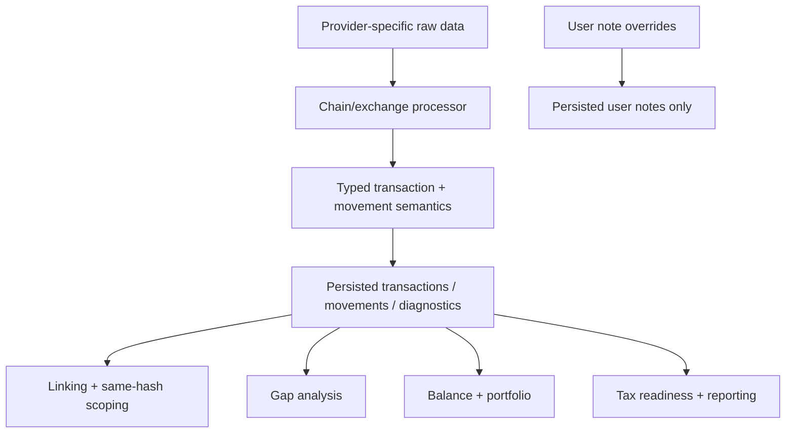

# Movement Semantics and Diagnostics Specification

> Target model for replacing machine-authored `Transaction.notes` usage with first-class movement semantics and typed diagnostics.

## Quick Reference

| Concept                  | Key Rule                                                                 |
| ------------------------ | ------------------------------------------------------------------------ |
| `movementRole`           | Every inflow/outflow must carry a generic semantic role                  |
| Transfer eligibility     | Derived from `movementRole`, never from chain-specific downstream logic  |
| `transactionDiagnostics` | Machine-authored typed diagnostics replace machine use of `notes`        |
| `userNotes`              | Free-form notes are user-authored only and never drive machine workflows |
| Movement identity        | Semantic refactors must not churn `movementFingerprint` by themselves    |

## Goals

- Separate **balance impact** from **transfer intent**.
- Let chain-specific processors emit generic semantics that downstream packages can consume without chain-specific conditionals.
- Eliminate machine dependence on free-form `Transaction.notes`.
- Preserve a clean place for human-authored notes that does not leak into accounting, linking, or review logic.

## Non-Goals

- Do not auto-resolve ambiguous cases from weak evidence.
- Do not replace or blur the existing `fees[]` model from [fees.md](./fees.md).
- Do not use diagnostics as a backdoor for transfer linking.
- Do not let user-authored notes mutate machine semantics.

## Problem Statement

Today every inflow/outflow is treated as raw movement data with no first-class statement of what the movement **is for**.

That overload causes downstream confusion:

- a staking withdrawal inflow is treated as a transfer candidate
- a protocol-overhead outflow is treated as an unmatched send
- a bridge transaction depends on note parsing instead of typed semantics
- tax readiness and review workflows inspect note strings instead of typed machine state

The missing abstraction is a generic semantic layer between processing and downstream accounting/linking/gap consumers.

## Definitions

### Movement Role

`movementRole` is the machine semantic for an inflow or outflow.

It answers:

- what economic role this movement plays
- whether it should participate in transfer analysis

Initial role set:

```ts
type MovementRole = 'principal' | 'staking_reward' | 'protocol_overhead' | 'refund_rebate';
```

Semantics:

- `principal`
  - primary economic asset movement
  - eligible for transfer analysis
- `staking_reward`
  - consensus/staking reward withdrawal or accrual
  - not eligible for transfer analysis
- `protocol_overhead`
  - non-fee protocol-side balance movement such as rent, storage, account funding, or protocol rebate legs
  - not eligible for transfer analysis
- `refund_rebate`
  - non-principal refund or rebate movement
  - not eligible for transfer analysis

Constraint:

> Processors may only emit generic roles. No chain-specific roles such as `cardano_staking_withdrawal` or `solana_ata_rent` are allowed in the shared contract.

### Transfer Eligibility

Transfer eligibility is **derived**, not stored.

```ts
function isTransferEligible(role: MovementRole): boolean {
  return role === 'principal';
}
```

Downstream packages must use transfer eligibility instead of raw inflow/outflow presence when doing:

- transfer linking
- same-hash scoping
- link-gap analysis
- transfer completeness checks

### Transaction Diagnostic

`transactionDiagnostics` are machine-authored, typed diagnostics for review surfaces and downstream policy.

They replace system usage of `Transaction.notes`.

```ts
interface TransactionDiagnostic {
  code:
    | 'classification_uncertain'
    | 'classification_failed'
    | 'bridge_transfer'
    | 'contract_interaction'
    | 'allocation_uncertain'
    | 'scam_token'
    | 'suspicious_airdrop';
  severity: 'info' | 'warning' | 'error';
  message: string;
  metadata?: Record<string, unknown> | undefined;
}
```

Diagnostics are:

- machine-authored
- persisted
- visible in review and export surfaces
- never used as free-form strings in shared logic

### User Note

`userNotes` are human-authored annotations.

```ts
interface UserNote {
  message: string;
  createdAt: string;
  author?: string | undefined;
}
```

Rules:

- user notes are not emitted by processors
- user notes are not parsed by accounting, linking, balance, asset review, or tax readiness
- user notes are the only remaining free-form note surface

## Migration Map From Current Notes

| Current note type / field              | Future home                     |
| -------------------------------------- | ------------------------------- |
| `staking_withdrawal`                   | `movementRole='staking_reward'` |
| `bridge_transfer`                      | `transactionDiagnostics`        |
| `classification_uncertain`             | `transactionDiagnostics`        |
| `classification_failed`                | `transactionDiagnostics`        |
| `contract_interaction`                 | `transactionDiagnostics`        |
| `allocation_uncertain`                 | `transactionDiagnostics`        |
| `SCAM_TOKEN` / `SUSPICIOUS_AIRDROP`    | `transactionDiagnostics`        |
| free-form durable transaction override | `userNotes`                     |

## Behavioral Rules

### Processor Responsibilities

- Every processor must assign `movementRole` to every inflow/outflow.
- `fees[]` remain separate and do not receive `movementRole`.
- If a processor has deterministic evidence for a non-principal role, it must encode it in `movementRole`.
- If a processor lacks deterministic evidence, it must leave the movement as `principal` and may emit a diagnostic instead.

### Downstream Responsibilities

Downstream consumers must not infer semantic role from chain names, note types, or string messages.

Required behavior:

- linking uses transfer-eligible movements only
- same-hash scoping uses transfer-eligible movements only
- gap analysis uses transfer-eligible movements only
- balance and portfolio still count all movements regardless of role
- tax/readiness/reporting reads typed diagnostics, not free-form notes

### Replay and Override Compatibility

Stable movement identity does not remove the need for semantic validation.

Required behavior:

- replayed transfer links must validate that referenced movements are still transfer-eligible
- manual link confirmation must validate current movement-role compatibility before persisting
- stale references must fail explicitly or surface as incompatible; they must not silently apply against newly ineligible movements

Reason:

- movement identity represents balance-movement continuity
- `movementRole` represents current semantic interpretation
- semantic refactors must not strand overrides just because classification improved

### Diagnostics Rules

- Diagnostics are machine state, not user state.
- Diagnostics are allowed to inform review surfaces and conservative policy.
- Diagnostics must not silently create transfer links.
- Diagnostics must not be used as a substitute for `movementRole` where deterministic movement semantics exist.

### User Note Rules

- User notes are UI-facing only.
- User note overrides must materialize only into `userNotes`.
- No machine workflow may branch on user note content.

## Data Model

### Core Transaction Shape

Target shape:

```ts
interface AssetMovement {
  assetId: string;
  assetSymbol: string;
  grossAmount: Decimal;
  netAmount?: Decimal | undefined;
  movementRole: MovementRole;
  movementFingerprint: string;
  priceAtTxTime?: PriceAtTxTime | undefined;
}

interface Transaction {
  id: number;
  accountId: number;
  txFingerprint: string;
  movements: {
    inflows?: AssetMovement[] | undefined;
    outflows?: AssetMovement[] | undefined;
  };
  fees: FeeMovement[];
  diagnostics?: TransactionDiagnostic[] | undefined;
  userNotes?: UserNote[] | undefined;
  excludedFromAccounting?: boolean | undefined;
}
```

### Persistence

Target persistence changes:

```sql
-- transaction_movements
movement_role TEXT,
CHECK (
  (movement_type IN ('inflow', 'outflow') AND movement_role IS NOT NULL)
  OR (movement_type = 'fee' AND movement_role IS NULL)
);

-- transactions
diagnostics_json TEXT NULL,
user_notes_json TEXT NULL
```

Implications:

- `notes_json` stops being the machine state bucket
- override materialization targets `user_notes_json`
- diagnostics persistence is owned by processors and reprocessing

## Identity Rules

`movementRole` is first-class semantics, but it is **not** part of `movementFingerprint`.

Movement identity represents the continuity of the economic balance movement itself, not the latest semantic interpretation.

Target canonical material:

```ts
`${movementType}|${assetId}|${grossAmount.toFixed()}|${effectiveNetAmount.toFixed()}`;
```

Excluded from identity:

- `movementRole`
- diagnostics
- user notes
- display metadata
- prices

Transaction identity remains unchanged.

Implication:

- a reprocess that changes `principal -> staking_reward` keeps the same `movementFingerprint`
- downstream replay paths must validate compatibility against current semantics instead of relying on fingerprint churn

Future note:

- if we later need a stable distinguisher for otherwise-identical movements with different provenance, add a dedicated provenance/origin input to identity rather than using `movementRole`

## Pipeline / Flow



## Invariants

- **Required**: every inflow/outflow has a `movementRole`.
- **Required**: downstream machine logic never parses free-form notes.
- **Required**: processors emit only generic roles and generic diagnostics.
- **Required**: `fees[]` remain the only fee model.
- **Required**: user notes never affect accounting or review logic.
- **Required**: semantic changes alone do not change `movementFingerprint`.
- **Required**: replay and override consumers validate current role compatibility before applying transfer-specific state.

## Edge Cases & Gotchas

- Mixed-intent transactions are expected and must be supported.
  - Example: principal outflow + staking reward inflow + network fee in one transaction.
- A processor may know that a transaction is unusual without knowing a non-principal movement role.
  - That case should emit a diagnostic, not a made-up role.
- `protocol_overhead` is not a fee replacement.
  - If the movement is already correctly represented in `fees[]`, do not duplicate it as a movement role.

## Rollout Constraints

1. Define the new core schemas and persistence fields.
2. Populate `movementRole` in processors.
3. Add shared helpers for transfer-eligible movement access.
4. Migrate downstream consumers off `Transaction.notes`.
5. Complete the transaction-user-note override path so user-authored notes remain separate from machine diagnostics.
6. Remove system-authored note materialization.

## Related Specs

- [Transaction and Movement Identity](./transaction-and-movement-identity.md)
- [Transaction Linking](./transaction-linking.md)
- [Fees](./fees.md)
- [Accounting Exclusions](./accounting-exclusions.md)

---

_Last updated: 2026-04-11_
