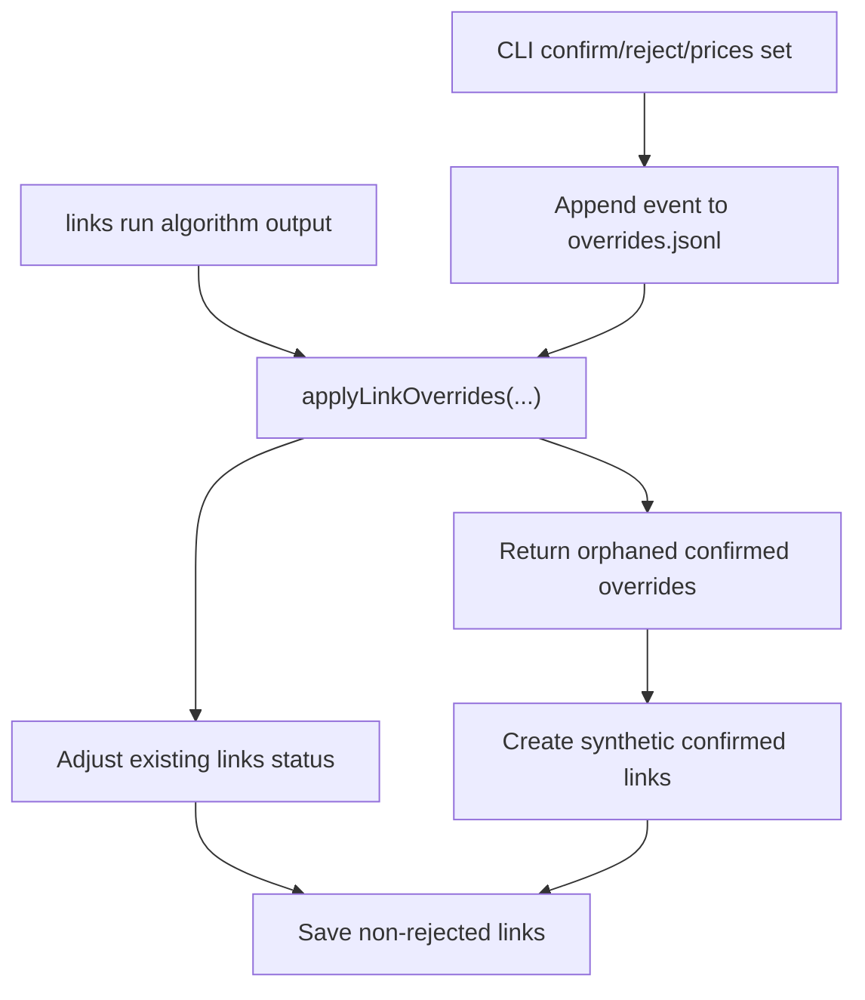

# Override Event Store and Replay Specification

> ⚠️ **Code is law**: If this document disagrees with implementation, update the spec to match code.

Defines how user overrides are persisted in `overrides.jsonl` and how link overrides are replayed during `links run` so user decisions survive reprocessing.

## Quick Reference

| Concept              | Key Rule                                                     |
| -------------------- | ------------------------------------------------------------ |
| Override storage     | Append-only JSONL at `${EXITBOOK_DATA_DIR}/overrides.jsonl`  |
| Transaction identity | Fingerprint is `${source_name}:${external_id}`               |
| Link identity        | Fingerprint is `link:${sortedTxFp1}:${sortedTxFp2}:${asset}` |
| Replay precedence    | Override replay runs after linking heuristic output          |
| Conflict resolution  | Last event wins per link fingerprint                         |

## Goals

- Persist high-value user decisions outside rebuildable databases.
- Reapply link decisions deterministically during `links run`.
- Keep CLI writes resilient: primary command succeeds even if override write fails.

## Non-Goals

- Full replay integration for all override scopes in all pipelines.
- Deleting or mutating prior events in place.
- Introducing a DB-level `tx_fingerprint` column.

## Definitions

### Override Event

Append-only event written to JSONL:

```ts
{
  id: string,
  created_at: string,
  actor: string,
  source: string,
  scope: 'price' | 'fx' | 'link' | 'unlink',
  reason?: string,
  payload: OverridePayload
}
```

### Transaction Fingerprint

Stable transaction identity:

```ts
`${source_name}:${external_id}`;
```

This follows issue #254 comment simplification and uses already persisted transaction fields.

### Link Fingerprint

Stable relationship identity:

```ts
`link:${sorted(source_tx, target_tx)}:${asset}`;
```

Sorting makes A->B and B->A equivalent.

## Behavioral Rules

### Storage Rules

- `OverrideStore.append()` validates via Zod and writes one JSON object per line.
- Writes are serialized by an internal queue to avoid interleaved JSONL corruption.
- `OverrideStore.readAll()` streams line-by-line, skipping invalid JSON/invalid schema rows with warnings.
- `OverrideStore.readByScope(scope)` filters `readAll()` results by scope.

### Write Path Rules (CLI)

| Command              | DB mutation                        | Override event                                                     |
| -------------------- | ---------------------------------- | ------------------------------------------------------------------ |
| `links confirm <id>` | Updates link status to `confirmed` | Appends `scope='link'`, `type='link_override'`, `action='confirm'` |
| `links reject <id>`  | Updates link status to `rejected`  | Appends `scope='unlink'`, `type='unlink_override'`                 |
| `prices set ...`     | Saves manual price                 | Appends `scope='price'`, `type='price_override'`                   |
| `prices set-fx ...`  | Saves manual FX                    | Appends `scope='fx'`, `type='fx_override'`                         |

- Idempotent no-op confirm/reject (`already confirmed` / `already rejected`) does not append a new event.
- Override append failures are logged as warnings and do not fail the user command.

### Replay Rules (`links run`)

`LinksRunHandler` flow:

1. Load transactions
2. Clear existing links (non-dry-run)
3. Run linking algorithm
4. Build link entities (confirmed + suggested)
5. Split internal links vs regular links
6. Apply link/unlink overrides to regular links
7. Reattach internal links
8. Save all non-rejected links (non-dry-run)

Replay semantics:

- Only `scope='link' | 'unlink'` events are considered.
- Event stream projection uses last-event-wins per link fingerprint.
- Matching algorithm links get status overwritten to confirmed/rejected.
- Confirmed override with resolvable transactions but no algorithm link is returned as `orphaned`, then materialized as a new confirmed link.
- Unresolvable fingerprints are returned as `unresolved` and logged.

### Orphaned Link Materialization

When materializing orphaned confirmed overrides, link fields use sentinels:

- `sourceAmount=0`, `targetAmount=0`
- `amountSimilarity=0`, `timingHours=0`
- `confidenceScore=1`
- `status='confirmed'`
- `metadata.overrideId=<event id>`

These represent user-authoritative links not rediscovered by heuristics.

## Data Model

### Override Event Payloads

```ts
type OverridePayload =
  | {
      type: 'price_override';
      asset: string;
      quote_asset: string;
      price: string;
      timestamp: string;
      tx_fingerprint?: string;
      price_source?: string;
    }
  | { type: 'fx_override'; fx_pair: string; rate: string; timestamp: string; tx_fingerprint?: string }
  | {
      type: 'link_override';
      action: 'confirm';
      link_type: 'transfer' | 'trade';
      source_fingerprint: string;
      target_fingerprint: string;
      asset: string;
    }
  | { type: 'unlink_override'; link_fingerprint: string };
```

Scope/payload pairing is enforced:

- `scope='price'` -> `type='price_override'`
- `scope='fx'` -> `type='fx_override'`
- `scope='link'` -> `type='link_override'`
- `scope='unlink'` -> `type='unlink_override'`

## Pipeline / Flow



## Invariants

- Override log is append-only.
- Link replay is deterministic for the same input transactions and event log.
- Link fingerprint construction is order-invariant due to sorted transaction fingerprints.
- User decision precedence: replay runs after heuristic link generation.

## Edge Cases and Gotchas

- Duplicate or malformed JSONL lines are skipped, not fatal.
- `unlink` events without prior resolvable link details can produce placeholder state and may become unresolved if no later confirm provides transaction details.
- Confirm/reject command success does not guarantee override durability if append fails.
- Rejected links are intentionally not persisted in final `links run` save.

## Known Limitations (Current Implementation)

- Replay integration is implemented for link/unlink flow in `links run`; price/fx replay in processing pipeline is not yet wired here.
- Event IDs are UUIDs, not ULIDs from the original issue proposal.
- Override ordering is file append order (chronological in practice), not re-sorted by `created_at`.
- `fingerprint-utils.ts` still exists as a thin helper, but identity is now `source_name:external_id` (no new DB fingerprint column).

## Related Specs

- [Links Run UI Spec](../mockups/links/links-run-spec.md)
- [Links Confirm/Reject CLI Spec](../mockups/links/links-confirm-reject-spec.md)
- [Accounts and Imports](./accounts-and-imports.md)

---

_Last updated: 2026-02-07_
