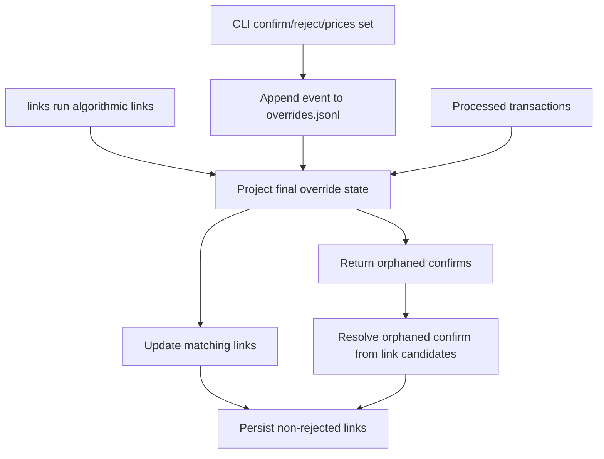

# Override Event Store and Replay Specification

> ⚠️ **Code is law**: If this document disagrees with implementation, update the spec to match code.

Defines how user overrides are stored in `overrides.jsonl` and how link/unlink
events are replayed during `links run`.

## Quick Reference

| Concept                 | Key Rule                                                                                                    |
| ----------------------- | ----------------------------------------------------------------------------------------------------------- |
| Storage                 | Append-only JSONL at `${EXITBOOK_DATA_DIR}/overrides.jsonl`                                                 |
| Transaction identity    | `${source}:${externalId}`                                                                                   |
| Link identity           | `link:${sortedTxFp1}:${sortedTxFp2}:${assetSymbol}`                                                         |
| Replay precedence       | Override replay runs after algorithmic link generation                                                      |
| Conflict resolution     | Last event wins per link fingerprint                                                                        |
| Orphaned confirm        | Materialize only when source and target transactions resolve and exactly one source/target candidate exists |
| Persisted orphaned link | Uses candidate-derived asset ids, amounts, and movement fingerprints; never zero-amount sentinels           |

## Goals

- **Durable user decisions**: Preserve high-value link and unlink choices outside rebuildable databases.
- **Deterministic replay**: Reapply the same decisions on every `links run`.
- **Best-effort CLI writes**: User-facing commands succeed even if the follow-up override append fails.

## Non-Goals

- Replaying every override scope in every pipeline.
- Mutating or deleting historical events in place.
- Replacing the canonical persisted link contract in `transaction_links`.

## Definitions

### Override Event

Append-only JSONL event:

```ts
{
  id: string,
  created_at: string,
  actor: string,
  source: string,
  scope: 'price' | 'fx' | 'link' | 'unlink',
  reason?: string,
  payload: OverridePayload
}
```

### Transaction Fingerprint

Stable transaction identity used by replay:

```ts
`${source}:${externalId}`;
```

### Link Fingerprint

Stable override identity for a logical link:

```ts
`link:${sorted(sourceFingerprint, targetFingerprint)}:${assetSymbol}`;
```

Sorting makes A→B and B→A equivalent for override replay.

## Behavioral Rules

### Storage Rules

- `OverrideStore.append()` validates via Zod and writes one JSON object per line.
- Writes are serialized by an internal queue.
- `OverrideStore.readAll()` streams line-by-line and skips malformed JSON or schema-invalid rows with warnings.
- `OverrideStore.readByScope(scope)` filters the full event stream by scope.

### CLI Write Path Rules

| Command              | Database mutation               | Override event                                                     |
| -------------------- | ------------------------------- | ------------------------------------------------------------------ |
| `links confirm <id>` | sets link status to `confirmed` | appends `scope='link'`, `type='link_override'`, `action='confirm'` |
| `links reject <id>`  | sets link status to `rejected`  | appends `scope='unlink'`, `type='unlink_override'`                 |
| `prices set ...`     | saves manual price              | appends `scope='price'`, `type='price_override'`                   |
| `prices set-fx ...`  | saves manual FX                 | appends `scope='fx'`, `type='fx_override'`                         |

Additional rules:

- idempotent confirm/reject no-ops do not append a new event
- append failures are logged as warnings and do not fail the primary CLI command

### Replay Rules (`links run`)

Replay runs after algorithmic link generation and before persistence.

Replay input:

- algorithmic `TransactionLink` values
- link/unlink override events
- processed transactions for fingerprint resolution

Replay semantics:

1. build `transactionFingerprint -> transactionId` lookup from processed transactions
2. project the override stream by link fingerprint using last-event-wins semantics
3. apply final projected state to matching algorithmic links
4. collect final `confirm` states that resolve transactions but have no matching algorithmic link as orphaned overrides
5. return unresolved events when the transaction fingerprints cannot be resolved

Important rules:

- only `scope='link' | 'unlink'` participate in link replay
- `unlink` with no prior `link` event creates a placeholder reject state, not a new link
- if the final projected state for a fingerprint is `reject`, no orphaned link is created

### Orphaned Confirmed Override Materialization

An orphaned confirmed override is a final `confirm` state whose source and target
transactions resolve, but whose pair was not rediscovered by the algorithm.

Materialization rules:

1. resolve source and target transactions from the override fingerprints
2. resolve source outflow candidates for the override `assetSymbol`
3. resolve target inflow candidates for the override `assetSymbol`
4. materialize only when exactly one source candidate and one target candidate remain
5. derive link type structurally from source and target `sourceType`
6. persist:
   - `sourceAssetId`
   - `targetAssetId`
   - `sourceAmount`
   - `targetAmount`
   - `sourceMovementFingerprint`
   - `targetMovementFingerprint`
7. persist `status='confirmed'`, `confidenceScore=1`, and override metadata
8. if either side is missing or ambiguous, log and skip

Explicitly not allowed:

- `sourceAmount=0`
- `targetAmount=0`
- missing asset ids
- missing movement fingerprints
- raw movement fallback outside the normal candidate builder

### Reviewed Metadata Rules

When replay updates or materializes a confirmed link:

- `reviewedBy = override.actor`
- `reviewedAt = new Date(override.created_at)`

When replay updates a rejected link:

- `status='rejected'`
- `reviewedBy` and `reviewedAt` are updated from the final unlink event

Rejected links are not persisted by `links run`.

## Data Model

### Override Event Payloads

```ts
type OverridePayload =
  | {
      type: 'price_override';
      asset: string;
      quote_asset: string;
      price: string;
      timestamp: string;
      tx_fingerprint?: string;
      price_source?: string;
    }
  | {
      type: 'fx_override';
      fx_pair: string;
      rate: string;
      timestamp: string;
      tx_fingerprint?: string;
    }
  | {
      type: 'link_override';
      action: 'confirm';
      link_type: 'transfer' | 'trade';
      source_fingerprint: string;
      target_fingerprint: string;
      asset: string;
    }
  | {
      type: 'unlink_override';
      link_fingerprint: string;
    };
```

Scope/payload pairing is enforced:

- `scope='price' -> type='price_override'`
- `scope='fx' -> type='fx_override'`
- `scope='link' -> type='link_override'`
- `scope='unlink' -> type='unlink_override'`

## Pipeline / Flow


```mermaid
graph TD
    A["CLI confirm/reject/prices set"] --> B["Append event to overrides.jsonl"]
    C["links run algorithmic links"] --> D["Project final override state"]
    B --> D
    E["Processed transactions"] --> D
    D --> F["Update matching links"]
    D --> G["Return orphaned confirms"]
    G --> H["Resolve orphaned confirm from link candidates"]
    F --> I["Persist non-rejected links"]
    H --> I
```

## Invariants

- **Append-only log**: Events are never edited in place.
- **Deterministic replay**: The same transaction set and event order produce the same final override state.
- **Order-invariant link identity**: Link fingerprints sort transaction fingerprints before hashing the relationship key.
- **User precedence**: Replay always runs after algorithmic link generation.
- **No vague orphaned links**: Orphaned confirms never persist zero-amount or fingerprint-less links.

## Edge Cases & Gotchas

- malformed JSONL lines are skipped, not fatal
- confirm/reject command success does not guarantee override durability if the append fails afterward
- `unlink` without a prior resolvable `link` event creates placeholder reject state; that placeholder never becomes a persisted link by itself
- link fingerprints remain keyed by `assetSymbol`, even though persisted links now carry stricter source/target asset ids

## Known Limitations (Current Implementation)

- price/fx override replay is not the focus of this spec and is not wired through every pipeline the same way as link replay
- override ordering follows file append order rather than a separate sort by `created_at`
- override identity is still symbol-based, not the stricter `(sourceAssetId, targetAssetId)` pair used by persisted links

## Related Specs

- [Transaction Linking](./transaction-linking.md) — canonical linking runtime and persisted link contract
- [CLI Links Run](./cli/links/links-run-spec.md) — command UX around linking runs
- [CLI Links Confirm/Reject](./cli/links/links-confirm-reject-spec.md) — user-facing mutation flows
- [Accounts and Imports](./accounts-and-imports.md) — processed transactions that replay resolves against

---

_Last updated: 2026-03-08_
