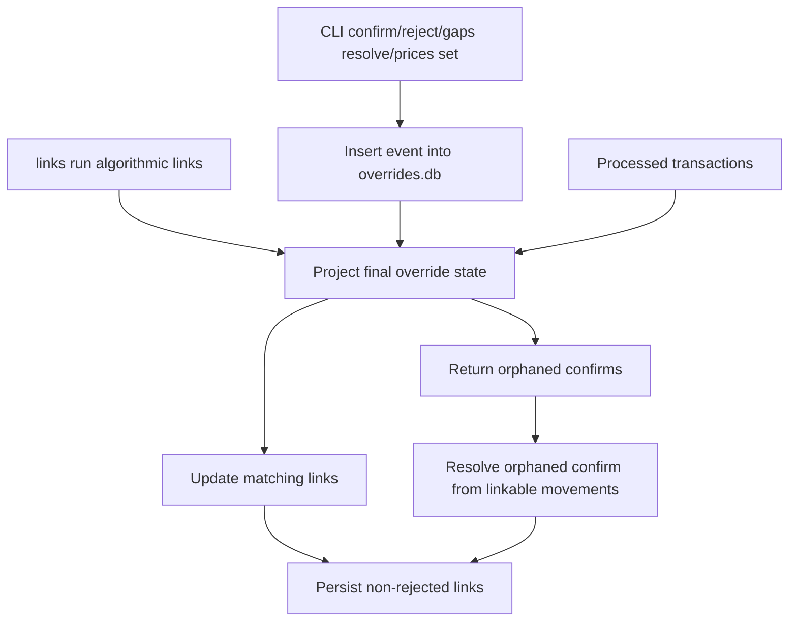

# Override Event Store and Replay Specification

> ⚠️ **Code is law**: If this document disagrees with implementation, update the spec to match code.

Defines how user overrides are stored in `overrides.db` and how replay/materialization
consumers read the relevant profile-scoped event streams.

## Quick Reference

| Concept                      | Key Rule                                                                                                       |
| ---------------------------- | -------------------------------------------------------------------------------------------------------------- |
| Storage                      | Dedicated SQLite DB at `${EXITBOOK_DATA_DIR}/overrides.db`                                                     |
| Durable scope                | Every override row belongs to exactly one `profile_key`                                                        |
| Transaction identity         | Persisted `txFingerprint`                                                                                      |
| Legacy link identity         | `link:${sortedTxFp1}:${sortedTxFp2}:${assetSymbol}`                                                            |
| Resolved link identity       | `resolved-link:v1:${sourceMovementFingerprint}:${targetMovementFingerprint}:${sourceAssetId}:${targetAssetId}` |
| Replay precedence            | Override replay runs after algorithmic link generation                                                         |
| Conflict resolution          | Last event wins per link fingerprint                                                                           |
| Transaction user-note replay | Last event wins per `tx_fingerprint`; user notes materialize into `transactions.user_notes_json`               |
| Orphaned confirm             | Materialize only when source and target transactions resolve and exactly one source/target movement exists     |
| Persisted orphaned link      | Uses linkable-movement-derived asset ids, amounts, and movement fingerprints; never zero-amount sentinels      |

## Goals

- **Durable user decisions**: Preserve high-value link and unlink choices outside rebuildable databases.
- **Durable transaction user notes**: Preserve user-authored transaction notes outside rebuildable processed transaction rows.
- **Deterministic replay**: Reapply the same decisions on every `links run`.
- **Best-effort CLI writes**: User-facing commands succeed even if the follow-up override append fails.

## Non-Goals

- Replaying every override scope in every pipeline.
- Mutating or deleting historical events in place.
- Replacing the canonical persisted link contract in `transaction_links`.

## Definitions

### Override Event

Append-only logical event stored as one row in SQLite:

```ts
{
  id: string,
  created_at: string,
  profile_key: string,
  actor: string,
  source: string,
  scope:
    | 'price'
    | 'fx'
    | 'link'
    | 'unlink'
    | 'link-gap-resolve'
    | 'link-gap-reopen'
    | 'transaction-user-note'
    | 'asset-exclude'
    | 'asset-include'
    | 'asset-review-confirm'
    | 'asset-review-clear',
  reason?: string,
  payload: OverridePayload
}
```

### Transaction Fingerprint

Stable transaction identity used by replay:

```ts
txFingerprint;
```

See [Transaction and Movement Identity](./transaction-and-movement-identity.md)
for the canonical derivation contract.

### Legacy Link Fingerprint

Legacy override identity for a logical source/target pair:

```ts
`link:${sorted(sourceFingerprint, targetFingerprint)}:${assetSymbol}`;
```

Sorting makes A→B and B→A equivalent for override replay.

### Resolved Link Fingerprint

Exact override identity for a persisted link:

```ts
`resolved-link:v1:${sourceMovementFingerprint}:${targetMovementFingerprint}:${sourceAssetId}:${targetAssetId}`;
```

This is direction-aware, movement-aware, and asset-id-aware.

## Behavioral Rules

### Storage Rules

- `OverrideStore.append()` validates via Zod and inserts one row into
  `override_events`.
- `OverrideStore.appendMany()` validates the entire batch first, then persists
  all rows atomically in append order or writes nothing.
- Writes are serialized by an internal queue.
- `OverrideStore.readAll()` returns rows ordered by the SQLite sequence column.
- `OverrideStore.readByScope(profileKey, scope)` and
  `readByScopes(profileKey, scopes)` query by top-level `profile_key` plus
  persisted `scope`, then preserve append order.
- `OverrideStore.findLatestCreatedAt(profileKey, scopes)` reads the latest
  override timestamp inside one profile stream.

### CLI Write Path Rules

| Command                                     | Database mutation                                     | Override event                                                                                     |
| ------------------------------------------- | ----------------------------------------------------- | -------------------------------------------------------------------------------------------------- |
| `links create <src> <dst> --asset <symbol>` | creates or confirms one exact manual link row         | appends `scope='link'`, `type='link_override'`, `action='confirm'`                                 |
| `links create-grouped ...`                  | creates or confirms multiple grouped manual link rows | appends one atomic batch of `scope='link'`, `type='link_override'`, `action='confirm'` events      |
| `links confirm <ref>`                       | sets link status to `confirmed`                       | appends `scope='link'`, `type='link_override'`, `action='confirm'`                                 |
| `links reject <ref>`                        | sets link status to `rejected`                        | appends `scope='unlink'`, `type='unlink_override'`                                                 |
| `links gaps resolve <ref>`                  | hides that specific gap issue from the open gaps lens | appends `scope='link-gap-resolve'`, `type='link_gap_resolve'`                                      |
| `links gaps reopen <ref>`                   | reopens a previously-resolved gap issue               | appends `scope='link-gap-reopen'`, `type='link_gap_reopen'`                                        |
| `transactions edit note <id> --message ...` | materializes a durable user note on that transaction  | appends `scope='transaction-user-note'`, `type='transaction_user_note_override'`, `action='set'`   |
| `transactions edit note <id> --clear`       | clears the durable user note on that transaction      | appends `scope='transaction-user-note'`, `type='transaction_user_note_override'`, `action='clear'` |
| `prices set ...`                            | saves manual price                                    | appends `scope='price'`, `type='price_override'`                                                   |
| `prices set-fx ...`                         | saves manual FX                                       | appends `scope='fx'`, `type='fx_override'`                                                         |

Additional rules:

- idempotent confirm/reject and note set/clear no-ops do not append a new event
- append failures are logged as warnings and do not fail the primary CLI command
- `links create` is the exception: override persistence is required because it is the durable source of truth for a user-authored link, so append failure aborts the command before `transaction_links` is mutated

### Link Gap Resolution Replay

Link-gap resolution overrides are replayed independently from link replay.

Replay input:

- `scope='link-gap-resolve' | 'link-gap-reopen'` override events

Replay semantics:

1. replay gap-resolution events in append order
2. key the projected state by `tx_fingerprint + asset_id + direction`
3. `link-gap-resolve` marks that issue identity as resolved
4. `link-gap-reopen` removes that issue identity from the resolved set
5. the final replay result is a `Set<linkGapIssueKey>` for currently resolved issue identities

Consumption rules:

- gap resolution only affects the gaps lens; it does not alter `transaction_links`
- replay is latest-event-wins per `tx_fingerprint + asset_id + direction`
- gap issues resolved this way are hidden from open gap browse output, but remain in processed transactions

### Link Replay Rules (`links run`)

Replay runs after algorithmic link generation and before persistence.

Replay input:

- algorithmic `TransactionLink` values
- link/unlink override events
- processed transactions for fingerprint resolution

Replay semantics:

1. build `transactionFingerprint -> transactionId` lookup from processed transactions
2. project the override stream by override fingerprint using last-event-wins semantics
3. apply final projected state to matching algorithmic links
4. collect final `confirm` states that resolve transactions but have no matching algorithmic link as orphaned overrides
5. return unresolved events when the transaction fingerprints cannot be resolved

Important rules:

- only `scope='link' | 'unlink'` participate in link replay
- replay matches links by `resolved_link_fingerprint`
- `unlink` with no prior `link` event creates a placeholder reject state, not a new link
- if the final projected state for a fingerprint is `reject`, no orphaned link is created

### Orphaned Confirmed Override Materialization

An orphaned confirmed override is a final `confirm` state whose source and target
transactions resolve, but whose pair was not rediscovered by the algorithm.

These confirmed states may come from either:

- `links confirm <ref>` on an algorithmic suggestion
- `links create <src> <dst> --asset <symbol>` for a user-authored exact pair

Materialization rules:

1. resolve source and target transactions from the override transaction
   fingerprints
2. revalidate the exact movement fingerprints and asset ids captured in the
   override against the current linkable movement set
3. materialize only when both exact movements resolve
4. derive link type structurally from source and target `platformKind`
5. persist:
   - `sourceAssetId`
   - `targetAssetId`
   - `sourceAmount`
   - `targetAmount`
   - `sourceMovementFingerprint`
   - `targetMovementFingerprint`
6. persist `status='confirmed'`, `confidenceScore=1`, and override metadata
7. if either exact side no longer resolves, log and skip

Explicitly not allowed:

- `sourceAmount=0`
- `targetAmount=0`
- missing asset ids
- missing movement fingerprints
- symbol-only orphaned override resolution

### Transaction User-Note Replay And Materialization

Transaction-user-note overrides are replayed independently from link replay.

Replay input:

- `scope='transaction-user-note'` override events
- processed transactions identified by persisted `tx_fingerprint`

Replay semantics:

1. replay `transaction_user_note_override` events in append order
2. key the projected state by `tx_fingerprint`
3. `action='set'` stores the latest message for that fingerprint
4. `action='clear'` removes any previously projected note for that fingerprint
5. the final replay result is a `Map<txFingerprint, userNote>`

Materialization rules:

- missing `overrides.db` means "no durable transaction-user-note overrides"
- materialization may be scoped by `accountIds` and/or `transactionIds`
- repository materialization replaces the stored `transactions.user_notes_json` projection without mutating transaction diagnostics
- repository materialization strips any previously materialized override-store `user_note`
- if a current replayed note exists, materialization appends exactly one projected `user_note` with `metadata.source='override-store'`
- if the projected note state is unchanged, materialization performs no write

### Reviewed Metadata Rules

When replay updates or materializes a confirmed link:

- `reviewedBy = override.actor`
- `reviewedAt = new Date(override.created_at)`

When replay updates a rejected link:

- `status='rejected'`
- `reviewedBy` and `reviewedAt` are updated from the final unlink event

Rejected links are not persisted by `links run`.

## Data Model

### `override_events`

Logical shape:

```ts
{
  id: string;
  created_at: string;
  profile_key: string;
  actor: string;
  source: string;
  scope: Scope;
  payload: OverridePayload;
  reason?: string;
}
```

Persistence/indexing rules:

- `profile_key` is required and stable across `transactions.db` rebuilds
- the durable query path is `(profile_key, scope, sequence_id)`
- append order still comes from SQLite `sequence_id`, not `created_at`

### Override Event Payloads

```ts
type OverridePayload =
  | {
      type: 'price_override';
      asset: string;
      quote_asset: string;
      price: string;
      timestamp: string;
      tx_fingerprint?: string;
      price_source?: string;
    }
  | {
      type: 'fx_override';
      fx_pair: string;
      rate: string;
      timestamp: string;
      tx_fingerprint?: string;
    }
  | {
      type: 'link_override';
      action: 'confirm';
      link_type: 'transfer' | 'trade';
      source_fingerprint: string;
      target_fingerprint: string;
      asset: string;
      resolved_link_fingerprint: string;
      source_asset_id: string;
      target_asset_id: string;
      source_movement_fingerprint: string;
      target_movement_fingerprint: string;
      source_amount: string;
      target_amount: string;
    }
  | {
      type: 'unlink_override';
      resolved_link_fingerprint: string;
    }
  | {
      type: 'link_gap_resolve';
      tx_fingerprint: string;
    }
  | {
      type: 'link_gap_reopen';
      tx_fingerprint: string;
    }
  | {
      type: 'transaction_user_note_override';
      action: 'set' | 'clear';
      tx_fingerprint: string;
      message?: string;
    };
```

Scope/payload pairing is enforced:

- `scope='price' -> type='price_override'`
- `scope='fx' -> type='fx_override'`
- `scope='link' -> type='link_override'`
- `scope='unlink' -> type='unlink_override'`
- `scope='link-gap-resolve' -> type='link_gap_resolve'`
- `scope='link-gap-reopen' -> type='link_gap_reopen'`
- `scope='transaction-user-note' -> type='transaction_user_note_override'`

## Pipeline / Flow


```mermaid
graph TD
    A["CLI confirm/reject/gaps resolve/prices set"] --> B["Insert event into overrides.db"]
    C["links run algorithmic links"] --> D["Project final override state"]
    B --> D
    E["Processed transactions"] --> D
    D --> F["Update matching links"]
    D --> G["Return orphaned confirms"]
    G --> H["Resolve orphaned confirm from linkable movements"]
    F --> I["Persist non-rejected links"]
    H --> I
```

## Invariants

- **Append-only log**: Events are never edited in place.
- **Deterministic replay**: The same transaction set and event order produce the same final override state.
- **Stable append order**: Event replay order comes from the SQLite append
  sequence, not from ad hoc file ordering.
- **Exact link identity**: Link/unlink events carry resolved link fingerprints
  based on movement fingerprints and asset ids.
- **Exact gap-resolution identity**: Gap-resolution events are keyed by persisted `tx_fingerprint`.
- **Exact transaction-user-note identity**: Transaction-user-note events are keyed by persisted `tx_fingerprint`.
- **User precedence**: Replay always runs after algorithmic link generation.
- **No vague orphaned links**: Orphaned confirms never persist zero-amount or fingerprint-less links.
- **Projected user-note projection**: Transaction-user-note materialization projects only user-authored notes into `transactions.user_notes_json`.

## Edge Cases & Gotchas

- confirm/reject command success does not guarantee override durability if the append fails afterward
- `unlink` without a prior resolvable `link` event creates placeholder reject state; that placeholder never becomes a persisted link by itself
- transaction-user-note replay projects a single latest user note per `tx_fingerprint`; historical note versions remain only in the append log

## Known Limitations (Current Implementation)

- price/fx override replay is not the focus of this spec and is not wired through every pipeline the same way as link replay
- transaction-user-note materialization only runs where the explicit materialization path is invoked; replay alone does not mutate processed transactions
- override ordering follows SQLite append sequence rather than a separate sort
  by `created_at`
- transaction fingerprints are still stored as opaque strings rather than a dedicated nominal `TransactionFingerprint` type

## Related Specs

- [Transaction and Movement Identity](./transaction-and-movement-identity.md) — canonical processed identity contracts for replay keys
- [Transaction Linking](./transaction-linking.md) — canonical linking runtime and persisted link contract
- [CLI Links Run](./cli/links/links-run-spec.md) — command UX around linking runs
- [CLI Links Confirm/Reject](./cli/links/links-confirm-reject-spec.md) — user-facing mutation flows
- [Accounts and Imports](./accounts-and-imports.md) — processed transactions that replay resolves against

---

_Last updated: 2026-03-26_
