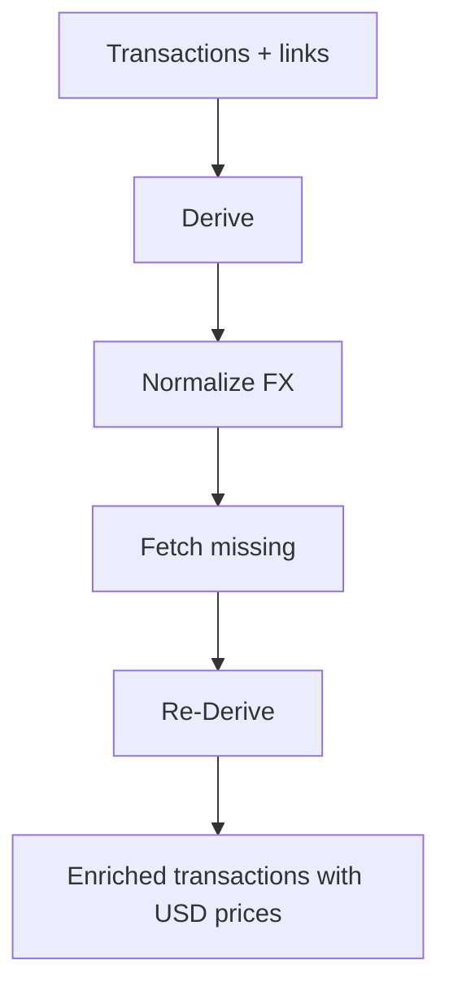

# Price Derivation Specification

> ⚠️ **Code is law**: If this disagrees with implementation, update the spec to match code.

How Exitbook assigns USD valuations to movements and fees via deterministic math, FX normalization, external providers, and re-derivation.

## Quick Reference

| Concept            | Key Rule                                                                                                       |
| ------------------ | -------------------------------------------------------------------------------------------------------------- |
| Stage order        | Derive → Normalize → Fetch → Re-Derive; flags can short-circuit stages                                         |
| Price priority     | `exchange-execution` (3) > `derived-ratio` / `link-propagated` (2) > providers/manual (1) > tentative fiat (0) |
| Simple-trade scope | Multi-pass derivation only runs when there is exactly 1 inflow and 1 outflow                                   |
| Fiat normalization | Non-USD fiat prices are converted to USD and upgraded from `fiat-execution-tentative` → `derived-ratio`        |
| Stablecoin quotes  | Provider prices in stablecoins are converted to USD; if stablecoin USD rate missing, assume 1:1 after warn     |
| No temporal reuse  | Prices are never copied based on “nearby” timestamps (ADR-001)                                                 |
| Link propagation   | Outflow → inflow only; same asset; gross amounts within 10% tolerance                                          |

## Goals

- **Persistent USD valuations** for movements and fees used in cost basis and proceeds.
- **Ground-truth first**: prefer execution math and confirmed links before external providers.
- **Deterministic, repeatable pipeline** with explicit stage controls and priorities.

## Non-Goals

- Display-currency conversion (USD → other) at report time.
- Guessing prices via temporal windows or heuristics beyond defined derivation rules.

## Definitions

### PriceAtTxTime (attached to movements/fees)

```ts
type PriceAtTxTime = {
  price: { amount: Decimal; currency: string };
  source: string;
  fetchedAt?: Date;
  granularity?: 'exact' | 'minute' | 'hour' | 'day';
  fxRateToUSD?: Decimal;
  fxSource?: string;
  fxTimestamp?: Date;
};
```

- `price.currency` is intended to be `USD`; non-USD fiat may appear pre-normalization.
- `source` drives overwrite priority.

### Price Source Priority (enforced)

| Priority | Sources                                                                       |
| -------: | ----------------------------------------------------------------------------- |
|        3 | `exchange-execution`                                                          |
|        2 | `derived-ratio`, `link-propagated`                                            |
|        1 | Provider/manual (e.g., `binance`, `coingecko`, `manual`, `binance+usdt-rate`) |
|        0 | `fiat-execution-tentative`                                                    |

### Transaction Group

- Transactions connected by the transitive closure of confirmed links; processed together during derivation.

### Price Cache Entry (`prices.db`)

```ts
{
  asset_symbol: string;   // e.g., 'BTC', 'EUR'
  currency: string;       // e.g., 'USD'
  timestamp: string;      // ISO
  price: string;          // decimal
  source_provider: string;
  granularity?: string;
  fetched_at: string;     // ISO
}
```

## Behavioral Rules

### Stage Selection

- Default CLI pipeline runs all stages. Flags allow partial runs: `--derive-only`, `--normalize-only`, `--fetch-only`.

### Stage 1: Derive (deterministic, no providers)

- Operates per transaction group (union-find over confirmed links), ordered chronologically.
- Multi-pass logic only applies to **simple trades** (exactly one inflow + one outflow):
  - **Pass 0**: If one side is USD, price the other in USD and stamp `exchange-execution` (priority 3). If one side is non-USD fiat, price in that fiat and stamp `fiat-execution-tentative` (priority 0). Stablecoins are treated as crypto, not fiat.
  - **Pass 1**: If outflow priced and inflow missing, derive inflow via swap ratio; source `derived-ratio` (priority 2); currency/granularity inherited.
  - **Pass N+2**: If both sides priced and neither is fiat/stablecoin, recompute inflow using execution ratio with outflow as anchor; overwrite inflow with `derived-ratio` (priority 2). Example: ETH→BTC swap where both sides have provider prices—treat ETH outflow priced at $3,000 as anchor and set BTC inflow price = `outflowValueUSD / btcAmount`, replacing the provider BTC spot.
- Fees:
  - If a fee shares asset with a priced movement in the same transaction, copy that price.
  - Unpriced fiat fees: USD → `exchange-execution`; non-USD fiat → `fiat-execution-tentative`.
- Link propagation (`propagatePricesAcrossLinks`):
  - Copy prices from **source outflows → target inflows** when asset matches and gross amounts are within 10% tolerance.
  - Copied prices keep original price/fetchedAt/granularity/FX metadata; `source` becomes `link-propagated` (priority 2).

### Stage 2: Normalize (non-USD fiat → USD)

- Targets movements/fees whose `price.currency` is fiat and not `USD`.
- Looks up historical FX at transaction timestamp via FX providers (ECB, Bank of Canada, Frankfurter).
- Validates FX rate in `(0, 1e3]`; errors on invalid values.
- Transforms `price.amount *= fxRate`; sets `price.currency = 'USD'`; records `fxRateToUSD`, `fxSource`, `fxTimestamp`.
- Upgrades `source` from `fiat-execution-tentative` to `derived-ratio` (priority 2) to prevent later provider overwrite.
- Crypto in `price.currency` is treated as unexpected and logged; normalization skips.

### Stage 3: Fetch (providers, gap filling)

- Collects assets needing prices per transaction:
  - Missing price entirely, or
  - `fiat-execution-tentative` still present (when normalization was skipped/failed),
  - Excludes fiat assets.
- Uses `PriceProviderManager` (failover, caching, circuit breakers). Crypto providers: `binance`, `coingecko`, `cryptocompare`. FX providers: `ecb`, `bank-of-canada`, `frankfurter`. Manual cache entries flow through with `source='manual'`.
- Stablecoin quote handling:
  - If provider returns price in a stablecoin (e.g., `BTC/USDT`), manager fetches stablecoin→USD and multiplies.
  - If stablecoin→USD fails, log `warn` and assume 1:1 for that timestamp.

### Stage 4: Re-Derive (second pass)

- Reruns derivation (Pass 1, Pass N+2, link propagation) after Normalize/Fetch to align swaps to execution ratios and spread new prices through links.

### Price Application & Overwrite Rules

- Higher priority replaces lower; equal priority may refresh (e.g., derived replacing earlier derived).
- `exchange-execution` is never overwritten.
- Derived sources (`derived-ratio`, `link-propagated`) can overwrite provider/manual results.

### Execution Identity Prices

- USD trades stamp USD identity (`1 USD = 1 USD`) with `exchange-execution`.
- Non-USD fiat trades stamp fiat identity with `fiat-execution-tentative` until normalized.

### FX Validation & Safety

- FX rates must be positive and within sanity bounds `[1e-7, 1000]`; failures raise errors.
- Normalization is skipped for already-USD prices.

## Data Model

### Movements / Fees

- Each movement/fee may hold `priceAtTxTime: PriceAtTxTime`.
- Persisted prices are intended to be USD; pre-normalization fiat is allowed transiently.

### Price Cache (`prices.db`)

- Single table keyed by `(asset_symbol, currency, timestamp)`.
- Stores provider name, granularity, fetched timestamp; used by fetch stage and stablecoin conversions.

## Pipeline / Flow



## Invariants

- **Simple-trade guard**: Multi-pass derivation only runs when exactly one inflow and one outflow exist.
- **Priority enforcement**: Application obeys source priority table; `exchange-execution` cannot be overwritten.
- **No temporal reuse**: Prices are never inferred from nearby timestamps (ADR-001, 2025-01-30).
- **FX sanity**: Non-positive or absurd FX rates are rejected.
- **Link propagation scope**: Only outflow → inflow with same asset and ≤10% gross difference.

## Edge Cases & Gotchas

- Stablecoin quote pairs rely on fetching the stablecoin’s USD rate; missing rate falls back to 1:1 with a warning.
- Transactions with crypto in `price.currency` are treated as malformed for normalization; left untouched and logged.
- Provider failures may leave `fiat-execution-tentative` in place if normalization was skipped; rerunning Normalize upgrades them.
- Execution math does not run for trades with multiple inflows/outflows; they depend on provider prices.
- Re-Derive must run after Normalize and Fetch to ensure swaps use execution ratios based on the newest prices; skipping it leaves inflow prices anchored to stale/independent provider spots.

## Known Limitations (Current Implementation)

- Derivation covers only the simple-trade shape (1 inflow, 1 outflow); complex trades need provider/manual prices.
- Link propagation copies prices only from source outflows to target inflows and only within 10% amount tolerance.
- No persisted “dedup window” for prices; correctness relies on priority and deterministic recomputation, not caching heuristics.

## Related Specs

- [Fees](./fees.md) — fee pricing and proceeds/basis interactions
- [Accounts & Imports](./accounts-and-imports.md) — where raw transactions originate before pricing
- [Transfers & Tax](./transfers-and-tax.md) — transfer matching and tax semantics that consume priced movements
- [Pagination & Streaming](./pagination-and-streaming.md) — ingestion batches that precede pricing

---

_Last updated: 2025-12-12_
