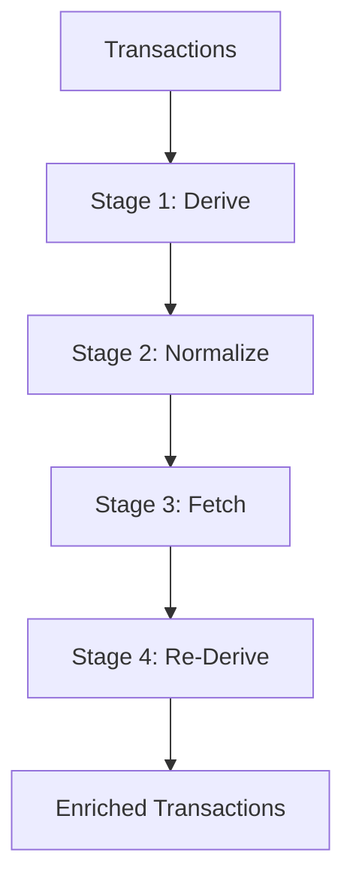

# Price Derivation & FX Normalization

This spec defines how Exitbook assigns **USD valuations** to transaction movements (and fees) for cost basis and reporting. In this repo, “derive prices” refers to **deterministic inference from transaction data + confirmed links**. “Fetch prices” refers to **external providers**. “Normalize” refers to **non-USD fiat → USD conversion**.

## Goals

- Persist USD valuations for all movements/fees.
- Prefer “ground truth” (execution math, confirmed links) over provider spot prices.
- Never reuse “nearby” transaction prices (no temporal proximity heuristic).

## Non-goals

- Display-currency conversion (USD → CAD/EUR) at report time.
- Guessing prices via time windows.

## Storage Currency

- Stored prices are **intended** to be USD, but the pipeline may temporarily persist **non-USD fiat** prices as `fiat-execution-tentative` until normalization runs.

## Pipeline (Recommended)

The CLI’s unified workflow is a 4-stage pipeline:

Stage selection is controlled by CLI flags (`--derive-only`, `--normalize-only`, `--fetch-only`). By default all stages run.

## Stage 1: Derive (Deterministic, No Providers)

**Inputs**

- Universal transactions in the DB
- Confirmed transaction links

**Key behavior**

- Transactions are grouped by the **transitive closure** of confirmed links (Union-Find grouping).
- Within each group, transactions are sorted chronologically and enriched together.
- Derivation is **pure**: it uses only transaction content + confirmed links (no external price calls).

### 1.1 Multi-pass inference (`inferMultiPass`)

Multi-pass inference only considers a **simple trade** shape: exactly **1 inflow + 1 outflow**.

**Pass 0 — Fiat execution pricing + fiat identity**

- If either side is **USD**, compute the other side’s execution price in USD and stamp USD identity (`1 USD = 1 USD`).
  - Source: `exchange-execution` (priority 3)
  - Granularity: `exact`
- If one side is **non-USD fiat** (CAD/EUR/GBP/etc.), compute prices in that fiat currency and stamp fiat identity (`1 CAD = 1 CAD`).
  - Source: `fiat-execution-tentative` (priority 0)
  - Granularity: `exact`
- Stablecoins are treated as crypto (not fiat): stablecoin trades are **not** execution-priced here so de-peg events can be captured by provider/secondary logic later.

**Pass 1 — Derive inflow from priced outflow**

- For a simple trade where:
  - outflow has a price, and
  - inflow is missing a price
- Compute inflow price via swap ratio and stamp:
  - Source: `derived-ratio` (priority 2)
  - Currency: inherited from the priced outflow’s price currency
  - Granularity: inherited from the priced outflow

**Pass N+2 — Recalculate crypto↔crypto swap inflow price**

- For a simple trade where both sides are priced, and **neither** side is fiat-or-stablecoin:
  - Treat the **outflow** (disposal) side as the FMV anchor (typically fetched/provider priced).
  - Recalculate the inflow (acquisition) side using the execution ratio.
  - Overwrite inflow using:
    - Source: `derived-ratio` (priority 2)
    - Currency/granularity: inherited from outflow price
- This is intentionally run again in Stage 4 after fetch/normalize to ensure swaps use **execution ratio math** rather than two independent provider spot prices.

### 1.2 Fee price enrichment

Fees are enriched from same-transaction movements:

- If a fee has the same asset as a priced movement, copy that price.
- Otherwise, if the fee asset is fiat and unpriced, stamp identity:
  - USD → `exchange-execution`
  - Non-USD fiat → `fiat-execution-tentative`

### 1.3 Link-based propagation (`propagatePricesAcrossLinks`)

Across confirmed links in a group:

- Copy prices from **source outflows → target inflows** when:
  - asset matches exactly, and
  - the gross amounts are within **10% tolerance** (to allow fee/slippage differences).
- Copied prices preserve the original `price`, `fetchedAt`, `granularity`, and FX metadata, but the `source` is set to `link-propagated` (priority 2).

## Stage 2: Normalize (Non-USD Fiat → USD)

Normalize converts any **non-USD fiat** `priceAtTxTime.price.currency` into USD using an FX provider.

**Scope**

- Movements and fees with `price.currency.isFiat()` and currency != `USD`.
- Already-USD prices are skipped.
- If a movement has a crypto currency in the `price.currency` field, it’s skipped and logged as unexpected.

**FX lookup**

- Uses historical FX rates at the transaction timestamp via the price-provider manager (e.g., ECB, Bank of Canada, Frankfurter).

**Validation**

- FX rates must be > 0 and within sanity bounds `[1e-7, 1000]`.

**Normalization output**

- `price.currency` becomes `USD`
- `price.amount` is multiplied by the FX rate
- FX metadata is recorded:
  - `fxRateToUSD`, `fxSource`, `fxTimestamp`
- If the original source was `fiat-execution-tentative`, it is upgraded to `derived-ratio` (priority 2). This prevents provider prices from overwriting execution-derived amounts.

## Stage 3: Fetch (Providers, Gap Filling)

Fetch fills remaining missing USD prices for non-fiat assets using external providers via the `PriceProviderManager` (with failover, circuit breakers, and caching).

**What gets fetched**

- For each transaction flagged as “needing prices”, gather unique assets that:
  - have no price, or
  - have a `fiat-execution-tentative` price (fallback behavior if normalization didn’t run or failed),
  - excluding fiat currencies.

**Providers (current, auto-registered unless disabled)**

- Crypto: `binance`, `coingecko`, `cryptocompare`
- FX: `ecb`, `bank-of-canada`, `frankfurter`
- Manual entries are stored in the same cache DB and surface through the manager as provider-like sources (default `source` is `manual` / user-provided).

**Stablecoin-denominated provider results**

- Some providers fetch crypto prices in stablecoin quote pairs (e.g., `BTC/USDT`).
- The manager converts stablecoin-denominated prices to USD by fetching the stablecoin’s USD rate and multiplying.
- If the stablecoin USD rate can’t be fetched, the manager logs a warning and assumes 1:1 parity for that stablecoin at that timestamp.

## Stage 4: Re-Derive (Second Pass)

After Normalize and/or Fetch, Derive is run again to:

- apply Pass 1 and Pass N+2 using newly available prices, and
- propagate across links again with improved coverage.

## Price Source Priority (Enforced in Code)

When enriching movements, prices are applied by priority:

| Priority | Source(s)                          | Notes                                                                                                          |
| -------: | ---------------------------------- | -------------------------------------------------------------------------------------------------------------- |
|        3 | `exchange-execution`               | Never overwritten.                                                                                             |
|        2 | `derived-ratio`, `link-propagated` | Can overwrite provider/manual sources. Derived sources can refresh other derived sources at the same priority. |
|        1 | Any other source string            | Includes provider sources and manual sources (e.g., `binance`, `coingecko`, `manual`, `binance+usdt-rate`).    |
|        0 | `fiat-execution-tentative`         | Provisional non-USD fiat; intended to be normalized to USD then upgraded.                                      |

## Temporal Proximity (Explicitly Not Implemented)

Per ADR 001 (2025-01-30): Exitbook does **not** reuse prices from “nearby” transactions. There is no temporal-window lookup in the derivation pipeline.

Allowed sources of truth are:

- same-transaction execution pricing (fiat ↔ crypto)
- same-transaction ratio inference
- confirmed link propagation
- provider fetch (or manual entry) for gaps

## Data Model

### `PriceAtTxTime` (movement/fee field)

`PriceAtTxTime` is the persisted valuation attached to movements and fees:

- `price` (Money), `source` (string), `fetchedAt` (Date)
- optional `granularity`: `exact | minute | hour | day`
- optional FX audit metadata: `fxRateToUSD`, `fxSource`, `fxTimestamp`

### Price cache DB (`prices.db`)

Crypto prices and FX rates are persisted in `prices.db` in a single `prices` table keyed by `(asset_symbol, currency, timestamp)`:

- `asset_symbol` (e.g., `BTC`, `EUR`)
- `currency` (e.g., `USD`)
- `timestamp` (ISO)
- `price` (string decimal)
- `source_provider` (provider/source string)
- optional `granularity`
- `fetched_at` (ISO)

## Known limitations (Current Behavior)

- Multi-pass inference only triggers for transactions shaped as **exactly one inflow and one outflow**.
- Link propagation only copies prices from source **outflows** to target **inflows** (asset-equal, within 10% amount tolerance).
