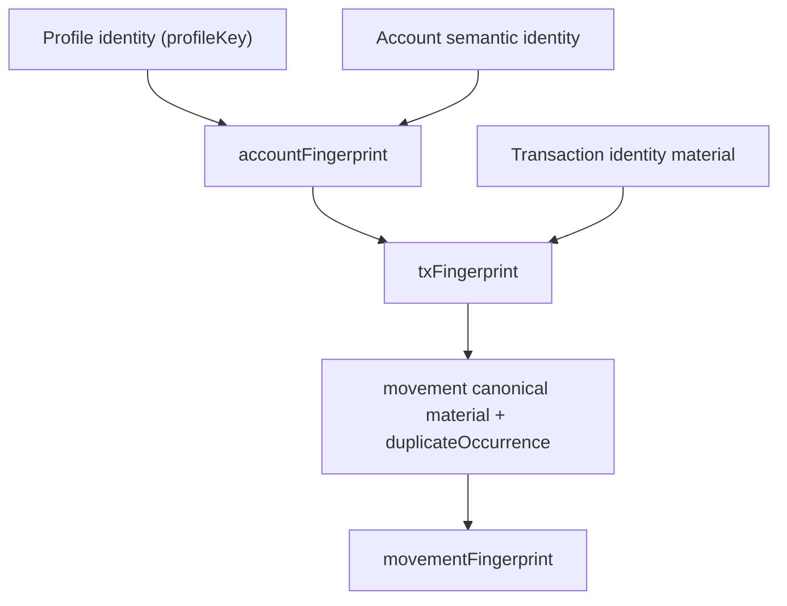

# Transaction and Movement Identity Specification

> ⚠️ **Code is law**: If this document disagrees with implementation, update the spec to match code.

Defines the canonical identity contracts for processed transactions and processed movements after raw import has already produced authoritative source event identities.

## Quick Reference

| Concept                        | Key Rule                                                                                                                                           |
| ------------------------------ | -------------------------------------------------------------------------------------------------------------------------------------------------- | ------------------------------------------ | ------------- | ------------------------------ | ---- |
| Account identity root          | `accountFingerprint` is derived from `profileKey` plus semantic account identity material                                                          |
| Exchange account identity      | `sha256(profileKey                                                                                                                                 | exchange                                   | platformKey)` |
| Wallet account identity        | `sha256(profileKey                                                                                                                                 | wallet                                     | platformKey   | identifier)`                   |
| Processed transaction identity | `txFingerprint` is the only durable processed transaction identifier                                                                               |
| Blockchain tx fingerprint      | `sha256(accountFingerprint                                                                                                                         | blockchain                                 | source        | blockchainTransactionHash)`    |
| Exchange tx fingerprint        | `sha256(accountFingerprint                                                                                                                         | exchange                                   | source        | sortedComponentEventIds.join(' | '))` |
| Processed movement identity    | `movementFingerprint = movement:<sha256(txFingerprint                                                                                              | canonicalMaterial)>:<duplicateOccurrence>` |
| Movement selector ref          | `MOVEMENT-REF` is a transaction-scoped convenience ref derived from `movementFingerprint`, not canonical identity                                  |
| Semantic stability             | `movementRole`, diagnostics, and user notes do not participate in movement identity                                                                |
| Persistence                    | `accounts.account_fingerprint`, `transactions.tx_fingerprint`, and `transaction_movements.movement_fingerprint` are persisted canonical identities |

## Goals

- deterministic processed identity across rebuilds when the underlying semantic facts are unchanged
- profile isolation for processed identities
- stable exchange identity across API-key rotation or CSV-directory changes
- durable transaction and movement references that do not depend on row IDs

## Definitions

### Account Fingerprint

Stable account identity fingerprint rooted in profile-scoped semantic account identity.

```ts
// exchange top-level accounts
accountFingerprint = sha256(`${trim(profileKey)}|exchange|${trim(platformKey)}`);

// blockchain accounts
accountFingerprint = sha256(`${trim(profileKey)}|wallet|${trim(platformKey)}|${trim(identifier)}`);
```

Semantics:

- `profileKey` is part of the identity root
- exchange identities intentionally ignore mutable API keys and CSV paths
- blockchain identities still include the semantic wallet identifier
- account fingerprints do not depend on database row IDs

Important invariant:

> Top-level exchange identity assumes at most one exchange account per platform within a profile. If that invariant changes, fingerprint design must be revisited first.

### Transaction Fingerprint

Canonical processed transaction identity:

```ts
// blockchain
txFingerprint = sha256(`${accountFingerprint}|blockchain|${source}|${blockchainTransactionHash}`);

// exchange
txFingerprint = sha256(`${accountFingerprint}|exchange|${source}|${sortedComponentEventIds.join('|')}`);
```

Semantics:

- `txFingerprint` is the only durable processed transaction identifier
- profile isolation falls out naturally from `accountFingerprint`
- user-note and link identities can remain keyed by `txFingerprint` because the fingerprint is already profile-scoped
- exchange component event IDs are trimmed and sorted before hashing

### Movement Canonical Material

Asset movement canonical material:

```ts
`${movementType}|${assetId}|${grossAmount.toFixed()}|${effectiveNetAmount.toFixed()}`;
```

Fee movement canonical material:

```ts
`fee|${assetId}|${amount.toFixed()}|${scope}|${settlement}`;
```

Excluded on purpose:

- symbols
- `movementRole`
- diagnostics
- user notes
- price data
- provider/debug metadata

### Duplicate Occurrence

If multiple movements in the same transaction share the exact same canonical material:

- they are treated as semantically interchangeable duplicates
- each receives a 1-based `duplicateOccurrence` within that identical-material bucket

### Movement Fingerprint

```ts
movementFingerprint = `movement:${sha256Hex(`${txFingerprint}|${canonicalMaterial}`)}:${duplicateOccurrence}`;
```

Semantics:

- movement identity is rooted in transaction identity plus canonical movement content
- exact duplicates are intentionally interchangeable apart from their bucket-local occurrence suffix

### Movement Ref

`MOVEMENT-REF` is a transaction-scoped selector-friendly convenience ref for one
persisted processed movement.

Canonical formatting:

```ts
formatMovementFingerprintRef(`movement:${movementHash}:${duplicateOccurrence}`);
// => `${movementHash.slice(0, 10)}:${duplicateOccurrence}`
```

Semantics:

- `MOVEMENT-REF` is for operator surfaces and transaction-scoped command input
- `MOVEMENT-REF` is not canonical identity
- `MOVEMENT-REF` must be derived from persisted `movementFingerprint`
- ambiguous refs must fail cleanly at the command boundary
- movement corrections must still key machine replay by full
  `movementFingerprint`, not by `MOVEMENT-REF`

## Behavioral Rules

### Draft vs Persisted Identity

- blockchain drafts require `blockchain.transaction_hash`
- exchange drafts require `identityMaterial.componentEventIds`
- persisted transactions always carry `txFingerprint`
- persisted movements always carry `movementFingerprint`

### Strict Derivation

Fingerprint derivation is strict:

- blockchain transactions without `blockchain.transaction_hash` are invalid
- exchange transactions without `componentEventIds` are invalid
- empty identity components are rejected

### Stability Guarantees

- renaming a profile does not change processed identity because `profileKey` stays stable
- API-key rotation does not change top-level exchange identity
- CSV-directory moves do not change top-level exchange identity
- importing the same semantic account into two different profiles produces different processed identities
- price-only enrichment must not change movement identity
- semantic-only refactors such as `principal -> staking_reward` must not change movement identity

### Compatibility Guarantees

Stable movement identity does not remove the need for semantic validation.

Required behavior:

- replayed transfer links must validate that referenced movements are still transfer-eligible
- manual link confirmation must validate current movement-role compatibility before persisting
- stale references must fail explicitly or surface as incompatible; they must not silently apply against newly ineligible movements

## Persistence

```sql
accounts.account_fingerprint TEXT NOT NULL UNIQUE
transactions.tx_fingerprint TEXT NOT NULL UNIQUE
transaction_movements.movement_fingerprint TEXT NOT NULL UNIQUE
```

Persisted shapes:

```ts
interface Transaction {
  id: number;
  accountId: number;
  txFingerprint: string;
}

interface Account {
  id: number;
  profileId: number;
  accountFingerprint: string;
}

interface AssetMovement {
  movementFingerprint: string;
}

interface FeeMovement {
  movementFingerprint: string;
}
```

## Flow



## Invariants

- **Required**: `txFingerprint` is the only durable processed transaction identifier.
- **Required**: `movementFingerprint` is the only durable processed movement identifier.
- **Required**: processed transaction identity is profile-aware through `profileKey`.
- **Required**: exchange top-level identity ignores mutable credentials and CSV paths.
- **Required**: movement identity excludes enrichable and display-only fields.
- **Required**: movement identity excludes `movementRole`, diagnostics, and user notes.
