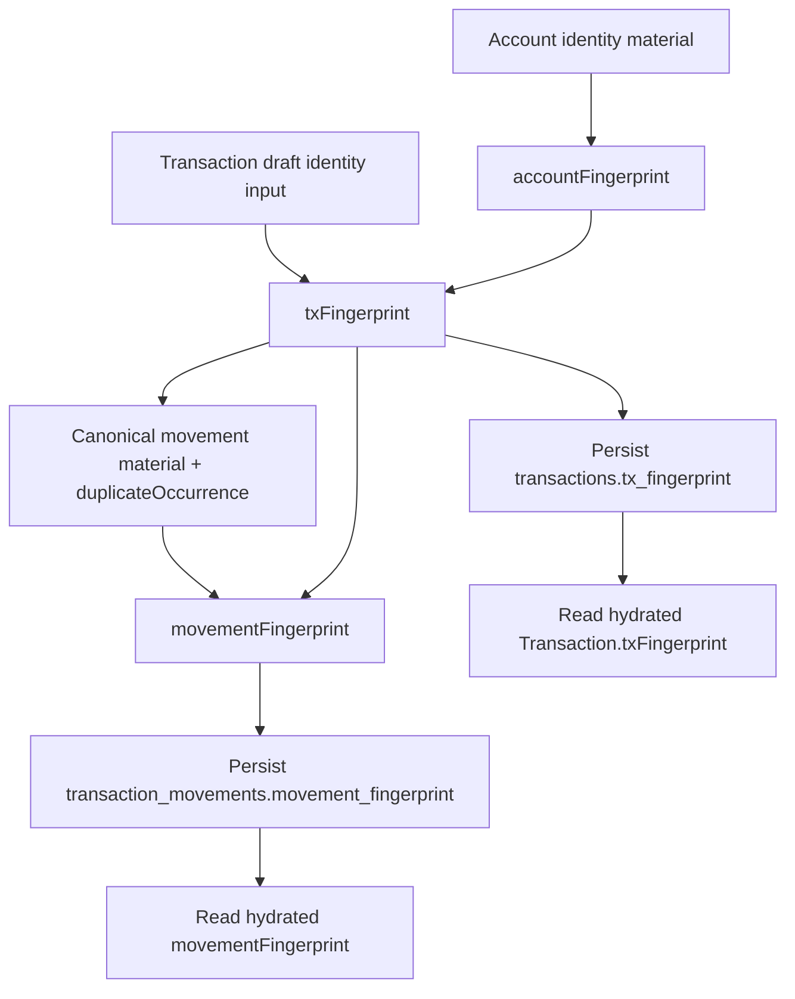

# Transaction and Movement Identity Specification

> ⚠️ **Code is law**: If this document disagrees with implementation, the implementation is correct and this spec must be updated.

Defines the canonical identity contracts for processed transactions and processed movements. This spec covers how `accountFingerprint`, `txFingerprint`, and `movementFingerprint` are derived, persisted, and interpreted after raw import has already produced authoritative event identities.

## Quick Reference

| Concept                        | Key Rule                                                                                                  |
| ------------------------------ | --------------------------------------------------------------------------------------------------------- | ------------------------------------------ | ------------------ | ------------------------------ | ---- |
| Account identity               | `accountFingerprint = sha256(trim(accountType)                                                            | trim(sourceName)                           | trim(identifier))` |
| Processed transaction identity | `txFingerprint` is the only durable processed transaction identifier                                      |
| Blockchain tx fingerprint      | `sha256(accountFingerprint                                                                                | blockchain                                 | source             | blockchainTransactionHash)`    |
| Exchange tx fingerprint        | `sha256(accountFingerprint                                                                                | exchange                                   | source             | sortedComponentEventIds.join(' | '))` |
| v1 output format               | `accountFingerprint` / `txFingerprint` are unprefixed lowercase SHA-256 hex strings                       |
| Processed movement identity    | `movementFingerprint = movement:<sha256(txFingerprint                                                     | canonicalMaterial)>:<duplicateOccurrence>` |
| Duplicate semantics            | Exact same-key duplicates are interchangeable; `duplicateOccurrence` is a bucket-local 1-based label      |
| Persistence                    | `transactions.tx_fingerprint` and `transaction_movements.movement_fingerprint` are required unique fields |
| Read ordering                  | Movement arrays materialize in canonical semantic order, not storage or processor insertion order         |

## Goals

- **One processed transaction identifier**: Downstream systems should reference processed transactions only by `txFingerprint`, not by provider-owned IDs or DB surrogate keys.
- **Deterministic processed movement identity**: Matching, overrides, and accounting should target persisted movement fingerprints rather than infer identity from array order.
- **Strict identity inputs**: Missing authoritative identity material should fail processing instead of inventing fallback identifiers.
- **Rebuild-safe persistence**: Reprocessing and price-only movement rebuilds should preserve identity when the canonical underlying facts are unchanged.

## Non-Goals

- Defining raw event identity for every source family. Raw `event_id` behavior is specified elsewhere.
- Making semantically different provider decompositions collapse to one movement identity.
- Preserving processor-emitted movement order as business identity.
- Using database row IDs as durable transaction or movement references.

## Definitions

### Account Fingerprint

Stable account identity fingerprint rooted in semantic account identity material:

```ts
accountFingerprint = sha256(`${trim(accountType)}|${trim(sourceName)}|${trim(identifier)}`);
```

Semantics:

- uses account identity material, not database `accounts.id`
- trims each input component before hashing
- must be stable across rebuilds for the same account definition
- is an internal identity root for processed fingerprints, not a user-facing reference
- is not the same thing as a projection freshness checksum such as `accountHash`

### Transaction Fingerprint

Canonical processed transaction identity:

```ts
// blockchain
txFingerprint = sha256(`${accountFingerprint}|blockchain|${source}|${blockchainTransactionHash}`);

// exchange
txFingerprint = sha256(`${accountFingerprint}|exchange|${source}|${sortedComponentEventIds.join('|')}`);
```

Semantics:

- `txFingerprint` is the only durable processed transaction identifier
- if a user-facing surface needs a durable transaction reference, it should use `txFingerprint`
- processed transaction models and persisted rows do not carry `externalId` or `external_id`
- there is no replacement `sourceReference` field
- blockchain transactions require `blockchain.transaction_hash`
- exchange transactions require `identityMaterial.componentEventIds`
- exchange component event IDs are trimmed, must be non-empty, and are sorted before hashing
- exchange fingerprint derivation does not deduplicate component event IDs

### Movement Canonical Material

Movement identity is rooted in semantic movement content inside one processed transaction.

Asset movement canonical material:

```ts
`${movementType}|${assetId}|${grossAmount.toFixed()}|${effectiveNetAmount.toFixed()}`;
```

Fee movement canonical material:

```ts
`fee|${assetId}|${amount.toFixed()}|${scope}|${settlement}`;
```

Excluded on purpose:

- `assetSymbol`
- `priceAtTxTime`
- note data
- source/provider metadata

### Duplicate Occurrence

If multiple movements in the same transaction share the exact same canonical material:

- they are treated as semantically interchangeable duplicates
- each receives a 1-based `duplicateOccurrence` within that exact canonical-material bucket

Important semantics:

- `duplicateOccurrence` is not a separate business concept
- exact duplicates may swap occurrence labels if processor input order changes
- that swap is accepted because the duplicates are defined as semantically equivalent

### Movement Fingerprint

Canonical processed movement identity:

```ts
movementFingerprint = `movement:${sha256Hex(txFingerprint | canonicalMaterial)}:${duplicateOccurrence}`;
```

Semantics:

- identity is rooted in transaction identity plus canonical movement content, not row order
- the `movement:` prefix is part of the persisted contract
- `duplicateOccurrence` must be a positive integer
- the stored fingerprint intentionally does not embed the full `txFingerprint` text, to reduce persistence overhead

### Fingerprint Output And Versioning

- v1 `accountFingerprint` and `txFingerprint` values are unprefixed lowercase SHA-256 hex strings
- `movementFingerprint` is versioned structurally by its documented `movement:` prefix plus hashed canonical material
- if the `txFingerprint` formula changes in a future version, that future version may introduce an explicit prefix
- unprefixed historical `txFingerprint` values are interpreted as v1

## Behavioral Rules

### Draft And Persisted Model Rules

- `TransactionDraft` carries transient identity input only:
  - exchange drafts require `identityMaterial.componentEventIds`
  - blockchain drafts must not carry `identityMaterial`
- persisted `Transaction` values must carry `txFingerprint`
- persisted `AssetMovement` and `FeeMovement` values must carry `movementFingerprint`

### Transaction Fingerprint Derivation Rules

- fingerprint derivation is strict:
  - blockchain transactions without `blockchain.transaction_hash` are invalid
  - exchange transactions without `identityMaterial.componentEventIds` are invalid
- transaction identity is computed centrally during persistence from semantic identity inputs
- downstream code must reuse persisted `txFingerprint`; it must not recompute transaction identity from ad hoc historical inputs

### Movement Fingerprint Derivation Rules

- movement fingerprints are computed during movement-row construction from:
  - persisted `txFingerprint`
  - canonical movement material
  - `duplicateOccurrence`
- exact identity excludes enrichable or display-only fields
- fee and asset movements use different canonical material builders because their business semantics differ

### Persistence Rules

- `transactions.tx_fingerprint` is required and unique
- `transaction_movements.movement_fingerprint` is required and unique
- movement rebuild paths reuse the persisted transaction fingerprint and the same movement fingerprint rules as initial writes
- processed identity is explicit and queryable in the database; downstream consumers should not infer it from row order

### Read And Materialization Rules

- transaction repository read paths hydrate persisted fingerprints onto domain models
- movement arrays materialize in canonical semantic order within each logical array (`inflows`, `outflows`, `fees`)
- canonical movement ordering is:
  1. canonical movement material ascending
  2. `duplicateOccurrence` ascending
  3. row ID only as a final deterministic tie-breaker for already equivalent entries

## Stability Guarantees

- blockchain `txFingerprint` is stable as long as account identity, source, and blockchain transaction hash are unchanged
- exchange `txFingerprint` is stable for the same account, source, and grouped raw `event_id` set
- movement identity is stable across rebuilds when the semantic movement set is unchanged
- price-only enrichment must not change movement identity when movement facts are unchanged

## Data Model

### Persisted Identity Columns

```sql
transactions.tx_fingerprint           TEXT NOT NULL UNIQUE
transaction_movements.movement_fingerprint TEXT NOT NULL UNIQUE
```

### Processed Identity Shapes

```ts
interface Transaction {
  id: number;
  accountId: number;
  txFingerprint: string;
  // ...
}

interface AssetMovement {
  movementFingerprint: string;
  // ...
}

interface FeeMovement {
  movementFingerprint: string;
  // ...
}
```

## Pipeline / Flow



## Invariants

- **Required**: `txFingerprint` is the only durable processed transaction identifier.
- **Required**: user-facing durable transaction references use `txFingerprint`, not provider-owned IDs or `transactions.id`.
- **Required**: `movementFingerprint` is the only durable processed movement identifier.
- **Required**: exchange transaction fingerprinting is order-insensitive with respect to `componentEventIds`.
- **Required**: exchange transaction fingerprinting trims component event IDs, rejects blank IDs, and does not deduplicate duplicates.
- **Required**: processed transaction persistence does not reintroduce `externalId` / `external_id`.
- **Required**: movement fingerprinting excludes display-only and enrichable fields.
- **Required**: there is no persisted `transaction_movements.position` contract.
- **Enforced**: fingerprint derivation fails when authoritative identity inputs are missing.

## Edge Cases & Gotchas

- Two exact same-key movements in one transaction are intentionally indistinguishable except for `duplicateOccurrence`.
- Reordering exact duplicates can change which interchangeable row gets occurrence `1` vs `2`; that is acceptable under the contract.
- Provider disagreement on movement decomposition still produces different fingerprints when the movement sets are genuinely different.
- `txFingerprint` and `movementFingerprint` are opaque strings; consumers must not parse business meaning out of them beyond their documented format.

## Known Limitations (Current Implementation)

- Exchange transaction identity is only as canonical as the imported raw `event_id` set. If provider event identity semantics change, the processed transaction fingerprint can change too.
- Exchange fingerprints do not guarantee invariance when overlapping duplicate files are later added or removed in a way that changes the grouped raw `event_id` set.
- No identity scheme here solves split-vs-merge disagreement when two providers materialize genuinely different movement sets for the same real-world activity.

## Related Specs

- [Accounts and Imports](./accounts-and-imports.md) — account and import boundaries that feed processed identity
- [EVM Raw Transaction Dedup & Event Identity](./evm-raw-transaction-dedup-and-event-identity.md) — raw event identity and base-hash dedup semantics
- [Transaction Linking](./transaction-linking.md) — movement-fingerprint-targeted linking and override replay
- [Cost Basis Accounting Scope](./cost-basis-accounting-scope.md) — scoped-accounting behavior built on persisted transaction and movement identity
- [Override Event Store and Replay](./override-event-store-and-replay.md) — durable user decisions keyed by persisted fingerprints

---

_Last updated: 2026-03-19_
