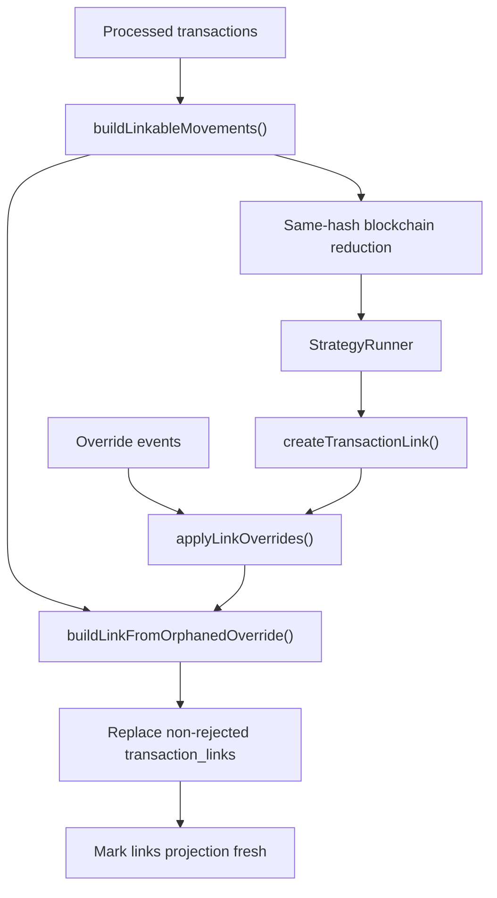

# Transaction Linking Specification

> ⚠️ **Code is law**: If this document disagrees with implementation, update the spec to match code.

Defines how Exitbook turns processed transactions into persisted `transaction_links`.
It covers the linking runtime boundary, same-hash blockchain reduction, matching,
override replay, and the persisted link contract.

## Quick Reference

| Concept                | Key Rule                                                                                                                                               |
| ---------------------- | ------------------------------------------------------------------------------------------------------------------------------------------------------ |
| Runtime boundary       | Linking builds linkable movements in memory from processed transactions; it does not persist a pre-linking shadow table                                |
| Linkable movement unit | One `LinkableMovement` per inflow or outflow movement                                                                                                  |
| Matching amount        | `netAmount ?? grossAmount`, except clear same-hash internal sends can reduce the source outflow amount first                                           |
| Structural trades      | Transactions with disjoint inflow/outflow asset sets are excluded from strategy matching                                                               |
| Same-hash grouping     | Blockchain transactions group by normalized hash, then by `assetId`                                                                                    |
| Internal-link topology | Only one pure outflow participant plus one or more pure inflow participants is linkable; ambiguous groups are skipped                                  |
| Movement identity      | Persisted links carry deterministic source/target movement fingerprints: `movement:${txFingerprint}:${movementType}:${position}`                       |
| Asset identity         | Persisted links carry both `sourceAssetId` and `targetAssetId`; one shared asset id is not enough                                                      |
| Match thresholds       | Defaults: `maxTimingWindowHours=48`, `clockSkewToleranceHours=2`, `minConfidenceScore=0.7`, `autoConfirmThreshold=0.95`, `minPartialMatchFraction=0.1` |
| Strategy order         | `exact-hash` → `same-hash external outflow` → `amount-timing` → `partial-match`                                                                        |
| Override replay        | Last event wins per link fingerprint; orphaned confirmed overrides materialize only when exactly one source and one target movement resolve            |
| Persistence            | `links run` replaces persisted non-rejected links atomically and then marks the `links` projection fresh                                               |

## Goals

- **Deterministic transfer linking**: The same processed transactions and override log produce the same persisted links.
- **Strict persisted contract**: Persist enough source/target identity that downstream consumers do not have to rebuild it heuristically.
- **Conservative blockchain handling**: Prefer skipped ambiguous same-hash cases over false internal links.
- **Rebuild-safe user decisions**: Link and unlink overrides survive `links run` reprocessing.

## Non-Goals

- Defining cost-basis accounting behavior on top of links.
- Inferring ownership inside ambiguous same-hash blockchain groups.
- Persisting pre-linking linkable movements or UTXO-adjusted shadow tables.
- Solving movement-level accounting exclusions.

## Definitions

### LinkableMovement

Ephemeral matching input built from processed transactions:

```ts
interface LinkableMovement {
  id: number;
  transactionId: number;
  accountId: number;
  sourceName: string;
  sourceType: SourceType;
  assetId: string;
  assetSymbol: Currency;
  direction: 'in' | 'out';
  amount: Decimal;
  grossAmount?: Decimal;
  timestamp: Date;
  blockchainTxHash?: string;
  fromAddress?: string;
  toAddress?: string;
  isInternal: boolean;
  excluded: boolean;
  position: number;
  movementFingerprint: string;
}
```

Important semantics:

- `amount` is the matching amount.
- `grossAmount` is only present when it differs from `amount`.
- `excluded=true` means the linkable movement exists for observability but strategies must not match it.
- `movementFingerprint` is deterministic and position-based within the transaction.

### Movement Fingerprint

Stable movement identity derived from transaction identity plus direction-local position:

```ts
computeMovementFingerprint({
  txFingerprint,
  movementType,
  position,
});

// movement:${txFingerprint}:${movementType}:${position}
```

This intentionally does not use `transaction_movements.id`. Movement rows can be
rebuilt; position within inflows, outflows, and fees is the stable contract.

### TransactionLink

Persisted transfer relationship:

```ts
interface TransactionLink {
  id: number;
  sourceTransactionId: number;
  targetTransactionId: number;
  assetSymbol: Currency;
  sourceAssetId: string;
  targetAssetId: string;
  sourceAmount: Decimal;
  targetAmount: Decimal;
  sourceMovementFingerprint: string;
  targetMovementFingerprint: string;
  linkType:
    | 'exchange_to_blockchain'
    | 'blockchain_to_exchange'
    | 'blockchain_to_blockchain'
    | 'exchange_to_exchange'
    | 'blockchain_internal';
  confidenceScore: Decimal;
  matchCriteria: MatchCriteria;
  status: 'suggested' | 'confirmed' | 'rejected';
  reviewedBy?: string;
  reviewedAt?: Date;
  createdAt: Date;
  updatedAt: Date;
  metadata?: Record<string, unknown>;
}
```

Important semantics:

- `assetSymbol` is the matching/display asset used by override fingerprints and matching heuristics.
- `sourceAssetId` and `targetAssetId` are the persisted accounting identities for the specific linked movements.
- `sourceMovementFingerprint` and `targetMovementFingerprint` identify the exact linked movements within those transactions.

### Link Fingerprint

Override replay identity for a logical source/target pair:

```ts
link:${sorted(sourceFingerprint, targetFingerprint)}:${assetSymbol}
```

This is order-invariant. Confirming A→B and B→A refers to the same override key.

### Same-Hash Asset Group

Internal reducer input for blockchain transactions that share a normalized hash:

```ts
interface SameHashAssetGroup {
  normalizedHash: string;
  blockchain: string;
  assetId: string;
  assetSymbol: string;
  participants: SameHashParticipant[];
}
```

Grouping is by `assetId`, not by symbol alone.

## Behavioral Rules

### Runtime Boundary

`links run` is a projection build with this shape:

1. mark the `links` projection as `building`
2. load processed transactions
3. build `LinkableMovement[]` plus internal blockchain links in memory
4. run matching strategies over those linkable movements
5. replay link/unlink overrides
6. persist all non-rejected links by replacement inside one transaction
7. mark the `links` projection as `fresh`

Important boundary rules:

- Linking persists `transaction_links` only.
- Pre-linking linkable movements are ephemeral runtime data.
- On failure, the projection is marked `failed`.

### Candidate Building

`buildLinkableMovements()` creates one linkable movement per inflow and outflow movement.

For every transaction:

- normalize blockchain hash when present
- reuse the persisted `txFingerprint` on the transaction
- compute a deterministic movement fingerprint for each inflow and outflow by direction-local position
- set `amount = netAmount ?? grossAmount`
- set `grossAmount` only when `netAmount` exists and differs from `grossAmount`

Structural trade exclusion:

- a transaction with at least one inflow and one outflow
- where inflow asset-symbol set and outflow asset-symbol set are disjoint
- is treated as a structural trade and marked `excluded=true`

Excluded linkable movements remain in the in-memory set but are not eligible for
strategy matching.

### Same-Hash Blockchain Reduction

Before ordinary matching, linking groups blockchain transactions by normalized
hash and then by `assetId`.

Only groups that span at least two transactions and at least two accounts are
considered.

Each participant is summarized with:

- total inflow gross amount for the asset
- total outflow gross amount for the asset
- inflow movement count
- outflow movement count
- same-asset on-chain fee amount

Reducer rules:

1. If a group has only pure outflow participants:
   - emit no internal links
   - apply no reductions
   - leave all ordinary linkable movements unchanged
   - later strategies may still consume the unchanged linkable movements for exact same-hash external-send matching
2. If any participant has both inflow and outflow for the same asset:
   - treat the group as ambiguous
   - log a warning
   - emit no internal links
   - apply no reductions
3. If a group has more than one pure outflow participant and at least one pure inflow participant:
   - treat the group as ambiguous
   - log a warning
   - emit no internal links
   - apply no reductions
4. If a group has exactly one pure outflow participant and one or more pure inflow participants:
   - require the sender to have exactly one outflow movement for that asset
   - require every receiver to have exactly one inflow movement for that asset
   - otherwise treat the group as ambiguous and skip it
5. For the clear internal case:
   - mark all participants as internal for linkable-movement metadata
   - create `blockchain_internal` links only for cross-account sender→receiver pairs
   - compute source reduction as:

```text
reduced source amount =
  sender outflow gross
  - total tracked inflow gross
  - deduplicated same-asset on-chain fee
```

Fee deduplication rule:

- deduplicated on-chain fee is the maximum same-asset on-chain fee seen across the group, not the sum

Internal-link materialization rule:

- the reducer first returns a fingerprint-less `PendingInternalLink`
- linking upgrades it to a persisted `NewTransactionLink` only after exactly one
  matching source movement and one matching target movement are found
- if either side is ambiguous, linking fails rather than persisting a partial link

### Strategy Matching

Ordinary strategies operate on non-internal cross-source linkable movements.

Default order:

1. `exact-hash`
2. `same-hash external outflow`
3. `amount-timing`
4. `partial-match`

Hard filters:

- source and target cannot come from the same transaction
- source must be `direction='out'`; target must be `direction='in'`
- source and target must share `assetSymbol`
- linkable movements from the same `sourceName` are skipped
- explicit address mismatch is a hard veto
- timing must be within `[-clockSkewToleranceHours, maxTimingWindowHours]`
- confidence must meet `minConfidenceScore`

Scoring model:

- asset match base: `0.30`
- amount similarity: up to `0.40`
- valid timing: `0.20`
- close timing bonus (`<= 1h`): `0.05`
- address match bonus: `0.10`

Amount similarity is fee-aware:

1. compare `source.amount` vs `target.amount`
2. if needed, compare `source.grossAmount` vs `target.amount`
3. if needed, compare `source.amount` vs `target.grossAmount`

Hash-match fast path:

- if normalized hashes match and both sides are blockchain linkable movements, the pair is skipped here because same-hash blockchain handling owns that case
- if normalized hashes match and the pair is not blockchain→blockchain, the pair gets confidence `1.0`
- multi-target hash matches are allowed only when the summed target amount does not exceed the source amount

Same-hash external outflow fast path:

- only considers pure same-hash blockchain outflow groups with:
  - at least two source movements
  - at least two accounts
  - exactly one shared `toAddress`
  - no tracked blockchain inflow movement for the same `(hash, assetId, sourceName)`
- reconstructs the group send amount as:

```text
group amount =
  sum(source gross amount)
  - max(same-hash duplicated fee)
```

- builds one synthetic group source for scoring only
- only proceeds when exactly one exchange inflow target matches that synthetic source with `amountSimilarity = 1.0`
- expands the accepted group match back into pairwise partial links, assigning the single deduplicated fee to one deterministic fee-bearing source and using gross amounts for the remaining sources
- uses the synthetic group match confidence and status for every expanded link

### Capacity Allocation And Partial Matches

Potential matches are sorted by:

1. confidence descending
2. hash matches before non-hash matches on ties

Allocation then applies greedy capacity consumption:

- each `(transactionId, assetSymbol)` source and target starts with capacity equal to its movement amount
- accepted matches consume `min(remainingSource, remainingTarget)`
- matches below `minPartialMatchFraction` of the larger original amount are rejected

Pure 1:1 restoration:

- if a source participates in exactly one accepted link and the target also participates in exactly one accepted link
- linking removes `consumedAmount`
- the persisted link uses original source and target amounts instead of the consumed partial amount

Actual splits and consolidations keep `consumedAmount` and persist partial-link metadata.

### Link Construction

`createTransactionLink()` validates and persists the matched pair.

Validation rules:

- `sourceAmount` and `targetAmount` must both be positive
- target cannot exceed source, except for hash matches where up to `1%` target excess is tolerated
- variance above `10%` is rejected

Persisted metadata rules:

- ordinary 1:1 links store `variance`, `variancePct`, and `impliedFee`
- partial links store:
  - `partialMatch=true`
  - `fullSourceAmount`
  - `fullTargetAmount`
  - `consumedAmount`
- same-hash external outflow expansions additionally store:
  - `dedupedSameHashFee`
  - `feeBearingSourceTransactionId`
  - `sameHashExternalSourceAllocations`
- score breakdown is stored when available
- hash-match target excess allowance is recorded in metadata when used

Status rules:

- links with confidence `>= autoConfirmThreshold` are persisted as `confirmed`
- lower-confidence accepted links are persisted as `suggested`
- `blockchain_internal` links are always `confirmed`

### Override Replay

Override replay runs after algorithmic matching and before persistence.

Only `scope='link'` and `scope='unlink'` events participate.

Projection rule:

- project the override stream by link fingerprint
- last event wins

Replay behavior:

- if an override fingerprint matches an algorithmic link, update that link's `status`, `reviewedBy`, and `reviewedAt`
- if a final `reject` state has no matching algorithmic link, do nothing
- if a final `confirm` state resolves both transactions but no algorithmic link exists, return it as orphaned for linkable-movement-based materialization
- if transaction fingerprints cannot be resolved, log and mark the event unresolved

### Orphaned Confirmed Override Materialization

Confirmed orphaned overrides are materialized from the same linkable movement set used by
the matcher.

Required behavior:

1. resolve source and target transactions from override fingerprints
2. find source outflow movements for the override `assetSymbol`
3. find target inflow movements for the override `assetSymbol`
4. materialize only when exactly one source movement and one target movement remain
5. derive the persisted link type from the source and target `sourceType`
6. persist linkable-movement-derived `sourceAssetId`, `targetAssetId`, `sourceAmount`, `targetAmount`, `sourceMovementFingerprint`, and `targetMovementFingerprint`
7. persist `status='confirmed'`, `confidenceScore=1`, and override metadata
8. otherwise log and skip materialization

Explicitly forbidden:

- zero-amount sentinel links
- missing asset ids
- missing movement fingerprints
- raw-movement fallback that bypasses linkable-movement shaping

## Data Model

### `transaction_links`

```sql
id INTEGER PRIMARY KEY,
source_transaction_id INTEGER NOT NULL,
target_transaction_id INTEGER NOT NULL,
asset TEXT NOT NULL,
source_asset_id TEXT NOT NULL,
target_asset_id TEXT NOT NULL,
source_amount TEXT NOT NULL,
target_amount TEXT NOT NULL,
source_movement_fingerprint TEXT NOT NULL,
target_movement_fingerprint TEXT NOT NULL,
link_type TEXT NOT NULL,
confidence_score TEXT NOT NULL,
match_criteria_json TEXT NOT NULL,
status TEXT NOT NULL,
reviewed_by TEXT NULL,
reviewed_at TEXT NULL,
created_at TEXT NOT NULL,
updated_at TEXT NOT NULL,
metadata_json TEXT NULL
```

Field semantics:

- `asset`: asset symbol used for matching and override fingerprints
- `source_asset_id`, `target_asset_id`: concrete source and target movement asset identities
- `source_amount`, `target_amount`: persisted link quantities after matching/allocation
- `source_movement_fingerprint`, `target_movement_fingerprint`: exact linked movement identities
- `match_criteria_json`: serialized runtime scoring criteria
- `metadata_json`: variance, partial-match audit fields, hash-match allowances, and score breakdown

## Pipeline / Flow



## Invariants

- **Ephemeral pre-linking**: Linking does not require a persisted linkable-movement or shadow-movement table.
- **Strict persisted identity**: Every persisted link has both asset ids and both movement fingerprints.
- **Positive quantities**: Persisted `sourceAmount` and `targetAmount` are always positive.
- **Conservative same-hash handling**: Ambiguous same-hash blockchain groups never emit synthetic internal links.
- **Deterministic replay**: For the same transaction set and override log order, replay produces the same final link states.
- **Rejected links are not persisted**: `links run` saves only non-rejected links.

## Edge Cases & Gotchas

- **Same-account participants**: Same-hash internal reduction can still mark participants as internal and reduce the sender, but persisted `blockchain_internal` links are only emitted for cross-account pairs.
- **Hash-match target excess**: A small target-over-source excess is only tolerated for hash matches, and only up to `1%`.
- **Multi-output hash matches**: A source can hash-match multiple targets only when their summed target amount does not exceed the source amount.
- **Asset-symbol matching**: Strategy matching and override fingerprints still key off `assetSymbol`, even though persisted links carry both asset ids.
- **Append-order replay**: Override conflict resolution follows JSONL append order; it is not re-sorted by `created_at`.

## Known Limitations (Current Implementation)

- Ambiguous same-hash blockchain groups are intentionally left unmatched rather than approximated.
- Same-hash external outflow matching only handles exact single-target exchange matches; non-exact groups still fall back to ordinary strategies or remain unmatched.
- Matching allocation is greedy, not globally optimal.
- Override fingerprints are still symbol-based; they do not yet use the stricter persisted asset-id pair.
- Movement fingerprints are stored as plain strings rather than a dedicated fingerprint schema/type.

## Related Specs

- [Override Event Store and Replay](./override-event-store-and-replay.md) — append-only override storage and replay rules
- [UTXO Address Model](./utxo-address-model.md) — raw per-address UTXO semantics feeding same-hash grouping
- [Transfers & Tax](./transfers-and-tax.md) — downstream tax treatment of confirmed links
- [CLI Links README](./cli/links/README.md) — user-facing link command surface

---

_Last updated: 2026-03-08_
