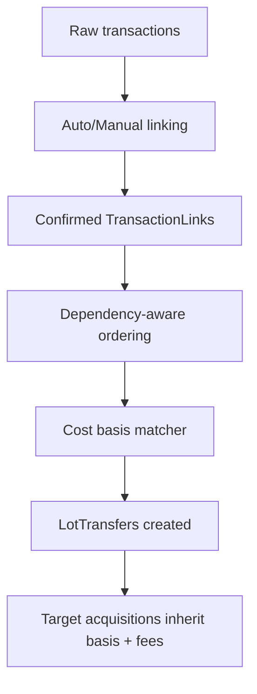

# Transfers & Tax Specification

> ⚠️ **Code is law**: If this disagrees with implementation, update the spec to match code.

How Exitbook detects self-transfers, links transactions, preserves cost basis, and applies jurisdictional fee policy during tax lot matching.

## Quick Reference

| Concept              | Key Rule                                                                                           |
| -------------------- | -------------------------------------------------------------------------------------------------- |
| Link eligibility     | Only `TransactionLink` with `status='confirmed'` and `confidenceScore >= 0.95` are honored         |
| Amounts used         | Linking and matching use `netAmount ?? grossAmount`                                                |
| Ordering             | Source transaction is processed before target via dependency-aware sort, overriding timestamps     |
| Variance guard       | Link creation rejects `targetAmount > sourceAmount` or >10% variance                               |
| Fee policy           | `sameAssetTransferFeePolicy`: `'disposal'` (USA/UK/EU) or `'add-to-basis'` (Canada) required       |
| Internal chain links | Auto-confirmed when transactions share normalized on-chain tx hash; cross-accounts only            |
| Pricing prerequisite | Non-fiat movements/fees must have `priceAtTxTime`; matcher errors when required prices are missing |

## Goals

- **Non-taxable self-transfers**: Preserve cost basis across owned accounts without triggering disposals.
- **Deterministic linking**: Confirmed links drive transfer handling; unconfirmed suggestions never affect tax.
- **Jurisdiction-aware fees**: Apply explicit policy for same-asset crypto fees to avoid silent assumptions.

## Non-Goals

- Discovering optimal tax strategies (strategy-agnostic core; FIFO/etc. handled elsewhere).
- Inferring transfers from heuristics beyond the stated matcher and thresholds.

## Definitions

### TransactionLink (transfer contract)

```ts
interface TransactionLink {
  sourceTransactionId: number;
  targetTransactionId: number;
  asset: string;
  sourceAmount: Decimal; // netAmount ?? grossAmount
  targetAmount: Decimal; // netAmount ?? grossAmount
  linkType: 'exchange_to_blockchain' | 'blockchain_to_blockchain' | 'exchange_to_exchange' | 'blockchain_internal';
  confidenceScore: Decimal;
  status: 'suggested' | 'confirmed' | 'rejected';
}
```

### LotTransfer (cost basis movement)

Moves basis from source lots to target acquisitions when a transfer is processed.

```sql
id TEXT PRIMARY KEY,
calculation_id TEXT NOT NULL,
source_lot_id TEXT NOT NULL,
link_id TEXT NOT NULL,
quantity_transferred TEXT NOT NULL,
cost_basis_per_unit TEXT NOT NULL,
source_transaction_id INTEGER NOT NULL,
target_transaction_id INTEGER NOT NULL,
metadata_json TEXT
```

### Fee Policy

`jurisdiction.sameAssetTransferFeePolicy`:

- `disposal`: same-asset crypto fee is a taxable disposal; remaining quantity transfers basis.
- `add-to-basis`: fee adds to target basis; no immediate disposal.

## Behavioral Rules

### Linking (Automatic & Manual)

- Auto-linker emits `suggestedLinks` and auto-confirms when `confidenceScore >= autoConfirmThreshold` (default 0.95).
- Confirmed links only: `status='confirmed'` and `confidenceScore >= 0.95`.
- Hard filters: asset match; target after source within `maxTimingWindowHours` (default 48h); amount similarity ≥ `minAmountSimilarity` (0.95); address mismatch rejects; confidence ≥ `minConfidenceScore` (0.7).
- Amount validation at creation: reject `targetAmount > sourceAmount` or variance > 10%.
- Internal blockchain links:
  - Group by normalized on-chain tx hash (strip log index suffix).
  - Cross-account only; skips tx with no movements.
  - Auto-confirmed at 100% confidence using primary movement amounts (first outflow gross else first inflow gross).

### Amount Basis for Matching

- Everywhere in linking and lot matching, `amount = movement.netAmount ?? movement.grossAmount`.
- Net amounts reflect on-chain fees when `settlement='on-chain'`; see fee spec.

### Ordering & Dependency

- Cost-basis calculation sorts transactions with a dependency-aware comparator: each source precedes its linked target, even if timestamps conflict (handles clock skew/backdated deposits).
- If a target is encountered before source due to missing dependency, matcher errors when no `LotTransfer` exists.

### Lot Matching Behavior

- When a source outflow with a confirmed link is processed:
  - Marked as transfer (non-disposal) for linked quantity.
  - Create `LotTransfer` rows to move basis to the target.
  - Same-asset fee handling follows configured policy.
- When a target inflow is processed:
  - Aggregate all inflows of the linked asset in the transaction (using net amounts).
  - Create acquisition lot with inherited basis from `LotTransfer` rows; add priced fiat fees (source + target).
  - Error if no `LotTransfer` rows exist for the link.

### Fee Treatment

- Same-asset crypto fees:
  - `disposal`: creates taxable disposal for fee amount.
  - `add-to-basis`: store fee USD value on `LotTransfer.metadata.cryptoFeeUsdValue`; adds to target basis.
  - **Example (Canada, add-to-basis)**: Transfer 1 BTC with 0.0001 BTC network fee priced at $6.50. Fee USD value is stored on `LotTransfer.metadata.cryptoFeeUsdValue`; target acquisition inherits source basis plus $6.50; no disposal event for the fee.
- Fiat fees:
  - Collected from source and target; added to basis only when `priceAtTxTime` exists; missing price logs warn and skips.
- Third-asset fees:
  - If emitted as explicit outflow in fee asset, treated as a normal disposal of that asset.

### Variance & Hidden Fee Checks

- Source vs target amounts (link creation): reject >10% variance.
- Outflow fee validation (hidden/missing fees):
  - Expect `outflow.net = gross - sum(on-chain fees in same asset)`.
  - `hiddenFee = |expectedNet - outflow.netAmount|`; `variancePct = hiddenFee / expectedNet * 100`.
  - Per-source thresholds (warn/error): `kraken` 0.5/2.0, `coinbase` 1.0/3.0, `binance` 1.5/5.0, `kucoin` 1.5/5.0, `default` 1.0/3.0.
- Transfer amount consistency during matching:
  - Source-side: compare outflow amount to `link.targetAmount`.
  - Target-side: compare summed `LotTransfer.quantityTransferred` to target inflow quantity.
  - Error on exceeding error tolerance; warn on warning tolerance.

### Pricing Requirements

- Non-fiat inflows/outflows require `priceAtTxTime`; fees require prices when participating in basis or disposal math.
- Pricing pipeline is independent but must have run to avoid matcher errors.

## Data Model

### transaction_links (relevant fields)

- `asset`, `source_amount`, `target_amount` (net or gross as defined above)
- `status`, `confidence_score`, `link_type`
- Indexes: `(source_transaction_id, asset, source_amount)` and `(target_transaction_id, asset)`
- `metadata_json`: variance (`variance`, `variancePct`, `impliedFee`), on-chain hash (`blockchainTxHash`, `blockchain`)

### lot_transfers

Tracks cost basis flow between linked transactions; see definition above.

## Pipeline / Flow



## Invariants

- **Confirmed-only**: Only links with `status='confirmed'` and `confidenceScore >= 0.95` affect transfers.
- **Net-first amounts**: `netAmount ?? grossAmount` used everywhere in linking/matching.
- **Source-before-target**: Dependency ordering guarantees source processed first; missing LotTransfers is an error.
- **Variance guard**: Link creation rejects `targetAmount > sourceAmount` or >10% variance.
- **Fee policy required**: Matcher errors if `sameAssetTransferFeePolicy` is unset when processing a linked transfer.

## Edge Cases & Gotchas

- Address mismatch hard-rejects a candidate even if other signals are strong.
- Internal blockchain links ignore transactions with no movements and only link across accounts.
- If pricing is missing for required movements/fees, matcher fails rather than assuming spot.
- Targets with multiple inflows aggregate amounts before basis assignment; per-movement granularity is lost—structure as separate transactions or use manual adjustments if per-leg basis is required.

## Known Limitations (Current Implementation)

- Auto-linker effectively allows one link per transaction id per direction when deduping; multi-outflow transactions may need manual links.
- Link propagation is one-way (source→target); no auto-splitting for partial matches beyond the 10% guard.
- Dependency ordering only covers known links; missing links can still produce negative-balance style errors until resolved.

## Related Specs

- [Fees](./fees.md) — fee semantics and pricing that feed transfer amounts
- [Price Derivation](./price-derivation.md) — required prices for movements/fees
- [Accounts & Imports](./accounts-and-imports.md) — where raw transactions originate
- [Pagination & Streaming](./pagination-and-streaming.md) — ingestion model preceding linking

---

_Last updated: 2025-12-12_
