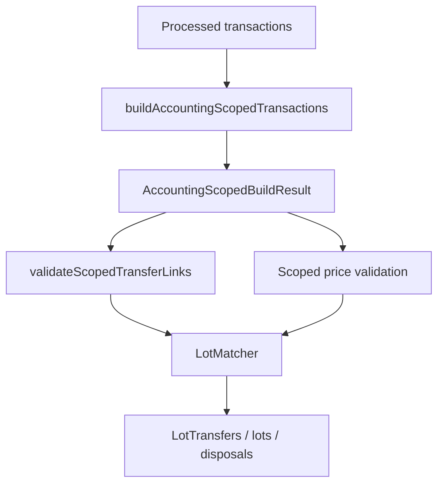

# Transfers & Tax Specification

> **Code is law**: If this document disagrees with implementation, update the spec to match code.

How Exitbook validates confirmed transfer links against the accounting-scoped boundary, preserves cost basis across owned-account transfers, and applies jurisdictional fee policy.

Link generation and the persisted `TransactionLink` contract are specified in [`transaction-linking.md`](./transaction-linking.md). This document covers the tax-facing behavior after linking.

## Quick Reference

| Concept                     | Rule                                                                                    |
| --------------------------- | --------------------------------------------------------------------------------------- |
| Tax input boundary          | `processed transactions → accounting scope builder → scoped validation → matcher`       |
| Link eligibility            | Only `status='confirmed'` external links are honored by cost basis                      |
| Confidence handling         | Cost basis does not re-threshold confirmed links by confidence score                    |
| Internal same-hash behavior | Resolved by the accounting scope builder, not by `blockchain_internal` link consumption |
| Link identity               | Source/target `assetId` and movement fingerprints must validate on the scoped boundary  |
| Partial links               | Supported for genuine 1:N and N:1 transfers on one scoped movement                      |
| Fee policy                  | `sameAssetTransferFeePolicy`: `'disposal'` or `'add-to-basis'`                          |
| Pricing prerequisite        | Required prices are checked on scoped movements and scoped fees, not raw processed rows |

## Goals

- Preserve cost basis across transfers between owned accounts without creating false disposals.
- Fail closed when persisted links disagree with the accounting-scoped reality.
- Keep same-hash internal accounting meaning out of the matcher and inside the cost-basis-owned scoped builder.
- Apply explicit jurisdictional handling for same-asset transfer fees.

## Non-Goals

- Explaining how links are discovered or suggested upstream.
- Applying exclusions inside the matcher. Exclusions belong on the scoped accounting boundary before matching.
- Changing strategy-specific lot allocation rules such as FIFO vs average cost.

## Tax-Facing Input Contract

Cost basis does not consume raw processed transactions plus arbitrary links anymore. It consumes:

1. `UniversalTransactionData[]`
2. `AccountingScopedBuildResult`
3. confirmed persisted external links
4. `ValidatedScopedTransferSet`

The scoped build result carries the authoritative accounting view:

- scoped inflows and outflows with stable `movementFingerprint`
- scoped fees keyed by `assetId`
- fee-only internal carryover sidecars for same-hash fee-only transfers

## Confirmed Link Validation

Before lot matching, each confirmed external link must validate against the scoped boundary.

Required checks:

- source transaction exists in scope
- target transaction exists in scope
- source movement fingerprint resolves to one scoped outflow
- target movement fingerprint resolves to one scoped inflow
- resolved source and target `assetId` match persisted `sourceAssetId` / `targetAssetId`
- resolved source and target symbol match persisted `assetSymbol`
- non-partial links reconcile exactly to the scoped movement amount
- partial links reconcile within the scoped movement bounds

Rejected from cost-basis matching:

- non-confirmed links
- `blockchain_internal` links

Failure mode:

- if one endpoint is in scope and the other is not, validation returns `Err`
- if both endpoints are outside scope, the link is ignored for that batch

## Same-Hash Internal Accounting

The accounting scope builder owns same-hash reduction.

For each `(blockchain, normalizedHash, assetId)` group it:

- fails closed on ambiguous topology
- removes purely internal inflows from the scoped transaction set
- reduces the sender outflow to the external quantity when internal change exists
- emits `FeeOnlyInternalCarryover` sidecars when the entire transfer quantity is internal and only fee treatment remains

This is why cost basis no longer needs `blockchain_internal` links as an accounting side channel.

## Matching Behavior

### Source Side

When a scoped outflow has validated links:

- the movement is treated as a transfer source, not a disposal, for the linked quantity
- link lookup is keyed by `sourceMovementFingerprint`
- one full validated link is allowed, or many partial validated links for that one movement
- non-partial transfers must reconcile exactly to the scoped transfer amount
- same-asset crypto fee handling follows `sameAssetTransferFeePolicy`

When a scoped outflow has no validated links:

- it is matched as a normal disposal

### Target Side

When a scoped inflow has validated links:

- target lookup is keyed by `targetMovementFingerprint`
- sibling inflows are not aggregated implicitly
- inherited basis comes only from source-side `LotTransfer` rows bound to that validated target
- eligible fiat fees from source and target can increase basis

When a scoped inflow is targeted by a fee-only internal carryover:

- inherited basis comes from carryover transfer rows keyed by source/target movement fingerprints
- jurisdictions still apply add-to-basis vs disposal treatment for the same-asset fee

When a scoped inflow has neither:

- it becomes a normal acquisition lot

## LotTransfer Provenance

`LotTransfer` records now carry provenance explicitly instead of overloading `linkId`.

```ts
type LotTransferProvenance =
  | {
      kind: 'confirmed-link';
      linkId: number;
      sourceMovementFingerprint: string;
      targetMovementFingerprint: string;
    }
  | {
      kind: 'fee-only-carryover';
      sourceMovementFingerprint: string;
      targetMovementFingerprint: string;
    };
```

This keeps confirmed persisted transfers separate from cost-basis-local carryover provenance.

## Fee Treatment

### Same-Asset Crypto Fees

`sameAssetTransferFeePolicy` controls treatment:

- `disposal`
  - retained transfer quantity keeps inherited basis
  - the fee quantity is a taxable disposal
- `add-to-basis`
  - no immediate disposal for the fee quantity
  - fee USD value is capitalized into the target lot basis

### Fiat Fees

- collected from source and target transactions on the scoped boundary
- keyed by `assetId`, not raw symbol-only scans
- added to target basis only when required price data exists

### Missing Fee Prices

- strict tax surfaces fail closed before matching when scoped price validation fails
- soft portfolio surfaces may exclude missing-price transactions earlier and warn that unrealized P&L is incomplete

## Pricing Requirements

Price coverage and hard validation operate on the accounting-scoped result.

That means:

- movements removed by same-hash scoping do not block the run
- fees removed by scoping do not block the run
- surviving scoped movements and scoped fees still require price completeness

## Pipeline


```mermaid
graph TD
    A["Processed transactions"] --> B["buildAccountingScopedTransactions"]
    B --> C["AccountingScopedBuildResult"]
    C --> D["validateScopedTransferLinks"]
    C --> E["Scoped price validation"]
    D --> F["LotMatcher"]
    E --> F
    F --> G["LotTransfers / lots / disposals"]
```

## Invariants

- Confirmed status is authoritative for cost basis; confidence score is not re-applied after confirmation.
- Internal same-hash behavior is derived from the scoped builder, not consumed from persisted internal links.
- Transfer source and target resolution are movement-specific, not asset-symbol heuristics.
- Matching failures abort the calculation; cost basis does not publish partial-success transfer results.
- The next exclusions phase can attach between the scoped builder and matcher without reopening transfer heuristics.

## Edge Cases & Gotchas

- A confirmed link that crosses the scoped batch boundary is a hard error.
- Same-asset sibling outflows in one transaction do not cross-match; source lookup uses `sourceMovementFingerprint`.
- Same-asset sibling inflows in one transaction do not aggregate unless validated partial links explicitly share one target movement fingerprint.
- Fee-only internal same-hash carryovers depend on movement fingerprints, not just transaction IDs.
- Missing validated links still cause ordinary disposal/acquisition behavior; the matcher does not invent transfer meaning.

## Related Specs

- [Transaction Linking](./transaction-linking.md)
- [Lot Matcher Transaction Dependency Ordering](./lot-matcher-transaction-dependency-ordering.md)
- [Fees](./fees.md)
- [Price Derivation](./price-derivation.md)
